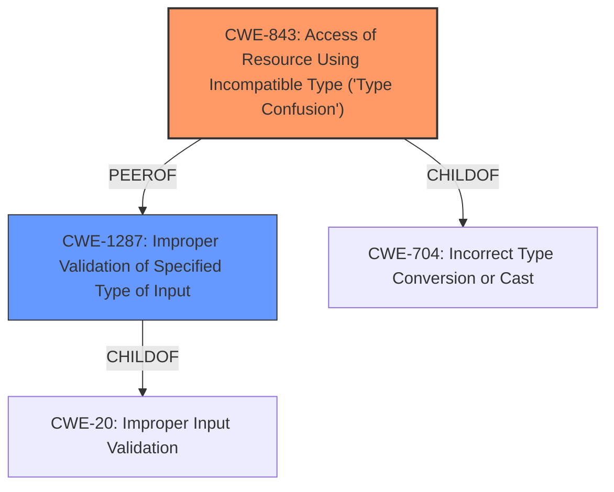

# Enhanced Analysis for CVE-2022-21144

# Summary
| CWE ID | CWE Name | Confidence | CWE Abstraction Level | CWE Vulnerability Mapping Label | CWE-Vulnerability Mapping Notes |
|---|---|---|---|---|---|
| CWE-843 | Access of Resource Using Incompatible Type ('Type Confusion') | 0.9 | Base | Primary | Allowed |
| CWE-1287 | Improper Validation of Specified Type of Input | 0.8 | Base | Secondary | Allowed |

## Evidence and Confidence

*   **Confidence Score:** 0.85
*   **Evidence Strength:** HIGH

## Relationship Analysis
The primary relationship that influenced the selection was the peer relationship between CWE-843 and CWE-1287, as well as the ChildOf relationship between CWE-843 and CWE-704 (Incorrect Type Conversion or Cast). CWE-843 directly addresses the **type confusion** issue, where the code attempts to use the `.toString()` method without verifying that the input is of the expected type (a function). CWE-1287 is selected as a secondary CWE as it highlights the **improper validation** of the input type, which contributes to the type confusion vulnerability.



## Vulnerability Chain
The vulnerability chain begins with the **lack of input validation** (CWE-1287), leading to **type confusion** (CWE-843) when the code attempts to call `.toString()` on an object that is not a function. This ultimately results in a crash (Denial of Service).
`Improper Input Validation (CWE-1287) -> Type Confusion (CWE-843) -> Crash (DoS)`

## Summary of Analysis
The initial analysis focused on identifying the root cause of the crash, which stems from the `libxmljs.parseXml` function not validating the input type. The evidence provided in the "CVE Reference Links Content Summary" clearly states that the code does not enforce that the input must be a string or buffer and assumes that any object will have a valid `toString` function.

> **Root Cause of Vulnerability:**
> The vulnerability arises from the `libxmljs.parseXml` and `libxmljs.parseHtml` functions not properly validating the input type. When these functions receive a non-buffer and non-string argument, the V8 engine attempts to call the `.toString()` method on the provided input. If the input's `toString` property is not a function, V8 will crash.

Based on this, the primary CWE selected is CWE-843, which accurately describes the **type confusion** issue. The secondary CWE, CWE-1287, is selected because it highlights the **improper validation** of the input type, which is a prerequisite for the type confusion to occur. Both CWEs are at the Base level of abstraction, which is preferred for mapping root causes.
The selection of CWE-843 is further supported by its description: "The product allocates or initializes a resource such as a pointer, object, or variable using one type, but it later accesses that resource using a type that is incompatible with the original type." In this case, the code expects the input to have a `toString` method (i.e., be a function), but it doesn't validate this assumption, leading to a crash when the input is of an incompatible type.

The selection of CWE-1287 is supported by its description: "The product receives input that is expected to be of a certain type, but it does not validate or incorrectly validates that the input is actually of the expected type." This aligns with the vulnerability description, which states that the `parseXml` and `parseHtml` functions do not properly validate the input type.

Other CWEs considered, such as CWE-754 (Improper Check for Unusual or Exceptional Conditions), were deemed less specific than CWE-843 and CWE-1287. The chosen CWEs provide a more accurate and detailed representation of the vulnerability's root cause.

Relevant CWE Information:

# Enhanced Context (25 CWEs)

## CWE-668: Exposure of Resource to Wrong Sphere
**Abstraction Level**: Class
**Similarity Score**: 0.77
**Source**: dense

**Description**:
The product exposes a resource to the wrong control sphere, providing unintended actors with inappropriate access to the resource.

**Mapping Guidance**:
- Usage: Discouraged
- Rationale: CWE-668 is high-level and is often misused as a catch-all when lower-level CWE IDs might be applicable. It is sometimes used for low-information vulnerability reports [REF-1287]. It is a level-1 Class (i.e., a child of a Pillar). It is not useful for trend analysis.

## CWE-843: Access of Resource Using Incompatible Type ('Type Confusion')
**Abstraction Level**: Base
**Similarity Score**: 0.77
**Source**: dense

**Description**:
The product allocates or initializes a resource such as a pointer, object, or variable using one type, but it later accesses that resource using a type that is incompatible with the original type.

**Mapping Guidance**:
- Usage: Allowed
- Rationale: This CWE entry is at the Base level of abstraction, which is a preferred level of abstraction for mapping to the root causes of vulnerabilities.

## CWE-1289: Improper Validation of Unsafe Equivalence in Input
**Abstraction Level**: Base
**Similarity Score**: 0.77
**Source**: dense

**Description**:
The product receives an input value that is used as a resource identifier or other type of reference, but it does not validate or incorrectly validates that the input is equivalent to a potentially-unsafe value.

**Mapping Guidance**:
- Usage: Allowed
- Rationale: This CWE entry is at the Base level of abstraction, which is a preferred level of abstraction for mapping to the root causes of vulnerabilities.

## CWE-41: Improper Resolution of Path Equivalence
**Abstraction Level**: Base
**Similarity Score**: 0.76
**Source**: dense

**Description**:
The product is vulnerable to file system contents disclosure through path equivalence. Path equivalence involves the use of special characters in file and directory names. The associated manipulations are intended to generate multiple names for the same object.

**Mapping Guidance**:
- Usage: Allowed
- Rationale: This CWE entry is at the Base level of abstraction, which is a preferred level of abstraction for mapping to the root causes of vulnerabilities.

## CWE-138: Improper Neutralization of Special Elements
**Abstraction Level**: Class
**Similarity Score**: 0.76
**Source**: dense

**Description**:
The product receives input from an upstream component, but it does not neutralize or incorrectly neutralizes special elements that could be interpreted as control elements or syntactic markers when they are sent to a downstream component.

**Mapping Guidance**:
- Usage: Discouraged
- Rationale: This CWE entry is a level-1 Class (i.e., a child of a Pillar). It might have lower-level children that would be more appropriate

## CWE-1321: Improperly Controlled Modification of Object Prototype Attributes ('Prototype Pollution')
**Abstraction Level**: Variant
**Similarity Score**: 0.76
**Source**: dense

**Description**:
The product receives input from an upstream component that specifies attributes that are to be initialized or updated in an object, but it does not properly control modifications of attributes of the object prototype.

**Mapping Guidance**:
- Usage: Allowed
- Rationale: This CWE entry is at the Variant level of abstraction, which is a preferred level of abstraction for mapping to the root causes of vulnerabilities.

## CWE-664: Improper Control of a Resource Through its Lifetime
**Abstraction Level**: Pillar
**Similarity Score**: 0.75
**Source**: dense

**Description**:
The product does not maintain or incorrectly maintains control over a resource throughout its lifetime of creation, use, and release.

**Mapping Guidance**:
- Usage: Discouraged
- Rationale: This CWE entry is high-level when lower-level children are available.

## CWE-754: Improper Check for Unusual or Exceptional Conditions
**Abstraction Level**: Class
**Similarity Score**: 0.75
**Source**: dense

**Description**:
The product does not check or incorrectly checks for unusual or exceptional conditions that are not expected to occur frequently during day to day operation of the product.

**Mapping Guidance**:
- Usage: Allowed-with-Review
- Rationale: This CWE entry is


## CWE Relationship Analysis

Current CWEs represent these abstraction levels: .


### Vulnerability Chain Analysis

**Chain starting from CWE-41:**
- 41 (Improper Resolution of Path Equivalence) - ROOT


**Chain starting from CWE-704:**
- 704 (Incorrect Type Conversion or Cast) - ROOT


### CWE Relationship Diagram

```mermaid
graph TD
    classDef primary fill:#f96,stroke:#333,stroke-width:2px
    classDef secondary fill:#69f,stroke:#333
    classDef tertiary fill:#9e9,stroke:#333
```