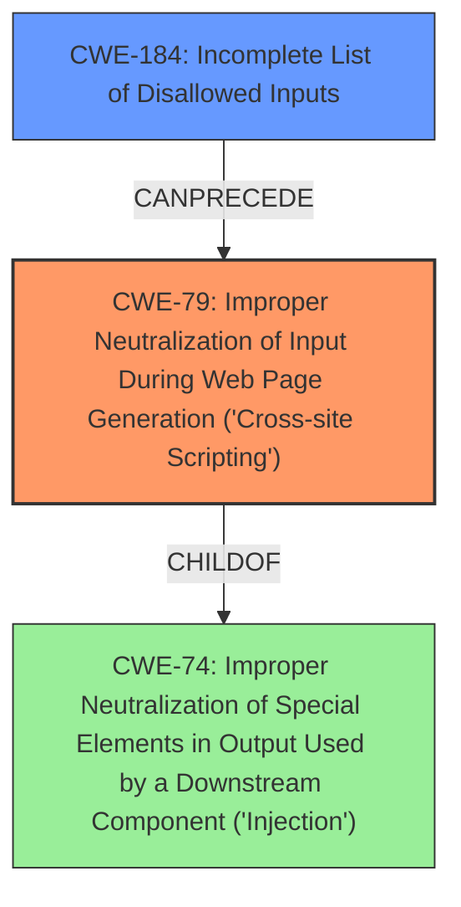

# Enhanced Analysis for CVE-2022-21145

# Summary
| CWE ID | CWE Name | Confidence | CWE Abstraction Level | CWE Vulnerability Mapping Label | CWE-Vulnerability Mapping Notes |
|---|---|---|---|---|---|
| CWE-79 | Improper Neutralization of Input During Web Page Generation ('Cross-site Scripting') | 1.0 | Base | Allowed | Primary CWE |
| CWE-184 | Incomplete List of Disallowed Inputs | 0.7 | Base | Allowed | Secondary CWE |

## Evidence and Confidence

*   **Confidence Score:** 0.85
*   **Evidence Strength:** HIGH

## Relationship Analysis
The primary weakness is CWE-79, which is a base-level CWE related to **improper neutralization of input during web page generation** leading to **Cross-site Scripting**. The secondary weakness is CWE-184, which is also a base-level CWE that describes an **incomplete list of disallowed inputs**. CWE-79 is a child of CWE-74, which is a class-level CWE for injection vulnerabilities. CWE-184 can precede CWE-79, indicating that an incomplete list of disallowed inputs can lead to XSS. The relationships help to establish the connection between the **lack of proper input validation/sanitization** (CWE-184) and the resulting XSS vulnerability (CWE-79).



## Vulnerability Chain
The vulnerability chain starts with **improper input sanitization** (CWE-184), which leads to **cross-site scripting** (CWE-79), and results in arbitrary Javascript code injection.

## Summary of Analysis
The primary vulnerability is clearly a stored cross-site scripting (XSS) issue, as indicated by the vulnerability description and the CVE reference. The application **fails to properly sanitize user-controlled input**, allowing an attacker to inject malicious JavaScript code into the database, which is then executed when a user visits the login page. This aligns directly with the description of CWE-79. The evidence supports this: "The vulnerability stems from insufficient sanitization of user-controlled input in the `WebUserActions.aspx` page...The application attempts to sanitize the input using `HtmlSanitizer.SanitizeHtml` but this can be bypassed by manipulating the `name` parameter of the HTTP request."

The secondary contributing factor is the **incomplete input validation**, where the application's sanitization logic can be bypassed by manipulating the `name` parameter. This aligns with CWE-184 which means that the list of inputs that require sanitization is incomplete, allowing the attacker to bypass the intended protection mechanism. The evidence supports this: "The vulnerability can be bypassed by manipulating the `name` parameter to be "Loginmessage" or " loginmessage" allowing the attacker to insert unsanitized data to the database through the value parameter."

The selection of CWE-79 is based on its direct relevance to the XSS vulnerability, while CWE-184 is chosen to represent the underlying cause of the vulnerability. Both CWEs are at the base level of abstraction, which is the preferred level.

Other CWEs Considered but Not Used:
*   CWE-80: Improper Neutralization of Script-Related HTML Tags in a Web Page (Basic XSS): While related to XSS, CWE-80 is more specific to HTML tags and not the general improper neutralization of input that leads to XSS. CWE-79 is a better fit.
*   CWE-113: Improper Neutralization of CRLF Sequences in HTTP Headers ('HTTP Request/Response Splitting'): This is not relevant as the vulnerability does not involve HTTP header manipulation.
*   CWE-918: Server-Side Request Forgery (SSRF): This is not relevant as the vulnerability does not involve making requests to internal servers.
*   CWE-74: Improper Neutralization of Special Elements in Output Used by a Downstream Component ('Injection'): This is too broad and CWE-79 is a more specific and accurate classification.
*   CWE-352: Cross-Site Request Forgery (CSRF): While XSS and CSRF can be related, this vulnerability is primarily about XSS due to **improper input sanitization**, not about tricking a user into making unintended requests.
*   CWE-134: Use of Externally-Controlled Format String: This is not relevant as the vulnerability does not involve format strings.
*   CWE-611: Improper Restriction of XML External Entity Reference: This is not relevant as the vulnerability does not involve XML entities.
*   CWE-843: Access of Resource Using Incompatible Type ('Type Confusion'): This is not relevant as the vulnerability does not involve type confusion.
*   CWE-1287: Improper Validation of Specified Type of Input: This is similar to CWE-184, but less precise than CWE-184 in describing the **incomplete list of disallowed inputs**.


## CWE Relationship Analysis

Current CWEs represent these abstraction levels: .


### Vulnerability Chain Analysis

**Chain starting from CWE-80:**
- 80 (Improper Neutralization of Script-Related HTML Tags in a Web Page (Basic XSS)) - ROOT


**Chain starting from CWE-918:**
- 918 (Server-Side Request Forgery (SSRF)) - ROOT


### CWE Relationship Diagram

```mermaid
graph TD
    classDef primary fill:#f96,stroke:#333,stroke-width:2px
    classDef secondary fill:#69f,stroke:#333
    classDef tertiary fill:#9e9,stroke:#333
```