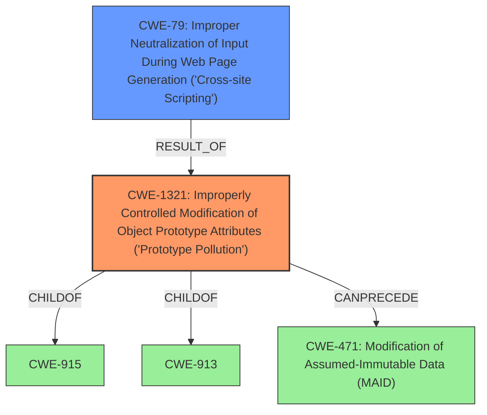

# Analysis Report for CVE-2022-21169

# Vulnerability Analysis Report: CVE-2022-21169

## Description


## Analysis (with Relationship Data)

# Summary
| CWE ID | CWE Name | Confidence | CWE Abstraction Level | CWE Vulnerability Mapping Label | CWE-Vulnerability Mapping Notes |
|---|---|---|---|---|---|
| CWE-1321 | Improperly Controlled Modification of Object Prototype Attributes ('Prototype Pollution') | 1.0 | Variant | Allowed | Primary CWE |
| CWE-79 | Improper Neutralization of Input During Web Page Generation ('Cross-site Scripting') | 0.7 | Base | Allowed | Secondary CWE |

## Evidence and Confidence

*   **Confidence Score:** 0.9
*   **Evidence Strength:** HIGH

## Relationship Analysis
The primary CWE selected is CWE-1321, which is a Variant of both CWE-915 and CWE-913. CWE-1321 can precede CWE-471 (Modification of Assumed-Immutable Data). CWE-79 (Improper Neutralization of Input During Web Page Generation ('Cross-site Scripting')) can result from prototype pollution, where the allowed tags are modified, leading to the bypass of XSS sanitization.



## Vulnerability Chain
The vulnerability chain starts with **Prototype Pollution** (CWE-1321), which leads to the bypass of XSS sanitization. This, in turn, results in a potential Cross-Site Scripting (XSS) vulnerability (CWE-79). The root cause is the improper control of object prototype attribute modification.

## Summary of Analysis
The initial analysis identified the **rootcause** as **prototype pollution**, which allows attackers to bypass XSS sanitization. The Retriever results and the CVE description content summary strongly support CWE-1321 (Improperly Controlled Modification of Object Prototype Attributes ('Prototype Pollution')) as the primary weakness. This is a Variant level CWE, which is the preferred level of abstraction.

The vulnerability description states: "The package express-xss-sanitizer before 1.1.3 are vulnerable to Prototype Pollution via the allowedTags attribute, allowing the attacker to bypass xss sanitization." This statement directly indicates that the `allowedTags` attribute is being improperly modified on the object prototype.

The CVE Reference Links Content Summary further clarifies this: "The vulnerability is due to Prototype Pollution in the `express-xss-sanitizer` package. Specifically, the `allowedTags` option of the sanitizer could be manipulated by polluting the `Object.prototype`."

As a consequence of prototype pollution, the XSS sanitization is bypassed, leading to a potential XSS vulnerability. This makes CWE-79 a secondary concern, as it represents the impact of the primary weakness.

CWE-1321 is selected as the primary CWE due to its direct relevance to the **rootcause** of the vulnerability. CWE-79 is included as a secondary CWE because the **impact** of the vulnerability involves bypassing XSS sanitization, which can then lead to XSS attacks.

The graph relationships influenced the selection by highlighting the connection between the primary weakness (CWE-1321) and its potential impact (CWE-79). This helped to map the complete chain of events from the initial flaw to its final consequence.

The selected CWEs are at the optimal level of specificity because CWE-1321 is a Variant that accurately describes the **rootcause**, and CWE-79 is a Base level CWE that accurately describes the potential **impact**.

Relevant CWE Information:

# Enhanced Context (25 CWEs)
The following CWEs were identified as potentially relevant to this vulnerability:

## CWE-1336: Improper Neutralization of Special Elements Used in a Template Engine
**Abstraction Level**: Base
**Similarity Score**: 0.76
**Source**: dense

**Description**:
The product uses a template engine to insert or process externally-influenced input, but it does not neutralize or incorrectly neutralizes special elements or syntax that can be interpreted as template expressions or other code directives when processed by the engine.

**Mapping Guidance**:
- Usage: Allowed
- Rationale: This CWE entry is at the Base level of abstraction, which is a preferred level of abstraction for mapping to the root causes of vulnerabilities.

## CWE-80: Improper Neutralization of Script-Related HTML Tags in a Web Page (Basic XSS)
**Abstraction Level**: Variant
**Similarity Score**: 0.75
**Source**: dense

**Description**:
The product receives input from an upstream component, but it does not neutralize or incorrectly neutralizes special characters such as "<", ">", and "&" that could be interpreted as web-scripting elements when they are sent to a downstream component that processes web pages.

**Mapping Guidance**:
- Usage: Allowed
- Rationale: This CWE entry is at the Variant level of abstraction, which is a preferred level of abstraction for mapping to the root causes of vulnerabilities.

## CWE-74: Improper Neutralization of Special Elements in Output Used by a Downstream Component ('Injection')
**Abstraction Level**: Class
**Similarity Score**: 0.75
**Source**: dense

**Description**:
The product constructs all or part of a command, data structure, or record using externally-influenced input from an upstream component, but it does not neutralize or incorrectly neutralizes special elements that could modify how it is parsed or interpreted when it is sent to a downstream component.

**Mapping Guidance**:
- Usage: Discouraged
- Rationale: CWE-74 is high-level and often misused when lower-level weaknesses are more appropriate.

## CWE-1289: Improper Validation of Unsafe Equivalence in Input
**Abstraction Level**: Base
**Similarity Score**: 0.74
**Source**: dense

**Description**:
The product receives an input value that is used as a resource identifier or other type of reference, but it does not validate or incorrectly validates that the input is equivalent to a potentially-unsafe value.

**Mapping Guidance**:
- Usage: Allowed
- Rationale: This CWE entry is at the Base level of abstraction, which is a preferred level of abstraction for mapping to the root causes of vulnerabilities.

## CWE-138: Improper Neutralization of Special Elements
**Abstraction Level**: Class
**Similarity Score**: 0.74
**Source**: dense

**Description**:
The product receives input from an upstream component, but it does not neutralize or incorrectly neutralizes special elements that could be interpreted as control elements or syntactic markers when they are sent to a downstream component.

**Mapping Guidance**:
- Usage: Discouraged
- Rationale: This CWE entry is a level-1 Class (i.e., a child of a Pillar). It might have lower-level children that would be more appropriate

## CWE-184: Incomplete List of Disallowed Inputs
**Abstraction Level**: Base
**Similarity Score**: 0.73
**Source**: dense

**Description**:
The product implements a protection mechanism that relies on a list of inputs (or properties of inputs) that are not allowed by policy or otherwise require other action to neutralize before additional processing takes place, but the list is incomplete.

**Mapping Guidance**:
- Usage: Allowed
- Rationale: This CWE entry is at the Base level of abstraction, which is a preferred level of abstraction for mapping to the root causes of vulnerabilities.

## CWE-917: Improper Neutralization of Special Elements used in an Expression Language Statement ('Expression Language Injection')
**Abstraction Level**: Base
**Similarity Score**: 0.73
**Source**: dense

**Description**:
The product constructs all or part of an expression language (EL) statement in a framework such as a Java Server Page (JSP) using externally-influenced input from an upstream component, but it does not neutralize or incorrectly neutralizes special elements that could modify the intended EL statement before it is executed.

**Mapping Guidance**:
- Usage: Allowed
- Rationale: This CWE entry is at the Base level of abstraction, which is a preferred level of abstraction for mapping to the root causes of vulnerabilities.

## CWE-116: Improper Encoding or Escaping of Output
**Abstraction Level**: Class
**Similarity Score**: 0.73
**Source**: dense

**Description**:
The product prepares a structured message for communication with another component, but encoding


## CWE Relationship Analysis

Current CWEs represent these abstraction levels: .


### Vulnerability Chain Analysis

**Chain starting from CWE-80:**
- 80 (Improper Neutralization of Script-Related HTML Tags in a Web Page (Basic XSS)) - ROOT


**Chain starting from CWE-913:**
- 913 (Improper Control of Dynamically-Managed Code Resources) - ROOT


### CWE Relationship Diagram

```mermaid
graph TD
    classDef primary fill:#f96,stroke:#333,stroke-width:2px
    classDef secondary fill:#69f,stroke:#333
    classDef tertiary fill:#9e9,stroke:#333
```


*Report generated on 2025-03-31 11:57:30*
