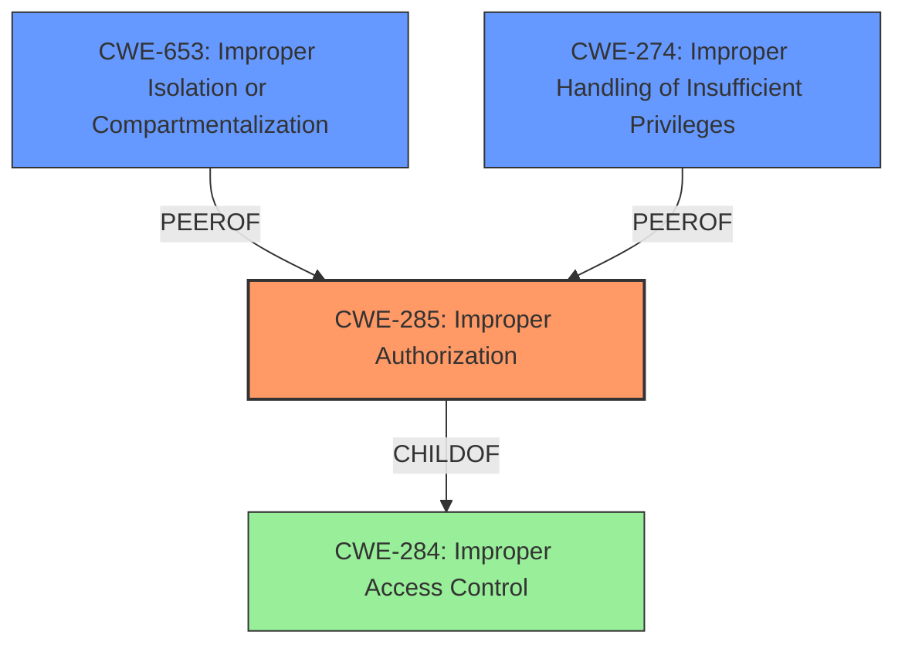

# Analysis for CVE-2022-21174

# Summary
| CWE ID | CWE Name | Confidence | CWE Abstraction Level | CWE Vulnerability Mapping Label | CWE-Vulnerability Mapping Notes |
|---|---|---|---|---|---|
| CWE-285 | Improper Authorization | 1.0 | Class | Primary | Allowed-with-Review |
| CWE-653 | Improper Isolation or Compartmentalization | 0.7 | Class | Secondary | Allowed |
| CWE-274 | Improper Handling of Insufficient Privileges | 0.6 | Base | Secondary | Discouraged |

## Evidence and Confidence

*   **Confidence Score:** 1.0
*   **Evidence Strength:** HIGH

## Relationship Analysis
The primary relationship influencing the decision is the hierarchical relationship. CWE-285 is a Class-level CWE, and while its children might be more specific, the provided information does not offer enough detail to pinpoint a specific authorization flaw. Other relationships, like those in a vulnerability chain (CanPrecede, CanFollow), are not applicable in this scenario.

## Vulnerability Chain
The vulnerability chain consists of:
1.  **Root Cause:** **Improper access control** in a third-party component.
2.  **Weakness:** Incorrect or missing authorization checks, leading to unauthorized access.
3.  **Impact:** Escalation of privilege for an authenticated user.

## Summary of Analysis
The initial assessment pointed towards **improper access control**, specifically an authorization issue. The evidence is the vulnerability description stating "**Improper access control** in a third-party component of Intel(R) Quartus(R) Prime Pro Edition before version 21.3 may allow an authenticated user to potentially enable escalation of privilege via local access." and the "CVE Reference Links Content Summary" stating that the root cause is "**Improper access control** in a third-party component of Intel(R) Quartus(R) Prime Pro Edition." and that the core weakness is a lack of proper access control, allowing for unauthorized access and manipulation.

CWE-284 (Improper Access Control) is too high-level and discouraged. The retriever results suggested CWE-285 (Improper Authorization), CWE-653 (Improper Isolation or Compartmentalization), and CWE-274 (Improper Handling of Insufficient Privileges). CWE-285 is a child of CWE-284, providing a more specific classification.

The final decision is to classify this vulnerability as CWE-285 (Improper Authorization) because it directly addresses the **root cause** of the vulnerability, which is a failure to properly authorize access to resources, leading to privilege escalation. CWE-653 and CWE-274 were considered as contributing factors, but CWE-285 best represents the primary weakness. This selection provides the optimal level of specificity based on the available evidence.

Relevant CWE Information:

# Enhanced Context (25 CWEs)

## CWE-653: Improper Isolation or Compartmentalization
**Abstraction Level**: Class
**Similarity Score**: 0.78
**Source**: dense

**Description**:
The product does not properly compartmentalize or isolate functionality, processes, or resources that require different privilege levels, rights, or permissions.

**Mapping Guidance**:
- Usage: Allowed
- Rationale: This CWE entry is at the Base level of abstraction, which is a preferred level of abstraction for mapping to the root causes of vulnerabilities.

*This CWE was considered because the third-party component might not be properly isolated from the rest of the application, which could contribute to the access control issue. However, the primary issue seems to be the authorization check itself, making CWE-285 a better fit.*

## CWE-274: Improper Handling of Insufficient Privileges
**Abstraction Level**: Base
**Similarity Score**: 0.77
**Source**: dense

**Description**:
The product does not handle or incorrectly handles when it has insufficient privileges to perform an operation, leading to resultant weaknesses.

**Mapping Guidance**:
- Usage: Discouraged
- Rationale: This CWE entry could be deprecated in a future version of CWE.

*This CWE was considered because the vulnerability results in privilege escalation. However, it is a consequence of the **improper access control** (authorization) rather than the **root cause** itself. Therefore, CWE-285 is a better fit.*

## CWE-1220: Insufficient Granularity of Access Control
**Abstraction Level**: Base
**Similarity Score**: 0.77
**Source**: dense

**Description**:
The product implements access controls via a policy or other feature with the intention to disable or restrict accesses (reads and/or writes) to assets in a system from untrusted agents. However, implemented access controls lack required granularity, which renders the control policy too broad because it allows accesses from unauthorized agents to the security-sensitive assets.

**Mapping Guidance**:
- Usage: Allowed
- Rationale: This CWE entry is at the Base level of abstraction, which is a preferred level of abstraction for mapping to the root causes of vulnerabilities.

*This CWE was not chosen because there is no evidence that the access controls lack required granularity. The description states that access controls are **improper**, suggesting a more fundamental flaw in the authorization process rather than a granularity issue.*

## CWE-280: Improper Handling of Insufficient Permissions or Privileges
**Abstraction Level**: Base
**Similarity Score**: 0.77
**Source**: dense

**Description**:
The product does not handle or incorrectly handles when it has insufficient privileges to access resources or functionality as specified by their permissions. This may cause it to follow unexpected code paths that may leave the product in an invalid state.

**Mapping Guidance**:
- Usage: Allowed
- Rationale: This CWE entry is at the Base level of abstraction, which is a preferred level of abstraction for mapping to the root causes of vulnerabilities.

*This CWE was not chosen because it focuses on handling insufficient privileges, whereas the description indicates that the vulnerability stems from **improper access control**, allowing an authenticated user to escalate privileges, which is more aligned with authorization flaws.*

## CWE-691: Insufficient Control Flow Management
**Abstraction Level**: Pillar
**Similarity Score**: 0.76
**Source**: dense

**Description**:
The code does not sufficiently manage its control flow during execution, creating conditions in which the control flow can be modified in unexpected ways.

**Mapping Guidance**:
- Usage: Discouraged
- Rationale: This CWE entry is extremely high-level, a Pillar. However, classification research is limited for weaknesses of this type, so there can be gaps or organizational difficulties within CWE that force use of this weakness, even at such a high level of abstraction.

*This CWE was not chosen because it is a very high-level abstraction and doesn't directly address the **root cause**, which is an **improper access control** issue.*

## CWE-664: Improper Control of a Resource Through its Lifetime
**Abstraction Level**: Pillar
**Similarity Score**: 0.76
**Source**: dense

**Description**:
The product does not maintain or incorrectly maintains control over a resource throughout its lifetime of creation, use, and release.

**Mapping Guidance**:
- Usage: Discouraged
- Rationale: This CWE entry is high-level when lower-level children are available.

*This CWE was not chosen because it is a high-level abstraction and doesn't directly address the **root cause**, which is an **improper access control** issue.*

## CWE-266: Incorrect Privilege Assignment
**Abstraction Level**: Base
**Similarity Score**: 0.76
**Source**: dense

**Description**:
A product incorrectly assigns a privilege to a particular actor, creating an unintended sphere of control for that actor.

**Mapping Guidance**:
- Usage: Allowed
- Rationale: This CWE entry is at the Base level of abstraction, which is a preferred level of abstraction for mapping to the root causes of vulnerabilities.

*This CWE was not chosen because there is no evidence of incorrect privilege assignment. The description focuses on **improper access control**, which suggests a flaw in authorization checks rather than incorrect assignment of privileges.*

## CWE-667: Improper Locking
**Abstraction Level**: Class
**Similarity Score**: 0.76
**Source**: dense

**Description**:
The product does not properly acquire or release a lock on a resource, leading to unexpected resource state changes and behaviors.

**Mapping Guidance**:
- Usage: Allowed-with-Review