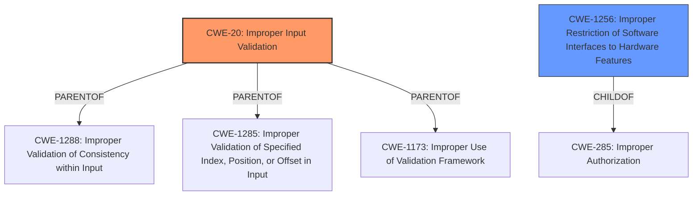

# Raw Analyzer Response for CVE-2022-21180

# Summary
| CWE ID | CWE Name | Confidence | CWE Abstraction Level | CWE Vulnerability Mapping Label | CWE-Vulnerability Mapping Notes |
|---|---|---|---|---|---|
| CWE-20 | Improper Input Validation | 0.9 | Class | Primary | Discouraged |
| CWE-1256 | Improper Restriction of Software Interfaces to Hardware Features | 0.6 | Base | Secondary | Allowed |

## Evidence and Confidence

*   **Confidence Score:** 0.75
*   **Evidence Strength:** MEDIUM

## Relationship Analysis
The primary CWE is CWE-20, which is a Class-level CWE and has many child CWEs that are more specific.
CWE-1256 is related because it talks about software interfaces with hardware, which is relevant to the MMIO access mentioned in the vulnerability.

## Vulnerability Chain
The chain of root cause and weaknesses for the Vulnerability Description:
1.  **Root Cause:** **Improper input validation** in the Memory Mapped I/O (MMIO) implementation of some 14nm Client/Xeon E3 Intel® Processors (CWE-20).
2.  **Weakness:** Undefined MMIO access due to the **improper input validation**.
3.  **Impact:** Denial of Service (DoS).

## Summary of Analysis
Based on the provided information, the primary weakness is **improper input validation** (CWE-20) in the MMIO implementation of certain Intel processors. This **improper input validation** leads to undefined MMIO access, which can result in a denial-of-service condition.

The vulnerability description clearly states "**Improper input validation** for some Intel(R) Processors may allow an authenticated user to potentially cause a denial of service via local access."

The CVE Reference Links Content Summary also supports this, stating: "Root Cause of Vulnerability: **Improper input validation** in the Memory Mapped I/O (MMIO) implementation of some 14nm Client/Xeon E3 Intel® Processors."

While CWE-20 is a Class-level CWE and typically discouraged, the provided information does not offer sufficient detail to pinpoint a more specific Base-level CWE. However, considering the MMIO context, CWE-1256 (Improper Restriction of Software Interfaces to Hardware Features) is also relevant. It's related because the vulnerability involves how software interfaces with hardware features (MMIO) are improperly restricted, allowing undefined access.

CWE-691 (Insufficient Control Flow Management) and CWE-284 (Improper Access Control) were considered but deemed less suitable. CWE-691 is too abstract (Pillar), and CWE-284, while relevant, doesn't directly address the input validation aspect.

CWE-1288 (Improper Validation of Consistency within Input) and CWE-1285 (Improper Validation of Specified Index, Position, or Offset in Input) are children of CWE-20 but don't fit the specifics of this vulnerability as well as CWE-1256.

CWE-1173 (Improper Use of Validation Framework) is a child of CWE-20, but the information is lacking on if an Input Validation Framework was used and improperly implemented.

Therefore, the selected CWEs (CWE-20 and CWE-1256) are considered to be at the optimal level of specificity given the available information.