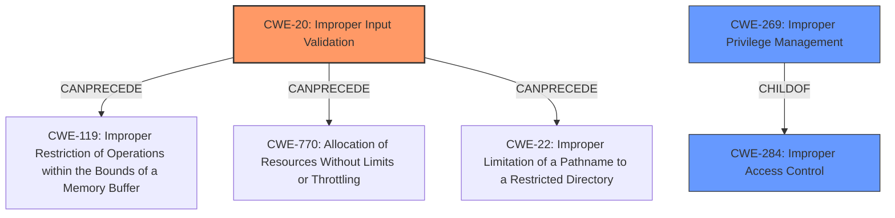

# Analysis for CVE-2022-21181

# Summary
| CWE ID | CWE Name | Confidence | CWE Abstraction Level | CWE Vulnerability Mapping Label | CWE-Vulnerability Mapping Notes |
|---|---|---|---|---|---|
| CWE-20 | Improper Input Validation | 0.8 | Class | Primary | Discouraged |
| CWE-269 | Improper Privilege Management | 0.6 | Class | Secondary | Discouraged |

## Evidence and Confidence

*   **Confidence Score:** 0.7
*   **Evidence Strength:** MEDIUM

## Relationship Analysis
The primary CWE is CWE-20, which is a Class-level CWE. The retriever also suggested CWE-269 which is a peer of CWE-284 (Improper Access Control).

## Vulnerability Chain
The vulnerability chain starts with **improper input validation** (CWE-20), which leads to an escalation of privilege. The **improper input validation** allows a privileged user to escalate privileges via local access, thus the impact is the escalation of privileges, which could indicate **improper privilege management** (CWE-269).

## Summary of Analysis
The initial analysis based on the vulnerability description key phrases suggests CWE-20 (Improper Input Validation) as the root cause. The description clearly states "**Improper input validation** for some Intel(R) PROSet/Wireless WiFi and Killer(TM) WiFi products may allow a privileged user to potentially enable escalation of privilege via local access."

The CVE Reference Links Content Summary confirms the root cause as **improper input validation**, the primary weakness as the lack of proper input validation, and the impact as a privileged user escalating their privileges.

The retriever results also suggest CWE-20. However, CWE-20 is a Class-level CWE and the mapping guidance discourages its use when lower-level CWEs are available. Despite this, the information available doesn't provide enough detail to pinpoint a more specific CWE.

Therefore, CWE-20 is chosen as the primary CWE. Given that the vulnerability allows a privileged user to escalate their privileges, CWE-269 (Improper Privilege Management) is considered as a secondary CWE.

The final decision is based on the available evidence and the relationships between the CWEs. CWE-20 represents the **improper input validation**, which is the root cause, and CWE-269 represents the impact. While both are Class-level CWEs, the available information is insufficient to map to more specific Base or Variant level CWEs.

Relevant CWE Information:

# Enhanced Context (25 CWEs)

## CWE-691: Insufficient Control Flow Management
**Abstraction Level**: Pillar
**Similarity Score**: 0.77
**Source**: dense

**Description**:
The code does not sufficiently manage its control flow during execution, creating conditions in which the control flow can be modified in unexpected ways.

**Mapping Guidance**:
- Usage: Discouraged
- Rationale: This CWE entry is extremely high-level, a Pillar. However, classification research is limited for weaknesses of this type, so there can be gaps or organizational difficulties within CWE that force use of this weakness, even at such a high level of abstraction.

*Rationale for not selecting:* This is a high-level Pillar CWE and not specific to the vulnerability.

## CWE-653: Improper Isolation or Compartmentalization
**Abstraction Level**: Class
**Similarity Score**: 0.76
**Source**: dense

**Description**:
The product does not properly compartmentalize or isolate functionality, processes, or resources that require different privilege levels, rights, or permissions.

**Mapping Guidance**:
- Usage: Allowed
- Rationale: This CWE entry is at the Base level of abstraction, which is a preferred level of abstraction for mapping to the root causes of vulnerabilities.

*Rationale for not selecting:* While the vulnerability leads to privilege escalation, there is no evidence to suggest **improper isolation or compartmentalization** as the root cause.

## CWE-131: Incorrect Calculation of Buffer Size
**Abstraction Level**: Base
**Similarity Score**: 0.75
**Source**: dense

**Description**:
The product does not correctly calculate the size to be used when allocating a buffer, which could lead to a buffer overflow.

**Mapping Guidance**:
- Usage: Allowed
- Rationale: This CWE entry is at the Base level of abstraction, which is a preferred level of abstraction for mapping to the root causes of vulnerabilities.

*Rationale for not selecting:* There is no mention of buffer size calculation in the vulnerability description.

## CWE-1289: Improper Validation of Unsafe Equivalence in Input
**Abstraction Level**: Base
**Similarity Score**: 0.75
**Source**: dense

**Description**:
The product receives an input value that is used as a resource identifier or other type of reference, but it does not validate or incorrectly validates that the input is equivalent to a potentially-unsafe value.

**Mapping Guidance**:
- Usage: Allowed
- Rationale: This CWE entry is at the Base level of abstraction, which is a preferred level of abstraction for mapping to the root causes of vulnerabilities.

*Rationale for not selecting:* The description is too generic. This is a possible candidate, but there is not enough evidence to support this.

## CWE-667: Improper Locking
**Abstraction Level**: Class
**Similarity Score**: 0.75
**Source**: dense

**Description**:
The product does not properly acquire or release a lock on a resource, leading to unexpected resource state changes and behaviors.

**Mapping Guidance**:
- Usage: Allowed-with-Review
- Rationale: This CWE entry is a Class and might have Base-level children that would be more appropriate

*Rationale for not selecting:* There is no mention of locking mechanisms in the vulnerability description.

## CWE-404: Improper Resource Shutdown or Release
**Abstraction Level**: Class
**Similarity Score**: 0.75
**Source**: dense

**Description**:
The product does not release or incorrectly releases a resource before it is made available for re-use.

**Mapping Guidance**:
- Usage: Allowed-with-Review
- Rationale: This CWE entry is a Class and might have Base-level children that would be more appropriate

*Rationale for not selecting:* There is no mention of resource shutdown or release in the vulnerability description.

## CWE-274: Improper Handling of Insufficient Privileges
**Abstraction Level**: Base
**Similarity Score**: 0.75
**Source**: dense

**Description**:
The product does not handle or incorrectly handles when it has insufficient privileges to perform an operation, leading to resultant weaknesses.

**Mapping Guidance**:
- Usage: Discouraged
- Rationale: This CWE entry could be deprecated in a future version of CWE.

*Rationale for not selecting:* The issue is not with handling insufficient privileges, but with **improper input validation** that allows a privileged user to escalate privileges.

## CWE-119: Improper Restriction of Operations within the Bounds of a Memory Buffer
**Abstraction Level**: Class
**Similarity Score**: 0.74
**Source**: dense

**Description**:
The product performs operations on a memory buffer, but it reads from or writes to a memory location outside the buffer's intended boundary. This may result in read or write operations on unexpected memory locations that could be linked to other variables, data structures, or internal program data.

**Mapping Guidance**:
- Usage: Discouraged
- Rationale: CWE-119 is commonly misused in low-information vulnerability reports when lower-level CWEs could be used instead, or when more details about the vulnerability are available.

*Rationale for not selecting:* There is no mention of memory buffer operations in the vulnerability description.

## CWE-664: Improper Control of a Resource Through its Lifetime
**Abstraction Level**: Pillar
**Similarity Score**: 0.74
**Source**: dense

**Description**:
The product does not maintain or incorrectly maintains control over a resource throughout its lifetime of creation, use, and release.

**Mapping Guidance**:
- Usage: Discouraged
- Rationale: This CWE entry is high-level when lower-level children are available.

*Rationale for not selecting:* This is a high-level Pillar CWE and not specific to the vulnerability.

## CWE-805: Buffer Access with Incorrect Length Value
**