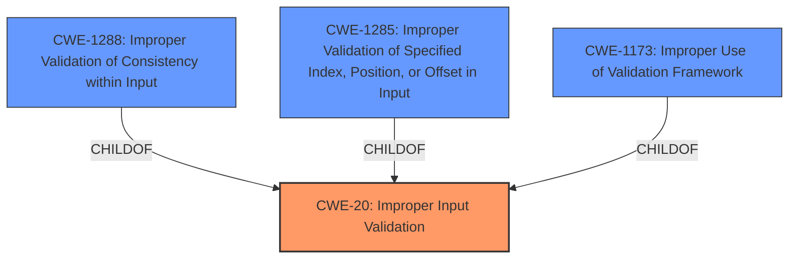

# Analysis Report for CVE-2022-21212

# Vulnerability Analysis Report: CVE-2022-21212

## Description


## Analysis (with Relationship Data)

# Summary
| CWE ID | CWE Name | Confidence | CWE Abstraction Level | CWE Vulnerability Mapping Label | CWE-Vulnerability Mapping Notes |
|---|---|---|---|---|---|
| CWE-20 | Improper Input Validation | 0.8 | Class | Primary | Discouraged: Consider lower-level children. |
| CWE-1288 | Improper Validation of Consistency within Input | 0.6 | Base | Secondary | Allowed |
| CWE-1285 | Improper Validation of Specified Index, Position, or Offset in Input | 0.5 | Base | Secondary | Allowed |
| CWE-1173 | Improper Use of Validation Framework | 0.4 | Base | Secondary | Allowed |

## Evidence and Confidence

*   **Confidence Score:** 0.8
*   **Evidence Strength:** HIGH

## Relationship Analysis
The primary relationship influencing the CWE selection is the parent-child relationship between CWE-20 and its potential children. While CWE-20 is a Class-level CWE and is discouraged, it serves as the initial best fit based on the provided description of **improper input validation**. Further analysis considers more specific Base-level children of CWE-20, such as CWE-1288, CWE-1285 and CWE-1173, to refine the classification. The relationship graph helps to visualize these options and determine the most accurate and specific representation of the vulnerability.



## Vulnerability Chain
The vulnerability chain starts with **improper input validation**, which leads to a denial of service.

Improper Input Validation (CWE-20) -> Denial of Service

## Summary of Analysis
The initial assessment based on the vulnerability description and key phrases points to **improper input validation** as the root cause. The "CWE for similar CVE Descriptions" section also lists CWE-20 as the primary match. However, the description lacks specifics about the *type* of input that is not validated, making it challenging to select a more specific CWE.

The "Retriever Results" section suggests several candidate CWEs related to input validation, including CWE-1288 (Improper Validation of Consistency within Input), CWE-1173 (Improper Use of Validation Framework), and CWE-1285 (Improper Validation of Specified Index, Position, or Offset in Input). Lacking further information on the nature of the input and the validation failure, selecting a more specific CWE is speculative.

Given the evidence, the primary CWE is CWE-20 (Improper Input Validation) with a confidence of 0.8. However, the MITRE mapping guidance discourages the use of CWE-20 when more specific CWEs are available. Based on the limited information, CWE-1288, CWE-1285 and CWE-1173 are considered as secondary candidates.

Relevant CWE Information:

# Enhanced Context (25 CWEs)
The following CWEs were identified as potentially relevant to this vulnerability:

## CWE-691: Insufficient Control Flow Management
**Abstraction Level**: Pillar
**Similarity Score**: 0.78

## CWE-693: Protection Mechanism Failure
**Abstraction Level**: Pillar
**Similarity Score**: 0.76

## CWE-664: Improper Control of a Resource Through its Lifetime
**Abstraction Level**: Pillar
**Similarity Score**: 0.76

## CWE-703: Improper Check or Handling of Exceptional Conditions
**Abstraction Level**: Pillar
**Similarity Score**: 0.76

## CWE-1289: Improper Validation of Unsafe Equivalence in Input
**Abstraction Level**: Base
**Similarity Score**: 0.75

## CWE-653: Improper Isolation or Compartmentalization
**Abstraction Level**: Class
**Similarity Score**: 0.75

## CWE-41: Improper Resolution of Path Equivalence
**Abstraction Level**: Base
**Similarity Score**: 0.75

## CWE-807: Reliance on Untrusted Inputs in a Security Decision
**Abstraction Level**: Base
**Similarity Score**: 0.74

## CWE-274: Improper Handling of Insufficient Privileges
**Abstraction Level**: Base
**Similarity Score**: 0.74

## CWE-404: Improper Resource Shutdown or Release
**Abstraction Level**: Class
**Similarity Score**: 0.74

## CWE-22: Improper Limitation of a Pathname to a Restricted Directory ('Path Traversal')
**Abstraction Level**: Base
**Similarity Score**: 6572.80

## CWE-119: Improper Restriction of Operations within the Bounds of a Memory Buffer
**Abstraction Level**: Class
**Similarity Score**: 6384.13

## CWE-1284: Improper Validation of Specified Quantity in Input
**Abstraction Level**: Base
**Similarity Score**: 6356.73

## CWE-125: Out-of-bounds Read
**Abstraction Level**: Base
**Similarity Score**: 6299.77

## CWE-23: Relative Path Traversal
**Abstraction Level**: Base
**Similarity Score**: 6254.39

## CWE-22: Improper Limitation of a Pathname to a Restricted Directory ('Path Traversal')
**Abstraction Level**: base
**Similarity Score**: 4.33

## CWE-770: Allocation of Resources Without Limits or Throttling
**Abstraction Level**: base
**Similarity Score**: 4.33

## CWE-190: Integer Overflow or Wraparound
**Abstraction Level**: base
**Similarity Score**: 4.33

## CWE-193: Off-by-one Error
**Abstraction Level**: base
**Similarity Score**: 4.33

## CWE-125: Out-of-bounds Read
**Abstraction Level**: base
**Similarity Score**: 3.89

## CWE-787: Out-of-bounds Write
**Abstraction Level**: base
**Similarity Score**: 3.89

## CWE-843: Access of Resource Using Incompatible Type ('Type Confusion')
**Abstraction Level**: base
**Similarity Score**: 3.44

## CWE-1284: Improper Validation of Specified Quantity in Input
**Abstraction Level**: base
**Similarity Score**: 3.42

## CWE-41: Improper Resolution of Path Equivalence
**Abstraction Level**: Base
**Similarity Score**: 3.32

## CWE-73: External Control of File Name or Path
**Abstraction Level**: Base
**Similarity Score**: 3.19

### CWE-20: Improper Input Validation
*   **Technical Explanation:** The vulnerability description states that **improper input validation** in Intel PROSet/Wireless WiFi products may lead to a denial of service. This aligns with CWE-20's description, which states that the product does not validate or incorrectly validates input.
*   **Security Implications:** **Improper input validation** can lead to a variety of security issues, including denial of service, arbitrary code execution, and information disclosure. In this case, the impact is a denial of service.
*   **Relationship Analysis:** CWE-20 is a Class-level CWE. More specific Base-level CWEs may be more appropriate if more information were available.
*   **Mapping Guidance:** The MITRE mapping guidance discourages the use of CWE-20 when lower-level CWEs are available. However, in this case, the lack of specific information makes it difficult to select a more specific CWE with confidence.

### CWE-1288: Improper Validation of Consistency within Input
*   **Technical Explanation:** This CWE applies if the input data has multiple elements or fields that must be consistent with each other, but the product does not validate or incorrectly validates that the input is actually consistent. It is possible that the Intel PROSet/Wireless WiFi products receive such complex inputs.
*   **Security Implications:** Inconsistent input can lead to unexpected errors, incorrect actions, or exploitable vulnerabilities.
*   **Relationship Analysis:** CWE-1288 is a child of CWE-20, providing a more specific classification of the **improper input validation** issue.
*   **Mapping Guidance:** The MITRE mapping guidance allows the use of CWE-1288.

### CWE-1285: Improper Validation


## CWE Relationship Analysis

Current CWEs represent these abstraction levels: .


### Vulnerability Chain Analysis

**Chain starting from CWE-41:**
- 41 (Improper Resolution of Path Equivalence) - ROOT


**Chain starting from CWE-807:**
- 807 (Reliance on Untrusted Inputs in a Security Decision) - ROOT


### CWE Relationship Diagram

```mermaid
graph TD
    classDef primary fill:#f96,stroke:#333,stroke-width:2px
    classDef secondary fill:#69f,stroke:#333
    classDef tertiary fill:#9e9,stroke:#333
```


*Report generated on 2025-03-30 17:08:45*
