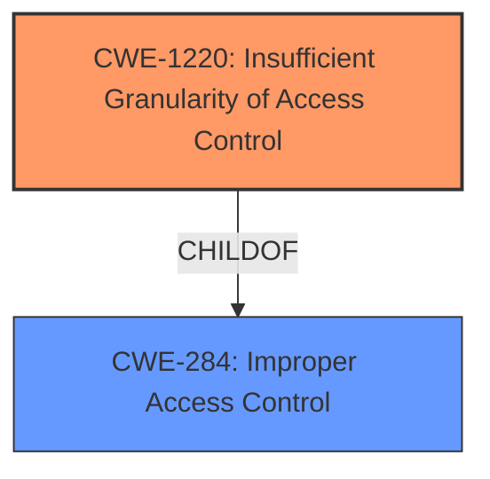

# Analysis Report for CVE-2022-21216

# Vulnerability Analysis Report: CVE-2022-21216

## Description


## Analysis (with Relationship Data)

# Summary
| CWE ID | CWE Name | Confidence | CWE Abstraction Level | CWE Vulnerability Mapping Label | CWE-Vulnerability Mapping Notes |
|---|---|---|---|---|---|
| CWE-1220 | Insufficient Granularity of Access Control | 1.0 | Base | Allowed | Primary CWE. Matches the root cause of the vulnerability. |
| CWE-284 | Improper Access Control | 0.6 | Pillar | Discouraged | Secondary CWE. A more general category that is less specific than CWE-1220. |

## Evidence and Confidence

*   **Confidence Score:** 1.0
*   **Evidence Strength:** HIGH

## Relationship Analysis
The primary CWE is CWE-1220, which is a Base level CWE. It has a ChildOf relationship to CWE-284, which is a Pillar level CWE. Since the vulnerability description clearly indicates **insufficient granularity of access control** as the root cause, CWE-1220 is the most appropriate choice. Choosing the more specific Base level CWE is preferred.



## Vulnerability Chain
The vulnerability chain starts with the **insufficient granularity of access control**, which then leads to a privileged user being able to escalate their privileges.

Root Cause: **Insufficient granularity of access control** (CWE-1220)
Impact: Escalation of Privilege

## Summary of Analysis
The vulnerability description clearly states that the root cause is the **insufficient granularity of access control** in the out-of-band management of some Intel processors. This aligns perfectly with the description of CWE-1220. The CVE Reference Links Content Summary reinforces this by explicitly stating "Insufficient granularity of access control in out-of-band management of certain Intel processors."
The retriever results also list CWE-1220 as the top candidate with a good similarity score.
CWE-284 was considered but it is a more general, Pillar level CWE. The MITRE mapping guidance discourages the use of CWE-284 when more specific CWEs are available. Therefore, CWE-1220 is the most appropriate and specific CWE to map to this vulnerability.

Relevant CWE Information:

# Enhanced Context (25 CWEs)

## CWE-1220: Insufficient Granularity of Access Control
**Abstraction:** Base
**Similarity Score**: 0.79
**Source**: dense

**Description**:
The product implements access controls via a policy or other feature with the intention to disable or restrict accesses (reads and/or writes) to assets in a system from untrusted agents. However, implemented access controls lack required granularity, which renders the control policy too broad because it allows accesses from unauthorized agents to the security-sensitive assets.

**Mapping Guidance**:
- Usage: Allowed
- Rationale: This CWE entry is at the Base level of abstraction, which is a preferred level of abstraction for mapping to the root causes of vulnerabilities.


## CWE Relationship Analysis

Current CWEs represent these abstraction levels: .


### Vulnerability Chain Analysis

**Chain starting from CWE-1220:**
- 1220 (Insufficient Granularity of Access Control) - ROOT


**Chain starting from CWE-284:**
- 284 (Improper Access Control) - ROOT


### CWE Relationship Diagram

```mermaid
graph TD
    classDef primary fill:#f96,stroke:#333,stroke-width:2px
    classDef secondary fill:#69f,stroke:#333
    classDef tertiary fill:#9e9,stroke:#333
```


*Report generated on 2025-03-30 19:13:56*
