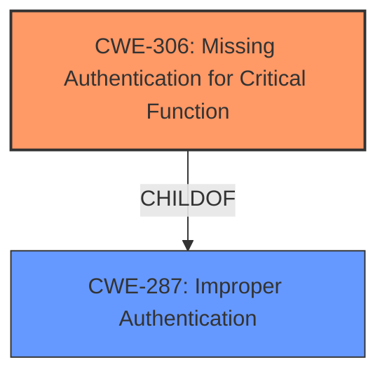

# Enhanced Analysis for CVE-2022-2141

# Summary
| CWE ID | CWE Name | Confidence | CWE Abstraction Level | CWE Vulnerability Mapping Label | CWE-Vulnerability Mapping Notes |
|---|---|---|---|---|---|
| CWE-306 | Missing Authentication for Critical Function | 1.0 | Base | Allowed | Primary CWE |
| CWE-287 | Improper Authentication | 0.7 | Class | Discouraged | Secondary Candidate |

## Evidence and Confidence

*   **Confidence Score:** 0.9
*   **Evidence Strength:** HIGH

## Relationship Analysis
The primary CWE selected is CWE-306 (Missing Authentication for Critical Function), which is a Base level CWE and a child of CWE-287 (Improper Authentication). CWE-287 is a Class level CWE and is discouraged for direct mapping, suggesting that CWE-306 is a more specific and appropriate choice. There are no relevant chain relationships to consider in this case.



## Vulnerability Chain
The chain of events is as follows:
1.  **Root Cause:** **Missing authentication** for SMS-based GPS commands.
2.  **Weakness:** The MiCODUS MV720 GPS tracker allows the execution of GPS commands without authentication.
3.  **Impact:** An attacker can control any MV720 GPS tracker, including access to location, routes, fuel cutoff commands, and the disarming of various features.

## Summary of Analysis
The initial analysis focused on identifying the root cause of the vulnerability. The vulnerability description clearly states that "SMS-based GPS commands can be executed by MiCODUS MV720 GPS tracker **without authentication**." The CVE Reference Links Content Summary reinforces this, stating "The vulnerability is caused by a **lack of authentication** for SMS-based GPS commands."

Based on this evidence, CWE-306 (Missing Authentication for Critical Function) was considered. Its description, "The product does not perform any authentication for functionality that requires a provable user identity or consumes a significant amount of resources," directly matches the vulnerability. The MITRE mapping guidance for CWE-306 indicates that its Usage is "Allowed" and its Abstraction Level is "Base," which is a preferred level of abstraction.

CWE-287 (Improper Authentication) was also considered, but its Usage is "Discouraged," with a suggestion to consider children like CWE-306. The relationship graph also confirms the child-parent relationship, solidifying the choice of CWE-306 as more specific.

The evidence strongly supports the selection of CWE-306 as the primary CWE. The vulnerability is a direct result of missing authentication, aligning perfectly with the CWE's definition.

Relevant CWE Information:

# Enhanced Context (25 CWEs)

## CWE-1392: Use of Default Credentials
**Abstraction Level**: Base
**Similarity Score**: 0.78
**Source**: dense

**Description**:
The product uses default credentials (such as passwords or cryptographic keys) for potentially critical functionality.

*This CWE was considered but does not fit the description because the device allows SMS commands without *any* authentication, not just with default credentials.*

## CWE-1391: Use of Weak Credentials
**Abstraction Level**: Class
**Similarity Score**: 0.78
**Source**: dense

**Description**:
The product uses weak credentials (such as a default key or hard-coded password) that can be calculated, derived, reused, or guessed by an attacker.

*This CWE was considered but does not fit the description because the device allows SMS commands without *any* authentication, not just with weak credentials.*

## CWE-1188: Initialization of a Resource with an Insecure Default
**Abstraction Level**: Base
**Similarity Score**: 0.77
**Source**: dense

**Description**:
The product initializes or sets a resource with a default that is intended to be changed by the administrator, but the default is not secure.

*This CWE was considered but does not fit the description because the device allows SMS commands without *any* authentication, so insecure defaults are not the root cause.*

## CWE-1393: Use of Default Password
**Abstraction Level**: Base
**Similarity Score**: 0.77
**Source**: dense

**Description**:
The product uses default passwords for potentially critical functionality.

*This CWE was considered but does not fit the description because the device allows SMS commands without *any* authentication, not just with default credentials.*

## CWE-807: Reliance on Untrusted Inputs in a Security Decision
**Abstraction Level**: Base
**Similarity Score**: 0.77
**Source**: dense

**Description**:
The product uses a protection mechanism that relies on the existence or values of an input, but the input can be modified by an untrusted actor in a way that bypasses the protection mechanism.

*This CWE was considered but does not fit the description because there is no protection mechanism in place at all.*

## CWE-798: Use of Hard-coded Credentials
**Abstraction Level**: Base
**Similarity Score**: 0.77
**Source**: dense

**Description**:
The product contains hard-coded credentials, such as a password or cryptographic key.

*This CWE was considered but does not fit the description because the device allows SMS commands without *any* authentication, not just with hardcoded credentials.*

## CWE-303: Incorrect Implementation of Authentication Algorithm
**Abstraction Level**: Base
**Similarity Score**: 0.77
**Source**: dense

**Description**:
The requirements for the product dictate the use of an established authentication algorithm, but the implementation of the algorithm is incorrect.

*This CWE was considered but does not fit the description because the device is missing authentication for critical functions, not an incorrect implementation.*

## CWE-345: Insufficient Verification of Data Authenticity
**Abstraction Level**: Class
**Similarity Score**: 0.76
**Source**: dense

**Description**:
The product does not sufficiently verify the origin or authenticity of data, in a way that causes it to accept invalid data.

*This CWE was considered but does not fit the description because there is no verification being done at all. It’s a missing check.*

## CWE-1390: Weak Authentication
**Abstraction Level**: Class
**Similarity Score**: 0.76
**Source**: dense

**Description**:
The product uses an authentication mechanism to restrict access to specific users or identities, but the mechanism does not sufficiently prove that the claimed identity is correct.

*This CWE was considered but does not fit the description because the device allows SMS commands without *any* authentication, not just weak authentication.*

## CWE-288: Authentication Bypass Using an Alternate Path or Channel
**Abstraction Level**: Base
**Similarity Score**: 0.75
**Source**: dense

**Description**:
The product requires authentication, but the product has an alternate path or channel that does not require authentication.

*This CWE was considered but does not fit the description because authentication is missing, not bypassed.*

## CWE-88: Improper Neutralization of Argument Delimiters in a Command ('Argument Injection')
**Abstraction Level**: Base
**Similarity Score**: 5802.48
**Source**: sparse

**Description**:
The product constructs a string for a command to be executed by a separate component
in another control sphere, but it does not properly delimit the
intended arguments, options, or switches within that command string.

*This CWE was considered but does not fit the description because the root cause is a missing authentication, not an argument injection.*

## CWE-184: Incomplete List of Disallowed Inputs
**Abstraction Level**: Base
**Similarity Score**: 5771.45
**Source**: sparse

**Description**:
The product implements a protection mechanism that relies on a list of inputs (or properties of inputs) that are not allowed by policy or otherwise require other action to neutralize before additional processing takes place, but the list is incomplete.

*This CWE was considered but does not fit the description because the root cause is a missing authentication, not an incomplete list of disallowed inputs.*

## CWE-22: Improper Limitation of a Pathname to a Restricted Directory ('Path Traversal')
**Abstraction Level**: Base
**Similarity Score**: 5492.38
**Source**: sparse

**Description**:
The product uses external input to construct a pathname that is intended to identify a file or directory that is located underneath a restricted parent directory, but the product does not properly neutralize special elements within the pathname that can cause the pathname to resolve to a location that is outside of the restricted directory.

*This CWE was considered but does not fit the description because the root cause is a missing authentication, not a path traversal.*

## CWE-116: Improper Encoding or Escaping of Output
**Abstraction Level**: Class
**Similarity Score**: 5473.17
**Source**: sparse

**Description**:
The product prepares a structured message for communication with another component


## CWE Relationship Analysis

Current CWEs represent these abstraction levels: .


### Vulnerability Chain Analysis

**Chain starting from CWE-1188:**
- 1188 (Initialization of a Resource with an Insecure Default) - ROOT


**Chain starting from CWE-303:**
- 303 (Incorrect Implementation of Authentication Algorithm) - ROOT


### CWE Relationship Diagram

```mermaid
graph TD
    classDef primary fill:#f96,stroke:#333,stroke-width:2px
    classDef secondary fill:#69f,stroke:#333
    classDef tertiary fill:#9e9,stroke:#333
```