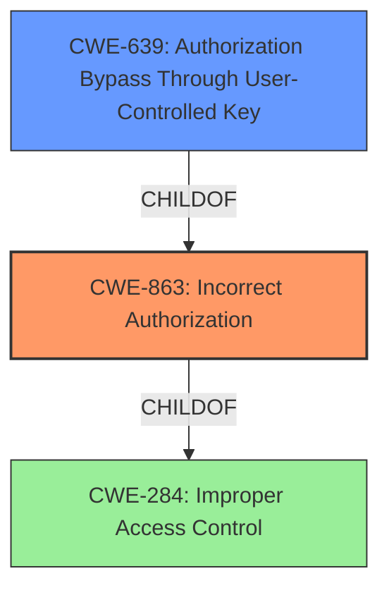

# Raw Analyzer Response for CVE-2022-2155

# Summary
| CWE ID | CWE Name | Confidence | CWE Abstraction Level | CWE Vulnerability Mapping Label | CWE-Vulnerability Mapping Notes |
|---|---|---|---|---|---|
| CWE-863 | Incorrect Authorization | 0.9 | Class | Primary | Allowed-with-Review |
| CWE-639 | Authorization Bypass Through User-Controlled Key | 0.7 | Base | Secondary | Allowed |

## Evidence and Confidence

*   **Confidence Score:** 0.8
*   **Evidence Strength:** HIGH

## Relationship Analysis
The primary CWE identified is CWE-863 (Incorrect Authorization), which is a Class-level CWE. CWE-639 (Authorization Bypass Through User-Controlled Key) is a Base-level CWE and a child of CWE-863, suggesting a more specific form of authorization failure. The vulnerability description explicitly states "**a flaw in access control mechanism implementation**" which means the program performs an authorization check, but it does not correctly perform the check. Therefore, the hierarchical relationship between CWE-863 and CWE-639 supports the selection of CWE-863 as the primary, with CWE-639 as a secondary.

## Vulnerability Chain
The vulnerability chain starts with **a flaw in access control mechanism implementation** (CWE-863), leading to the Limited Engineer role gaining unauthorized access to Power BI reports, and finally allowing manipulation of asset issue comments.

## Summary of Analysis
The initial analysis focused on the "**flaw in access control mechanism implementation**" mentioned in the vulnerability description. This directly points to a problem with authorization. The retriever results listed CWE-863 (Incorrect Authorization) as a strong candidate, along with CWE-639 (Authorization Bypass Through User-Controlled Key).

CWE-863 aligns well with the description as the application performs an authorization check, but it is **incorrect**. CWE-639 is a more specific case where the authorization bypass occurs through a user-controlled key. Since the description does not explicitly mention a user-controlled key, CWE-863 is selected as the primary CWE and CWE-639 is selected as the secondary CWE.

The selection of CWE-863 is further supported by the MITRE mapping guidance, which allows its usage with review, suggesting to examine its children for a better fit. However, since the description does not explicitly state that the key is user-controlled, CWE-863 remains the most appropriate primary mapping.

The evidence from the vulnerability description is clear: "**a flaw in access control mechanism implementation** on the Limited Engineer role, granting it access to the embedded Power BI reports feature." This indicates an authorization problem where the Limited Engineer role has been incorrectly granted access to resources they should not have.

Other CWEs considered but not used:

*   CWE-284 (Improper Access Control): This is a very high-level CWE (Pillar) and is discouraged, with a suggestion to use more specific descendants.
*   CWE-285 (Improper Authorization): Similar to CWE-863 but broader. CWE-863 is a child of CWE-285 and a more precise fit.
*   CWE-522 (Insufficiently Protected Credentials): This CWE relates to the protection of credentials, which is not the primary issue described in the vulnerability.
*   CWE-269 (Improper Privilege Management): This is a more general CWE, and the specific issue is with authorization, not general privilege management.
*   CWE-200 (Exposure of Sensitive Information to an Unauthorized Actor): This is an impact of the vulnerability, not the root cause. The root cause is the authorization issue that allows the exposure.
*   CWE-668 (Exposure of Resource to Wrong Sphere): This is a high-level CWE, and more specific CWEs are available.
*   CWE-306 (Missing Authentication for Critical Function): The vulnerability description states that there is an **access control mechanism implementation** and is not missing entirely.

Relevant CWE Information: