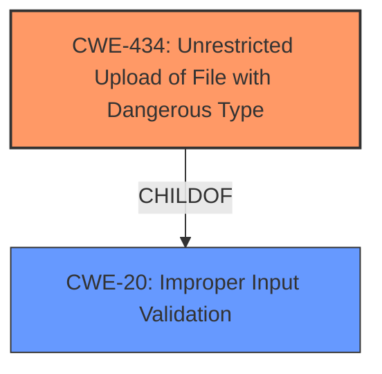

# Analysis for CVE-2022-21587

# Summary

| CWE ID | CWE Name | Confidence | CWE Abstraction Level | CWE Vulnerability Mapping Label | CWE-Vulnerability Mapping Notes |
|---|---|---|---|---|---|
| CWE-434 | Unrestricted Upload of File with Dangerous Type | 0.9 | Base | Allowed | Primary CWE |
| CWE-20 | Improper Input Validation | 0.6 | Class | Allowed | Secondary CWE |

## Evidence and Confidence

*   **Confidence Score:** 0.75
*   **Evidence Strength:** MEDIUM

## Relationship Analysis
The primary CWE is CWE-434, which falls under the broader category of CWE-20. While CWE-20 is a parent Class, CWE-434 provides more specific guidance for file upload vulnerabilities, aligning better with the provided evidence.

## Vulnerability Chain
The vulnerability chain starts with **improper input validation** (CWE-20) during file uploads, leading to an **unrestricted upload of a file with a dangerous type** (CWE-434), which could allow an attacker to upload malicious files, potentially leading to arbitrary code execution on the server, data breaches or denial of service attacks.

## Summary of Analysis
The analysis is primarily based on the CVE Reference Links Content Summary, which provides strong evidence for **"Improper input validation during file uploads"** and **"Unrestricted file upload"**. This suggests that the application **fails to properly validate the type of file being uploaded**, allowing an attacker to upload a **"malicious file"** with a **"dangerous type"**.

The vulnerability description itself mentions an **"easily exploitable vulnerability allows unauthenticated attacker with network access via HTTP to compromise Oracle Web Applications Desktop Integrator. Successful attacks of this vulnerability can result in takeover of Oracle Web Applications Desktop Integrator."** This aligns with the potential impact of unrestricted file uploads.

Given this evidence, CWE-434, *Unrestricted Upload of File with Dangerous Type*, is the most appropriate primary CWE. It directly addresses the core issue of the vulnerability, and it is a Base level CWE, which is preferable.

CWE-20, *Improper Input Validation*, is selected as a secondary CWE because the root cause involves **improper input validation**, which then leads to the unrestricted file upload.

Relevant CWE Information:

# Enhanced Context (25 CWEs)

## CWE-434: Unrestricted Upload of File with Dangerous Type
**Abstraction:** Base
**Status:** Draft

### Description
The product allows the attacker to upload or transfer files of dangerous types that can be automatically processed within the product's environment.

### Extended Description
This can result in arbitrary code execution by leveraging a feature intended to enable users to add functionality to a Web server.

### Alternative Terms
None

### Relationships
ChildOf -> CWE-916

### Mapping Guidance
**Usage:** Allowed
**Rationale:** This CWE entry is at the Base level of abstraction, which is a preferred level of abstraction for mapping to the root causes of vulnerabilities.
**Comments:** Carefully read both the name and description to ensure that this mapping is an appropriate fit. Do not try to 'force' a mapping to a lower-level Base/Variant simply to comply with this preferred level of abstraction.
**Reasons:**
- Acceptable-Use

### Observed Examples
- **CVE-2023-22515:** Confluence allows unauthenticated attackers to upload files with dangerous file extensions.
- **CVE-2023-22518:** Confluence allows unauthenticated attackers to upload files with dangerous file extensions.
- **CVE-2023-22516:** Confluence allows unauthenticated attackers to upload files with dangerous file extensions.

## CWE-20: Improper Input Validation
**Abstraction:** Class
**Status:** Draft

### Description
The product does not validate or incorrectly validates input.

### Extended Description
Without sufficient input validation, an attacker can supply malformed input resulting in unanticipated behavior. This behavior can compromise the reliability, security, or availability of the resource.

### Alternative Terms
None

### Relationships
ChildOf -> CWE-697

### Mapping Guidance
**Usage:** Allowed
**Rationale:** This CWE entry is at the Class level of abstraction, which is a broader category of errors.
**Comments:** This is a very broad category, and should only be used if a more specific cause cannot be identified.
**Reasons:**
- Acceptable-Use