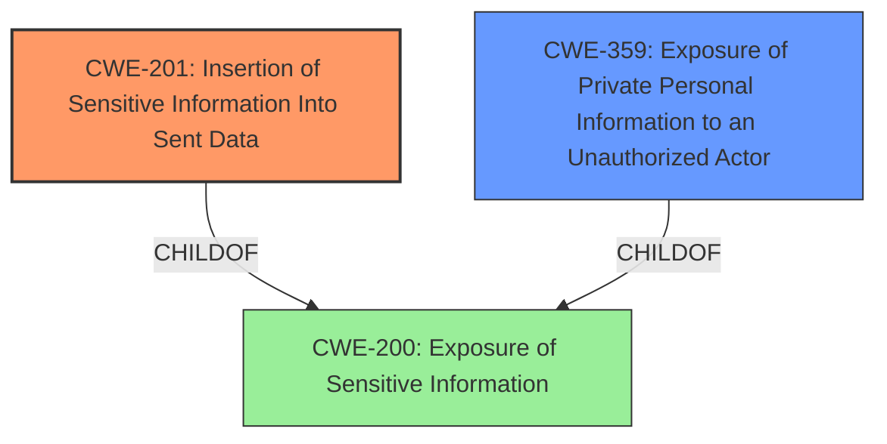

# Enhanced Analysis for CVE-2022-21642

# Summary
| CWE ID | CWE Name | Confidence | CWE Abstraction Level | CWE Vulnerability Mapping Label | CWE-Vulnerability Mapping Notes |
|---|---|---|---|---|---|
| CWE-201 | Insertion of Sensitive Information Into Sent Data | 0.9 | Base | Primary | Allowed |
| CWE-359 | Exposure of Private Personal Information to an Unauthorized Actor | 0.7 | Base | Secondary | Allowed |

## Evidence and Confidence

*   **Confidence Score:** 0.8
*   **Evidence Strength:** HIGH

## Relationship Analysis
The primary relationship that influenced the decision was the parent-child relationship between CWE-200 and both CWE-201 and CWE-359, as they all deal with information exposure. CWE-201 was chosen as the primary because it directly addresses the insertion of sensitive information into sent data. CWE-359 was considered as a secondary CWE because it highlights the exposure of private personal information, which is a specific type of sensitive information. The base abstraction level was preferred for both as it represents a concrete implementation weakness.



## Vulnerability Chain
The vulnerability chain starts with the **incorrect filtering** of user suggestions, leading to the **insertion of sensitive information** (whisper participants) into the message composition data, resulting in the **exposure of private personal information** to unauthorized actors.
  - Incorrect Filtering -> Insertion of Sensitive Information -> Exposure of Private Personal Information
  - The root cause is the failure to properly filter user suggestions.
  - The ultimate impact is the privacy violation of revealing whisper participants.

## Summary of Analysis
Based on the evidence provided, the primary weakness is the **insertion of sensitive information into sent data (CWE-201)** because the vulnerability involves the unintended inclusion of whisper participants in user suggestions during message composition. This directly aligns with the description of CWE-201, which states, "The code transmits data to another actor, but a portion of the data includes sensitive information that should not be accessible to that actor." The fact that the system reveals whisper participants, who are not intended to be visible to other participants, strongly supports this classification.

Supporting evidence:
- "when composing a message from topic the composer user suggestions reveals whisper participants"
- "The system was incorrectly including users who were participants in 'whisper' posts within the topic, even though these users were not meant to be revealed to other participants."

Additionally, the vulnerability can be classified as the **exposure of private personal information to an unauthorized actor (CWE-359)** because the whisper participants' identities are considered private information that is being exposed without authorization. While CWE-201 captures the direct mechanism of the vulnerability, CWE-359 highlights the privacy aspect and the nature of the information being leaked.

Supporting evidence:
- "The vulnerability stems from the user suggestion feature... The system was incorrectly including users who were participants in 'whisper' posts within the topic, even though these users were not meant to be revealed to other participants."
- "Privacy Violation: Attackers could use this vulnerability to identify users who have participated in 'whisper' conversations within a topic, potentially revealing sensitive information about their participation or relationship to the content of the whisper messages."

The selection of CWE-201 as the primary and CWE-359 as a secondary is based on the specificity of the descriptions. CWE-201 describes the direct action of inserting sensitive data into sent data, while CWE-359 focuses on the type of data being exposed. Both are at the Base level of abstraction, providing the most detailed representation of the vulnerability.

Other CWEs Considered:
- CWE-79 (Improper Neutralization of Input During Web Page Generation ('Cross-site Scripting')): This was considered but rejected because the vulnerability does not involve the injection of malicious script into a web page.
- CWE-863 (Incorrect Authorization): This was considered but rejected because the vulnerability is more about information exposure than authorization.
- CWE-226 (Sensitive Information in Resource Not Removed Before Reuse) and CWE-212 (Improper Removal of Sensitive Information Before Storage or Transfer): These were considered but did not fit as well as CWE-201 because the core issue is about sending the sensitive data, not the reuse or storage of it.

Relevant CWE Information:

# Enhanced Context (25 CWEs)
The following CWEs were identified as potentially relevant to this vulnerability:

## CWE-226: Sensitive Information in Resource Not Removed Before Reuse
**Abstraction Level**: Base
**Similarity Score**: 0.78
**Source**: dense

**Description**:
The product releases a resource such as memory or a file so that it can be made available for reuse, but it does not clear or "zeroize" the information contained in the resource before the product performs a critical state transition or makes the resource available for reuse by other entities.

**Mapping Guidance**:
- Usage: Allowed
- Rationale: This CWE entry is at the Base level of abstraction, which is a preferred level of abstraction for mapping to the root causes of vulnerabilities.


## CWE-212: Improper Removal of Sensitive Information Before Storage or Transfer
**Abstraction Level**: Base
**Similarity Score**: 0.77
**Source**: dense

**Description**:
The product stores, transfers, or shares a resource that contains sensitive information, but it does not properly remove that information before the product makes the resource available to unauthorized actors.

**Mapping Guidance**:
- Usage: Allowed
- Rationale: This CWE entry is at the Base level of abstraction, which is a preferred level of abstraction for mapping to the root causes of vulnerabilities.


## CWE-74: Improper Neutralization of Special Elements in Output Used by a Downstream Component ('Injection')
**Abstraction Level**: Class
**Similarity Score**: 0.77
**Source**: dense

**Description**:
The product constructs all or part of a command, data structure, or record using externally-influenced input from an upstream component, but it does not neutralize or incorrectly neutralizes special elements that could modify how it is parsed or interpreted when it is sent to a downstream component.

**Mapping Guidance**:
- Usage: Discouraged
- Rationale: CWE-74 is high-level and often misused when lower-level weaknesses are more appropriate.


## CWE-538: Insertion of Sensitive Information into Externally-Accessible File or Directory
**Abstraction Level**: Base
**Similarity Score**: 0.77
**Source**: dense

**Description**:
The product places sensitive information into files or directories that are accessible to actors who are allowed to have access to the files, but not to the sensitive information.

**Mapping Guidance**:
- Usage: Allowed
- Rationale: This CWE entry is at the Base level of abstraction, which is a preferred level of abstraction for mapping to the root causes of vulnerabilities.


## CWE-1289: Improper Validation of Unsafe Equivalence in Input
**Abstraction Level**: Base
**Similarity Score**: 0.77
**Source**: dense

**Description**:
The product receives an input value that is used as a resource identifier or other type of reference, but it does not validate or incorrectly validates that the input is equivalent to a potentially-unsafe value.

**Mapping Guidance**:
- Usage: Allowed
- Rationale: This CWE entry is at the Base level of abstraction, which is a preferred level of abstraction for mapping to the root causes of vulnerabilities.


## CWE-116: Improper Encoding or Escaping of Output
**Abstraction Level**: Class
**Similarity Score**: 0.77
**Source**: dense

**Description**:
The product prepares a structured message for communication with another component, but encoding or escaping of the data is either missing or done incorrectly. As a result, the intended structure of the message is not preserved.

**Mapping Guidance**:
- Usage: Allowed-with-Review
- Rationale: This CWE entry is a Class and might have Base-level children that would be more appropriate


## CWE-138: Improper Neutralization of Special Elements
**Abstraction Level**: Class
**Similarity Score**: 0.76
**Source**: dense

**Description**:
The product receives input from an upstream component, but it does not neutralize or incorrectly neutralizes special elements that could be interpreted as control elements or syntactic markers when they are sent to a downstream component.

**Mapping Guidance**:
- Usage: Discouraged
- Rationale: This CWE entry is a level-1 Class (i.e., a child of a Pillar). It might have lower-level children that would be more appropriate


## CWE-319: Cleartext Transmission of Sensitive Information
**Abstraction Level**: Base
**Similarity Score**:


## CWE Relationship Analysis

Current CWEs represent these abstraction levels: .


### Vulnerability Chain Analysis

**Chain starting from CWE-201:**
- 201 (Insertion of Sensitive Information Into Sent Data) - ROOT


**Chain starting from CWE-200:**
- 200 (Exposure of Sensitive Information to an Unauthorized Actor) - ROOT


### CWE Relationship Diagram

```mermaid
graph TD
    classDef primary fill:#f96,stroke:#333,stroke-width:2px
    classDef secondary fill:#69f,stroke:#333
    classDef tertiary fill:#9e9,stroke:#333
```