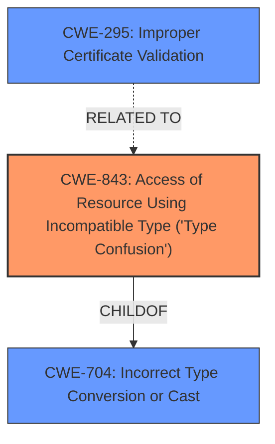

# Analysis Report for CVE-2022-21656

# Vulnerability Analysis Report: CVE-2022-21656

## Description


## Analysis (with Relationship Data)

# Summary
| CWE ID | CWE Name | Confidence | CWE Abstraction Level | CWE Vulnerability Mapping Label | CWE-Vulnerability Mapping Notes |
|---|---|---|---|---|---|
| CWE-843 | Access of Resource Using Incompatible Type ('Type Confusion') | 0.9 | Base | Allowed | Primary CWE |
| CWE-295 | Improper Certificate Validation | 0.6 | Base | Allowed | Secondary Candidate |

## Evidence and Confidence

*   **Confidence Score:** 0.8
*   **Evidence Strength:** HIGH

## Relationship Analysis
The primary relationship influencing the decision is the direct match of the vulnerability description to the CWE-843 description, indicating a **type confusion bug**. While CWE-295 (Improper Certificate Validation) is related because the **type confusion** leads to bypassing certificate validation, it is a consequence of the **type confusion**. CWE-843 is also related to CWE-704 (Incorrect Type Conversion or Cast), but the description is more specific to accessing a resource using an incompatible type.



## Vulnerability Chain
The chain starts with a **type confusion bug** (CWE-843) in the handling of subjectAltNames, which results in bypassing nameConstraints and ultimately leads to Envoy trusting upstream certificates that should not be trusted.

## Summary of Analysis
The primary assessment focuses on the **root cause**, which is the **type confusion** within the Envoy's certificate validation routines. The vulnerability description explicitly mentions a "**type confusion bug**". The CVE Reference Links Content Summary confirms this by stating, "The API for matching Subject Alternative Names (SAN) in X.509 certificates did not consider the SAN type."

The selection of CWE-843 is based on its direct relevance to the "**type confusion bug**" described in the vulnerability. The retriever results also list CWE-843 as the top match. Other CWEs like CWE-295 (Improper Certificate Validation) are related but represent the consequence rather than the root cause. Therefore, CWE-843 is at the optimal level of specificity for representing this vulnerability.

Relevant CWE Information:

# Enhanced Context (25 CWEs)

## CWE-843: Access of Resource Using Incompatible Type ('Type Confusion')
**Abstraction:** Base
**Status:** Incomplete

### Description
The product allocates or initializes a resource such as a pointer, object, or variable using one type, but it later accesses that resource using a type that is incompatible with the original type.

### Extended Description


When the product accesses the resource using an incompatible type, this could trigger logical errors because the resource does not have expected properties. In languages without memory safety, such as C and C++, type confusion can lead to out-of-bounds memory access.


While this weakness is frequently associated with unions when parsing data with many different embedded object types in C, it can be present in any application that can interpret the same variable or memory location in multiple ways.

### Mapping Guidance
**Usage:** Allowed
**Rationale:** This CWE entry is at the Base level of abstraction, which is a preferred level of abstraction for mapping to the root causes of vulnerabilities.

## CWE-295: Improper Certificate Validation
**Abstraction:** Base
**Status:** Draft

### Description
The product does not validate, or incorrectly validates, a certificate.

### Extended Description
When a certificate is invalid or malicious, it might allow an attacker to spoof a trusted entity by interfering in the communication path between the host and client. The product might connect to a malicious host while believing it is a trusted host, or the product might be deceived into accepting spoofed data that appears to originate from a trusted host.

### Mapping Guidance
**Usage:** Allowed
**Rationale:** This CWE entry is at the Base level of abstraction, which is a preferred level of abstraction for mapping to the root causes of vulnerabilities.

### Considered but not used:
- CWE-125: Out-of-bounds Read: While **type confusion** can lead to out-of-bounds reads, the primary issue here is the **type confusion** itself, not necessarily a direct out-of-bounds read.
- CWE-674: Uncontrolled Recursion: Not relevant to the vulnerability description.
- CWE-697: Incorrect Comparison: While there might be an incorrect comparison as a consequence, the **root cause** is the **type confusion**.
- CWE-599: Missing Validation of OpenSSL Certificate: The **type confusion** leads to bypassing validation, but the **root cause** isn't specifically missing validation, but rather, incorrect handling of types.
- CWE-822: Untrusted Pointer Dereference: Not directly related, as the issue isn't about untrusted pointer dereferencing.
- CWE-923: Improper Restriction of Communication Channel to Intended Endpoints: This is a higher-level issue and not as specific as the **type confusion** in certificate validation.
- CWE-327: Use of a Broken or Risky Cryptographic Algorithm: Not directly applicable as the vulnerability isn't about a broken algorithm, but a **type confusion** during certificate validation.
- CWE-789: Memory Allocation with Excessive Size Value: Not relevant to the vulnerability description.


## CWE Relationship Analysis

Current CWEs represent these abstraction levels: .


### Vulnerability Chain Analysis

**Chain starting from CWE-327:**
- 327 (Use of a Broken or Risky Cryptographic Algorithm) - ROOT


**Chain starting from CWE-599:**
- 599 (Missing Validation of OpenSSL Certificate) - ROOT


### CWE Relationship Diagram

```mermaid
graph TD
    classDef primary fill:#f96,stroke:#333,stroke-width:2px
    classDef secondary fill:#69f,stroke:#333
    classDef tertiary fill:#9e9,stroke:#333
```


*Report generated on 2025-03-31 04:20:48*
