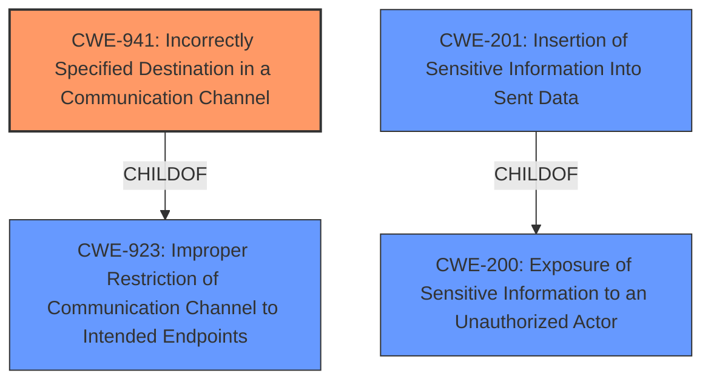

# Enhanced Analysis for CVE-2022-21671

# Summary
| CWE ID  | CWE Name                                                    | Confidence | CWE Abstraction Level | CWE Vulnerability Mapping Label | CWE-Vulnerability Mapping Notes |
| :-------- | :---------------------------------------------------------- | :--------- | :---------------------- | :------------------------------ | :------------------------------ |
| CWE-941 | Incorrectly Specified Destination in a Communication Channel | 0.95       | Base                    | Primary CWE                     | Allowed                       |
| CWE-201 | Insertion of Sensitive Information Into Sent Data           | 0.8        | Base                    | Secondary Candidate             | Allowed                       |

## Evidence and Confidence

*   **Confidence Score:** 0.9
*   **Evidence Strength:** HIGH

## Relationship Analysis
The primary CWE is CWE-941, which is a Base level CWE. It has a parent CWE of CWE-923 (Improper Restriction of Communication Channel to Intended Endpoints), which is a Class level CWE. CWE-201, the secondary CWE, is also a Base level CWE and a child of CWE-200. The selection of CWE-941 is influenced by its direct relevance to the **incorrectly specified destination** root cause. It can also be related to CWE-406 (Insufficiently Protected Resource), since the destination is not protected, but that is not the primary issue.



## Vulnerability Chain
The vulnerability chain starts with the **incorrectly specified destination** (CWE-941), which leads to **sensitive information** (the token) being **inserted into sent data** (CWE-201), ultimately resulting in the **full compromise of the Repl environment**.

## Summary of Analysis
The initial analysis strongly suggested CWE-941 as the primary weakness due to the outdated proxy URL. The vulnerability description and CVE reference content explicitly state that the library uses an outdated, potentially malicious polling proxy address. The token used to connect to a Replit environment is sent to this proxy, leading to potential compromise.

The analysis considered the retriever results and the complete CWE specifications. The top CWEs identified by the retriever were:
- CWE-941: Incorrectly Specified Destination in a Communication Channel
- CWE-201: Insertion of Sensitive Information Into Sent Data
- CWE-327: Use of a Broken or Risky Cryptographic Algorithm
- CWE-863: Incorrect Authorization
- CWE-200: Exposure of Sensitive Information to an Unauthorized Actor

CWE-941 was chosen as the primary CWE because the root cause of the vulnerability is the **incorrectly specified destination** of the communication channel. The `CVE Reference Links Content Summary` states that "The `@replit/crosis` library, when failing to establish a WebSocket connection, falls back to a poll-based proxy" and "The default URL for this proxy was outdated, potentially leading to connections to an external, attacker-controlled server instead of the intended Replit server." This directly aligns with the description of CWE-941, which states, "The product creates a communication channel to initiate an outgoing request to an actor, but it does not correctly specify the intended destination for that actor."

CWE-201 was selected as a secondary weakness because sensitive information (the token) is sent to the incorrect destination. The `CVE Reference Links Content Summary` mentions "The token used to connect to a Replit environment (Repl) is included in the connection string and sent to the polling proxy. Sending this token to an attacker-controlled server could result in a compromised Repl." This is an example of **insertion of sensitive information into sent data**.

CWE-200 was considered but ultimately not selected as the primary CWE. While the vulnerability does result in the exposure of sensitive information, the root cause is the **incorrectly specified destination**, making CWE-941 a more accurate classification of the underlying weakness. The mapping guidance for CWE-200 discourages its use as a catch-all for loss of confidentiality.

CWE-327 and CWE-863 were also considered but deemed less relevant. There is no indication that the cryptographic algorithms are broken or risky (CWE-327) or that the authorization checks are incorrect (CWE-863). The main issue is that the communication is being sent to the wrong destination.

The chosen CWEs are at the optimal level of specificity because they directly represent the root cause and a key contributing factor to the vulnerability. CWE-941 accurately describes the **incorrectly specified destination**, and CWE-201 captures the fact that **sensitive information** is being sent to that destination.


## CWE Relationship Analysis

Current CWEs represent these abstraction levels: .


### Vulnerability Chain Analysis

**Chain starting from CWE-201:**
- 201 (Insertion of Sensitive Information Into Sent Data) - ROOT


**Chain starting from CWE-200:**
- 200 (Exposure of Sensitive Information to an Unauthorized Actor) - ROOT


### CWE Relationship Diagram

```mermaid
graph TD
    classDef primary fill:#f96,stroke:#333,stroke-width:2px
    classDef secondary fill:#69f,stroke:#333
    classDef tertiary fill:#9e9,stroke:#333
```