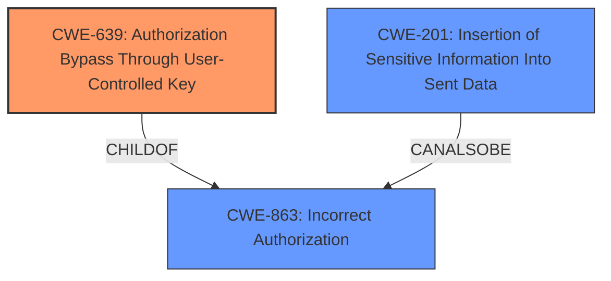

# Analysis for CVE-2022-21673

# Summary
| CWE ID  | CWE Name                                                                 | Confidence | CWE Abstraction Level | CWE Vulnerability Mapping Label | CWE-Vulnerability Mapping Notes |
| :-------- | :----------------------------------------------------------------------- | :--------- | :-------------------- | :------------------------------ | :------------------------------ |
| CWE-639   | Authorization Bypass Through User-Controlled Key                       | 0.9        | Base                  | Primary CWE                     | Allowed                       |
| CWE-863   | Incorrect Authorization                                                | 0.7        | Class                 | Secondary Candidate             | Allowed-with-Review           |
| CWE-201   | Insertion of Sensitive Information Into Sent Data                      | 0.6        | Base                  | Secondary Candidate             | Allowed                       |

## Evidence and Confidence

*   **Confidence Score:** 0.8
*   **Evidence Strength:** HIGH

## Relationship Analysis
The primary relationship that influenced the selection was the parent-child relationship between CWE-863 (Incorrect Authorization) and CWE-639 (Authorization Bypass Through User-Controlled Key). CWE-639 is a more specific case of incorrect authorization where the bypass occurs through manipulation of a user-controlled key. The description aligns well with this specific scenario. CWE-201 (Insertion of Sensitive Information Into Sent Data) is potentially related as the unauthorized data access could lead to sensitive information being sent where it shouldn't.

## Vulnerability Chain
The vulnerability chain starts with the **incorrect implementation of the Forward OAuth Identity feature**, leading to **authorization bypass** and ultimately the potential for **unauthorized data access.**

*   **Root Cause:** **Incorrect OAuth Identity Forwarding** due to the **Forward OAuth Identity feature** implementation flaw.
*   **Weakness:** **Authorization Bypass** - API token holders can access data they shouldn't.
*   **Impact:** **Unauthorized Data Access** - Sensitive information may be exposed.

## Summary of Analysis
The initial analysis identified several potential CWEs based on the description and retriever results. However, after carefully reviewing the details, relationship analysis, and mapping guidance, CWE-639 (Authorization Bypass Through User-Controlled Key) emerges as the most appropriate primary CWE.

The evidence supporting CWE-639 includes:

*   "sending a query to that datasource with an API token (and no other user credentials) will forward the OAuth Identity of the most recently logged-in user." This indicates a **user-controlled key (API token)** is used to access data.
*   "This can allow API token holders to retrieve data for which they may not have intended access." This confirms the **authorization bypass.**

CWE-863 (Incorrect Authorization) is a broader category, and while applicable, CWE-639 provides a more specific and accurate representation of the vulnerability. CWE-201 is a potential secondary weakness, since the end result of the vulnerability could be the exposure of sensitive information.

The selected CWEs are at the optimal level of specificity because they directly address the root cause and mechanism of the vulnerability, as evidenced by the vulnerability description and CVE reference summary.

Relevant CWE Information:

# Enhanced Context (25 CWEs)
The following CWEs were identified as potentially relevant to this vulnerability:

## CWE-668: Exposure of Resource to Wrong Sphere
**Abstraction Level**: Class
**Similarity Score**: 0.78
**Source**: dense

**Description**:
The product exposes a resource to the wrong control sphere, providing unintended actors with inappropriate access to the resource.

**Mapping Guidance**:
- Usage: Discouraged
- Rationale: CWE-668 is high-level and is often misused as a catch-all when lower-level CWE IDs might be applicable. It is sometimes used for low-information vulnerability reports [REF-1287]. It is a level-1 Class (i.e., a child of a Pillar). It is not useful for trend analysis.
*Not selected*: This is too high level a CWE.

## CWE-639: Authorization Bypass Through User-Controlled Key
**Abstraction Level**: Base
**Similarity Score**: 0.77
**Source**: dense

**Description**:
The system's authorization functionality does not prevent one user from gaining access to another user's data or record by modifying the key value identifying the data.

**Mapping Guidance**:
- Usage: Allowed
- Rationale: This CWE entry is at the Base level of abstraction, which is a preferred level of abstraction for mapping to the root causes of vulnerabilities.

*Selected as primary*

## CWE-1390: Weak Authentication
**Abstraction Level**: Class
**Similarity Score**: 0.76
**Source**: dense

**Description**:
The product uses an authentication mechanism to restrict access to specific users or identities, but the mechanism does not sufficiently prove that the claimed identity is correct.

**Mapping Guidance**:
- Usage: Allowed-with-Review
- Rationale: This CWE entry is a Class and might have Base-level children that would be more appropriate

*Not selected*: Authentication itself is not weak, the authentication is correct, but authorization is bypassed.

## CWE-41: Improper Resolution of Path Equivalence
**Abstraction Level**: Base
**Similarity Score**: 0.76
**Source**: dense

**Description**:
The product is vulnerable to file system contents disclosure through path equivalence. Path equivalence involves the use of special characters in file and directory names. The associated manipulations are intended to generate multiple names for the same object.

**Mapping Guidance**:
- Usage: Allowed
- Rationale: This CWE entry is at the Base level of abstraction, which is a preferred level of abstraction for mapping to the root causes of vulnerabilities.
*Not selected*: This is not related to file paths at all.

## CWE-212: Improper Removal of Sensitive Information Before Storage or Transfer
**Abstraction Level**: Base
**Similarity Score**: 0.76
**Source**: dense

**Description**:
The product stores, transfers, or shares a resource that contains sensitive information, but it does not properly remove that information before the product makes the resource available to unauthorized actors.

**Mapping Guidance**:
- Usage: Allowed
- Rationale: This CWE entry is at the Base level of abstraction, which is a preferred level of abstraction for mapping to the root causes of vulnerabilities.
*Not selected*: The root cause is not about sensitive information.

## CWE-807: Reliance on Untrusted Inputs in a Security Decision
**Abstraction Level**: Base
**Similarity Score**: 0.75
**Source**: dense

**Description**:
The product uses a protection mechanism that relies on the existence or values of an input, but the input can be modified by an untrusted actor in a way that bypasses the protection mechanism.

**Mapping Guidance**:
- Usage: Allowed
- Rationale: This CWE entry is at the Base level of abstraction, which is a preferred level of abstraction for mapping to the root causes of vulnerabilities.
*Not selected*: The main problem is authorization, not specifically the reliance on untrusted input.

## CWE-74: Improper Neutralization of Special Elements in Output Used by a Downstream Component ('Injection')
**Abstraction Level**: Class
**Similarity Score**: 0.75
**Source**: dense

**Description**:
The product constructs all or part of a command, data structure, or record using externally-influenced input from an upstream component, but it does not neutralize or incorrectly neutralizes special elements that could modify how it is parsed or interpreted when it is sent to a downstream component.

**Mapping Guidance**:
- Usage: Discouraged
- Rationale: CWE-74 is high-level and often misused when lower-level weaknesses are more appropriate.
*Not selected*: There's no indication of injection.

## CWE-23: Relative Path Traversal
**Abstraction Level**: Base
**Similarity Score**: 0.75
**Source**: dense

**Description**:
The product uses external input to construct a pathname that should be within a restricted directory, but it does not properly neutralize sequences such as ".." that can resolve to a location that is outside of that directory.

**Mapping Guidance**:
- Usage: Allowed
- Rationale: This CWE entry is at the Base level of abstraction, which is a preferred level of abstraction for mapping to the root causes of vulnerabilities.
*Not selected*: There is no path traversal.

## CWE-610: Externally Controlled Reference to a Resource in Another Sphere
**Abstraction Level**: Class
**Similarity Score**: 0.75
**Source**: dense

**Description**:
The product uses an externally controlled name or reference that resolves to a resource that is outside of the intended control sphere.

**Mapping Guidance