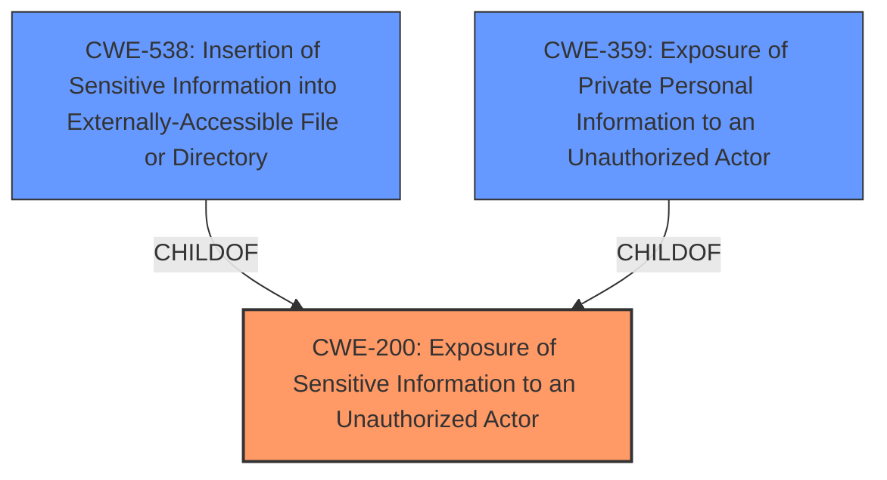

# Analysis for CVE-2022-21678

# Summary
| CWE ID | CWE Name | Confidence | CWE Abstraction Level | CWE Vulnerability Mapping Label | CWE-Vulnerability Mapping Notes |
|---|---|---|---|---|---|
| CWE-200 | Exposure of Sensitive Information to an Unauthorized Actor | 0.8 | Class | Primary | Allowed-with-Review |
| CWE-538 | Insertion of Sensitive Information into Externally-Accessible File or Directory | 0.7 | Base | Secondary | Allowed |
| CWE-359 | Exposure of Private Personal Information to an Unauthorized Actor | 0.6 | Base | Secondary | Allowed |

## Evidence and Confidence

*   **Confidence Score:** 0.8
*   **Evidence Strength:** HIGH

## Relationship Analysis
The primary CWE is CWE-200, which is a Class-level CWE. The analysis considered more specific Base-level CWEs that are children of CWE-200, such as CWE-538 and CWE-359. The final mapping includes CWE-200 as the primary weakness due to the general nature of the information exposure, supplemented by CWE-538 and CWE-359 to provide more specific context about the nature of the exposed information and its location.

## Vulnerability Chain
The vulnerability chain starts with the **weakness** of **information disclosure**. The user's bio, intended to be private, was inserted into the HTML meta tags, making it accessible to unauthorized actors. The chain consists of:

1.  **Root Cause:** Incorrect handling of profile visibility leading to unintentional insertion of sensitive information.
2.  **Weakness:** **Information disclosure** due to the bio being present in meta tags.
3.  **Impact:** Privacy breach and potential exposure of sensitive user data.

## Summary of Analysis
The initial analysis focused on **information disclosure**. The key evidence is that the bios of users who set their profiles to private were still visible in the `` tags on their user pages. This is a clear case of sensitive information being exposed to unauthorized actors. The primary CWE selected is CWE-200 **Exposure of Sensitive Information to an Unauthorized Actor**, a Class-level CWE. However, given the context, it is further refined by including CWE-538 **Insertion of Sensitive Information into Externally-Accessible File or Directory** and CWE-359 **Exposure of Private Personal Information to an Unauthorized Actor** to represent the specific type of information and its location. This multi-faceted approach provides a more accurate and detailed representation of the vulnerability.

The selection of CWE-200 as the primary CWE is influenced by the fact that the vulnerability results in sensitive information being exposed to an unauthorized actor. The "CVE Reference Links Content Summary" section confirms this, stating, "Sensitive user data (the bio) was leaked in the meta tags, which are accessible to anyone viewing the page source."

The choice of CWE-538 is supported by the fact that the sensitive information (user bios) was inserted into an externally accessible file (the HTML source code of the user page). This aligns with the description of CWE-538, which states, "The product places sensitive information into files or directories that are accessible to actors who are allowed to have access to the files, but not to the sensitive information."

The inclusion of CWE-359 is justified by the fact that the exposed information is private personal information (user bios). This is consistent with the description of CWE-359, which states, "The product does not properly prevent a person's private, personal information from being accessed by actors who either (1) are not explicitly authorized to access the information or (2) do not have the implicit consent of the person about whom the information is collected."

The chosen CWEs are at the optimal level of specificity because they accurately represent the nature of the **information disclosure** and the context in which it occurs. While CWE-200 is a more general Class-level CWE, the addition of CWE-538 and CWE-359 provides a more detailed and specific classification of the vulnerability.

Relevant CWE Information:

# Enhanced Context (25 CWEs)
The following CWEs were identified as potentially relevant to this vulnerability:

## CWE-538: Insertion of Sensitive Information into Externally-Accessible File or Directory
**Abstraction Level**: Base
**Similarity Score**: 0.79
**Source**: dense

**Description**:
The product places sensitive information into files or directories that are accessible to actors who are allowed to have access to the files, but not to the sensitive information.

**Mapping Guidance**:
- Usage: Allowed
- Rationale: This CWE entry is at the Base level of abstraction, which is a preferred level of abstraction for mapping to the root causes of vulnerabilities.

## CWE-497: Exposure of Sensitive System Information to an Unauthorized Control Sphere
**Abstraction Level**: Base
**Similarity Score**: 0.78
**Source**: dense

**Description**:
The product does not properly prevent sensitive system-level information from being accessed by unauthorized actors who do not have the same level of access to the underlying system as the product does.

**Mapping Guidance**:
- Usage: Allowed
- Rationale: This CWE entry is at the Base level of abstraction, which is a preferred level of abstraction for mapping to the root causes of vulnerabilities.

CWE-497 was not selected as the bio information is not "system-level".

## CWE-226: Sensitive Information in Resource Not Removed Before Reuse
**Abstraction Level**: Base
**Similarity Score**: 0.78
**Source**: dense

**Description**:
The product releases a resource such as memory or a file so that it can be made available for reuse, but it does not clear or "zeroize" the information contained in the resource before the product performs a critical state transition or makes the resource available for reuse by other entities.

**Mapping Guidance**:
- Usage: Allowed
- Rationale: This CWE entry is at the Base level of abstraction, which is a preferred level of abstraction for mapping to the root causes of vulnerabilities.

CWE-226 was not selected as the information was not related to a resource that was reused.

## CWE-668: Exposure of Resource to Wrong Sphere
**Abstraction Level**: Class
**Similarity Score**: 0.77
**Source**: dense

**Description**:
The product exposes a resource to the wrong control sphere, providing unintended actors with inappropriate access to the resource.

**Mapping Guidance**:
- Usage: Discouraged
- Rationale: CWE-668 is high-level and is often misused as a catch-all when lower-level CWE IDs might be applicable. It is sometimes used for low-information vulnerability reports [REF-1287]. It is a level-1 Class (i.e., a child of a Pillar). It is not useful for trend analysis.

CWE-668 was not selected due to its high-level nature and the availability of more specific CWEs.

## CWE-552: Files or Directories Accessible to External Parties
**Abstraction Level**: Base
**Similarity Score**: 0.77
**Source**: dense

**Description**:
The product makes files or directories accessible to unauthorized actors, even though they should not be.

**Mapping Guidance**:
- Usage: Allowed
- Rationale: This CWE entry is at the Base level of abstraction, which is a preferred level of abstraction for mapping to the root causes of vulnerabilities.

CWE-552 was not selected because it implies that the entire file or directory is accessible, whereas in this case, only specific information within the HTML file was exposed.

## CWE-212: Improper Removal of Sensitive Information Before Storage or Transfer
**Abstraction Level**: Base
**Similarity Score**: 0.77
**Source**: dense

**Description**:
The product stores, transfers, or shares a resource that contains sensitive information, but it does not properly remove that information before the product makes the resource available to unauthorized actors.

**Mapping Guidance**:
- Usage: Allowed
- Rationale: This CWE entry is at the Base level of abstraction, which is a preferred level of abstraction for mapping to the root causes of vulnerabilities.

CWE-212 was not selected as the root cause was an improper handling of profile visibility, not an improper removal of sensitive information.

## CWE-274: Improper Handling of Insufficient Privileges
**Abstraction Level**: Base
**Similarity Score**: 0.76
**Source**: dense

**Description**:
The product does not handle or incorrectly handles when it has insufficient privileges to perform an operation, leading to resultant weaknesses.

**Mapping Guidance**:
- Usage: