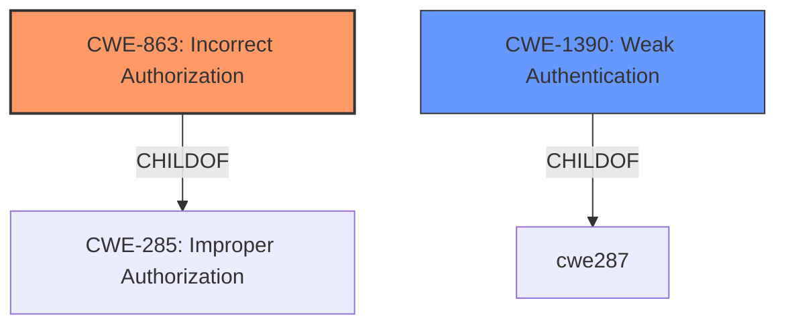

# Analysis for CVE-2022-21684

# Summary
| CWE ID    | CWE Name                                                                      | Confidence | CWE Abstraction Level | CWE Vulnerability Mapping Label | CWE-Vulnerability Mapping Notes |
| :--------- | :---------------------------------------------------------------------------- | :--------- | :-------------------- | :------------------------------ | :------------------------------ |
| CWE-863    | Incorrect Authorization                                                       | 0.9        | Class                 | Primary                         | Allowed-with-Review             |
| CWE-1390   | Weak Authentication                                                           | 0.7        | Class                 | Secondary                       | Allowed-with-Review             |

## Evidence and Confidence

*   **Confidence Score:** 0.8
*   **Evidence Strength:** HIGH

## Relationship Analysis

The primary relationship that influenced the decision was the parent-child relationship between CWE-285 (Improper Authorization), CWE-862 (Missing Authorization), and CWE-863 (Incorrect Authorization). While CWE-285 is too high-level and discouraged, CWE-862 and CWE-863 offer more specific classifications. The analysis leans towards CWE-863 because the vulnerability involves an authorization check that is performed but is **incorrect**, leading to the bypass. CWE-1390 (Weak Authentication) is considered as a related weakness, since it deals with authentication mechanisms that do not sufficiently prove the claimed identity.

## Vulnerability Chain

The vulnerability chain starts with the **incorrect** implementation of authorization logic. The sequence can be mapped as follows:

1.  **Incorrect Authorization** (CWE-863): The system performs an authorization check, but it's flawed. Specifically, the check `does not allow unapproved users to sign in`, yet users invited via email bypass this.
2.  **Bypass of User Approval:** The immediate impact is the bypass of the `must_approve_users` setting, allowing unapproved access.
3.  **Unauthorized Access:** Unapproved users gain access to the forum and can perform actions as approved users.

The root cause is the **incorrect** authorization, leading to the bypass and unauthorized access.

## Summary of Analysis

The initial assessment considered several CWEs, including CWE-285, CWE-862, CWE-863, and CWE-1390. The final decision to prioritize CWE-863 and include CWE-1390 is based on the evidence provided in the vulnerability description and CVE reference links.

The vulnerability description states that a user invited via email bypasses the check that `does not allow unapproved users to sign in`. This indicates that an authorization check is in place but is **incorrectly** implemented. The CVE reference link content summary confirms this by stating that the vulnerability was due to `the lack of a check that ensured that only approved users could be logged in upon invite acceptance.` This points directly to CWE-863 (Incorrect Authorization), which describes a scenario where the product performs an authorization check, but it's not done correctly.

CWE-1390 (Weak Authentication) is included as a secondary weakness because the bypass effectively weakens the authentication process, allowing users to access the system before proper approval.

The selected CWEs are at the optimal level of specificity because they accurately reflect the root cause and contributing factors to the vulnerability. CWE-863 captures the **incorrect** authorization logic, while CWE-1390 highlights the resulting weakening of the authentication process.

CWE-285 (Improper Authorization) was considered but not used because it is too high-level and the MITRE mapping guidance discourages its use when more specific CWEs are available. CWE-862 (Missing Authorization) was also considered but deemed less accurate because an authorization check was present but implemented incorrectly.

Relevant CWE Information:
CWE-863: Incorrect Authorization
CWE-1390: Weak Authentication
CWE-285: Improper Authorization
CWE-862: Missing Authorization