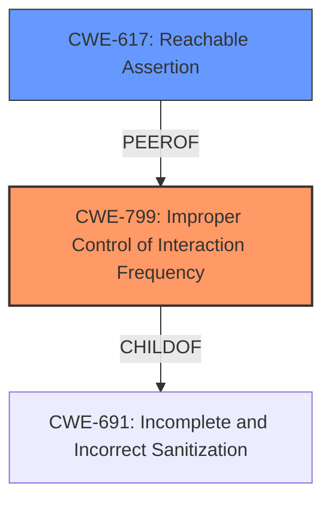

# Enhanced Analysis for CVE-2022-21689

# Summary
| CWE ID | CWE Name | Confidence | CWE Abstraction Level | CWE Vulnerability Mapping Label | CWE-Vulnerability Mapping Notes |
|---|---|---|---|---|---|
| **CWE-799** | Improper Control of Interaction Frequency | 0.9 | Class | Primary | Allowed-with-Review |
| CWE-617 | Reachable Assertion | 0.7 | Base | Secondary | Allowed |

## Evidence and Confidence

*   **Confidence Score:** 0.8
*   **Evidence Strength:** HIGH

## Relationship Analysis
The primary CWE selected is CWE-799 (Improper Control of Interaction Frequency), which is a Class-level CWE. While it is a Class-level CWE, there isn't a more specific Base-level CWE that perfectly captures the essence of the vulnerability. The vulnerability stems from the **limitation** of concurrent uploads, leading to a denial-of-service.

CWE-617 (Reachable Assertion) was also considered because the rate limiting logic leads to an error, but CWE-799 focuses more on the root cause of the **improper** frequency of interaction and thus it is the better option.



## Vulnerability Chain
The vulnerability chain starts with the **improper** rate limiting mechanism, which **limits** the creation of new upload directories to 100 per second. This rate limiting can be triggered by a simple script from an attacker. If more than 100 upload requests arrive in a single second, subsequent requests are blocked. This leads to a denial of service because legitimate users are not able to upload their files.

## Summary of Analysis
The initial assessment identified CWE-799 (Improper Control of Interaction Frequency) as the primary candidate due to the **weakness** in rate limiting concurrent uploads. This aligns with the vulnerability description highlighting the impact: blocking file uploads for others. The retriever results also support CWE-799 as the top candidate with a high score.

The decision is heavily based on the provided evidence, particularly the "Vulnerability Description Key Phrases" and "CVE Reference Links Content Summary." The "CVE Reference Links Content Summary" provides more information.

The selected CWEs are at the optimal level of specificity. CWE-799 captures the core issue of **improper** control of interaction frequency which leads to a denial of service.

Relevant CWE Information:

# Enhanced Context (25 CWEs)
The following CWEs were identified as potentially relevant to this vulnerability:

## CWE-617: Reachable Assertion
**Abstraction Level**: Base
**Similarity Score**: 0.79
**Source**: dense

**Description**:
The product contains an assert() or similar statement that can be triggered by an attacker, which leads to an application exit or other behavior that is more severe than necessary.

**Mapping Guidance**:
- Usage: Allowed
- Rationale: This CWE entry is at the Base level of abstraction, which is a preferred level of abstraction for mapping to the root causes of vulnerabilities.

CWE-617 was considered because the overly aggressive rate limiting of directory creation in the receive mode leads to an error, which could be considered an assertion. However, the primary issue is the **improper** rate of interaction.

## CWE-799: Improper Control of Interaction Frequency
**Abstraction Level**: Class
**Similarity Score**: 0.77
**Source**: dense

**Description**:
The product does not properly limit the number or frequency of interactions that it has with an actor, such as the number of incoming requests.

**Mapping Guidance**:
- Usage: Allowed-with-Review
- Rationale: This CWE entry is a Class and might have Base-level children that would be more appropriate

CWE-799 is the best match because the vulnerability stems from the **limitation** of concurrent uploads, leading to a denial-of-service.

## CWE-754: Improper Check for Unusual or Exceptional Conditions
**Abstraction Level**: Class
**Similarity Score**: 0.76
**Source**: dense

**Description**:
The product does not check or incorrectly checks for unusual or exceptional conditions that are not expected to occur frequently during day to day operation of the product.

CWE-754 was not selected since the rate limiting is the **weakness** rather than a check for unusual conditions.

## CWE-345: Insufficient Verification of Data Authenticity
**Abstraction Level**: Class
**Similarity Score**: 0.76
**Source**: dense

**Description**:
The product does not sufficiently verify the origin or authenticity of data, in a way that causes it to accept invalid data.

CWE-345 was not selected since it does not deal with data authenticity.

## CWE-703: Improper Check or Handling of Exceptional Conditions
**Abstraction Level**: Pillar
**Similarity Score**: 0.76
**Source**: dense

**Description**:
The product does not properly anticipate or handle exceptional conditions that rarely occur during normal operation of the product.

CWE-703 was not selected since it is too generic.

## CWE-668: Exposure of Resource to Wrong Sphere
**Abstraction Level**: Class
**Similarity Score**: 0.76
**Source**: dense

**Description**:
The product exposes a resource to the wrong control sphere, providing unintended actors with inappropriate access to the resource.

CWE-668 was not selected since there is no exposure of resource.

## CWE-807: Reliance on Untrusted Inputs in a Security Decision
**Abstraction Level**: Base
**Similarity Score**: 0.76
**Source**: dense

**Description**:
The product uses a protection mechanism that relies on the existence or values of an input, but the input can be modified by an untrusted actor in a way that bypasses the protection mechanism.

CWE-807 was not selected since this vulnerability does not deal with untrusted inputs.

## CWE-1289: Improper Validation of Unsafe Equivalence in Input
**Abstraction Level**: Base
**Similarity Score**: 0.76
**Source**: dense

**Description**:
The product receives an input value that is used as a resource identifier or other type of reference, but it does not validate or incorrectly validates that the input is equivalent to a potentially-unsafe value.

CWE-1289 was not selected since the product doesn't receive an input value as a resource identifier.

## CWE-252: Unchecked Return Value
**Abstraction Level**: Base
**Similarity Score**: 0.75
**Source**: dense

**Description**:
The product does not check the return value from a method or function, which can prevent it from detecting unexpected states and conditions.

CWE-252 was not selected since the product doesn't fail to check the return value from a method or function.

## CWE-41: Improper Resolution of Path Equivalence
**Abstraction Level**: Base
**Similarity Score**: 0.75
**Source**: dense

**Description**:
The product is vulnerable to file system contents disclosure through path equivalence. Path equivalence involves the use of special characters in file and directory names. The associated manipulations are intended to generate multiple names for the same object.

CWE-41 was not selected since there is no file system contents disclosure.

## CWE-799: Improper Control of Interaction Frequency
**Abstraction Level**: Class
**Similarity Score**: 6144.99
**Source**: sparse

**Description**:
The product does not properly limit the number or frequency of interactions that it has with an actor, such as the number of incoming requests.

## CWE-941: Incorrectly Specified Destination in a Communication Channel
**Abstraction Level**: Base
**Similarity Score**: 5913.84
**Source**: sparse

**Description**:
The product creates a communication channel to initiate an outgoing request to an actor, but it does not correctly specify the intended destination for that actor.

CWE-941 was not selected since the product does not specify incorrect destinations.

## CWE-923: Improper Restriction of Communication Channel to Intended Endpoints
**Abstraction Level**: Class
**Similarity Score**: 5903.40
**Source**: sparse

**Description**:
The product establishes a communication channel to (or from) an endpoint for privileged or protected operations, but it does not properly ensure that it is communicating with the correct endpoint.

CWE-923 was not selected since it does not deal with communication channel endpoint restrictions.

## CWE-327: Use of a Broken or Risky Cryptographic Algorithm
**Abstraction Level**: Class
**Similarity Score**: 5693.18
**Source**: sparse

**


## CWE Relationship Analysis

Current CWEs represent these abstraction levels: .


### Vulnerability Chain Analysis

**Chain starting from CWE-941:**
- 941 (Incorrectly Specified Destination in a Communication Channel) - ROOT


**Chain starting from CWE-327:**
- 327 (Use of a Broken or Risky Cryptographic Algorithm) - ROOT


### CWE Relationship Diagram

```mermaid
graph TD
    classDef primary fill:#f96,stroke:#333,stroke-width:2px
    classDef secondary fill:#69f,stroke:#333
    classDef tertiary fill:#9e9,stroke:#333
```