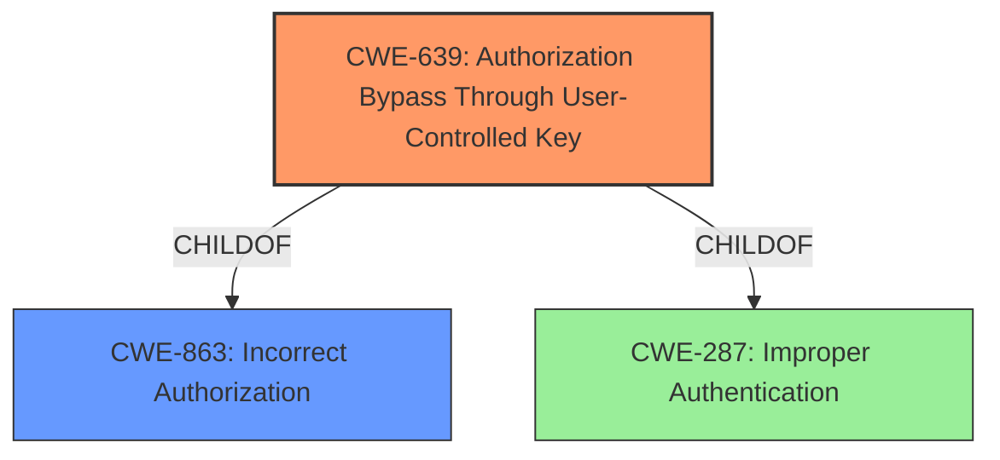

# Enhanced Analysis for CVE-2022-21695

# Summary
| CWE ID | CWE Name | Confidence | CWE Abstraction Level | CWE Vulnerability Mapping Label | CWE-Vulnerability Mapping Notes |
|---|---|---|---|---|---|
| CWE-639 | Authorization Bypass Through User-Controlled Key | 0.9 | Base | Allowed | Primary CWE |
| CWE-863 | Incorrect Authorization | 0.7 | Class | Allowed-with-Review | Secondary Candidate |
| CWE-287 | Improper Authentication | 0.6 | Class | Discouraged | Secondary Candidate |

## Evidence and Confidence

*   **Confidence Score:** 0.8
*   **Evidence Strength:** HIGH

## Relationship Analysis
The primary CWE selected is CWE-639, which is a base-level weakness and a child of CWE-863. CWE-863 represents a broader class of authorization issues. CWE-287 (Improper Authentication) is also related but less directly relevant as the vulnerability focuses more on bypassing authorization after authentication rather than the authentication process itself. The hierarchical relationship influenced the decision to prefer CWE-639 due to its greater specificity.



## Vulnerability Chain
The vulnerability chain starts with the **lack of proper access control** in the chat functionality. This allows users to bypass the intended join process, leading to **hidden participation** in the chat. The ability to participate without joining can then be exploited to **impersonate other users** and abuse other vulnerabilities (OTF-004). The root cause is the missing authorization check that ensures users are properly registered as chat participants before sending messages.

## Summary of Analysis
The initial analysis considered several CWEs, including CWE-799, CWE-201, CWE-287, and CWE-639. However, the core issue is that users can bypass authorization checks to send messages without being properly registered in the chat. The most accurate CWE is CWE-639 (Authorization Bypass Through User-Controlled Key), because the user is able to modify their state (being part of the chat) without proper authorization. The "CVE Reference Links Content Summary" section provides clear evidence: "The primary weakness is the **lack of proper access control** within the chat functionality. Users can bypass the intended join process and still interact with the chat, making their presence invisible to other participants."

The graph relationships show that CWE-639 is a child of CWE-863 (Incorrect Authorization), which is a broader category. However, CWE-639 is more specific because it involves bypassing authorization through a user-controlled key (in this case, the join state). This level of specificity makes CWE-639 the optimal choice. Other CWEs like CWE-287 (Improper Authentication) are less relevant because the vulnerability occurs after authentication.

Relevant CWE Information:

# Enhanced Context (25 CWEs)
The following CWEs were identified as potentially relevant to this vulnerability:

## CWE-639: Authorization Bypass Through User-Controlled Key
**Abstraction Level**: Base
**Similarity Score**: 0.77
**Source**: dense

**Description**:
The system's authorization functionality does not prevent one user from gaining access to another user's data or record by modifying the key value identifying the data.

**Mapping Guidance**:
- Usage: Allowed
- Rationale: This CWE entry is at the Base level of abstraction, which is a preferred level of abstraction for mapping to the root causes of vulnerabilities.

## CWE-863: Incorrect Authorization
**Abstraction Level**: Class
**Similarity Score**: 6804.11
**Source**: sparse

**Description**:
The product performs an authorization check when an actor attempts to access a resource or perform an action, but it does not correctly perform the check.

**Mapping Guidance**:
- Usage: Allowed-with-Review
- Rationale: This CWE entry is a Class and might have Base-level children that would be more appropriate

## CWE-287: Improper Authentication
**Abstraction Level**: Class
**Similarity Score**: 6695.75
**Source**: sparse

**Description**:
When an actor claims to have a given identity, the product does not prove or insufficiently proves that the claim is correct.

**Mapping Guidance**:
- Usage: Discouraged
- Rationale: This CWE entry might be misused when lower-level CWE entries are likely to be applicable. It is a level-1 Class (i.e., a child of a Pillar).

### CWE Considerations
*   **CWE-639 Authorization Bypass Through User-Controlled Key:**
    *   The user can bypass the join process and still send messages.
    *   This is a Base level CWE, aligning with the preferred level of abstraction.
    *   Confidence: 0.9
*   **CWE-863 Incorrect Authorization:**
    *   The system does not correctly check if the user has joined the chat before sending messages.
    *   This is a Class level CWE, so CWE-639 is more specific.
    *   Confidence: 0.7
*   **CWE-287 Improper Authentication:**
    *   This is less relevant as it focuses on the authentication process itself, not the authorization after authentication.
    *   Confidence: 0.6

### Other CWEs Considered but Not Used:
*   **CWE-799:** This focuses on interaction frequency, which is not the primary issue. The problem is not how often users interact, but that they can interact without proper authorization.
*   **CWE-201:** This involves insertion of sensitive information. While the messages themselves might contain sensitive information, the vulnerability isn't about exposing existing sensitive data but about bypassing authorization.
*   **CWE-79:** This focuses on Cross-Site Scripting, which is not relevant to the described vulnerability.
*   **CWE-613:** This focuses on insufficient session expiration, which isn't the core issue.
*   **CWE-494:** This is Download of Code Without Integrity Check, which is not relevant.


## CWE Relationship Analysis

Current CWEs represent these abstraction levels: .


### Vulnerability Chain Analysis

**Chain starting from CWE-201:**
- 201 (Insertion of Sensitive Information Into Sent Data) - ROOT


**Chain starting from CWE-799:**
- 799 (Improper Control of Interaction Frequency) - ROOT


### CWE Relationship Diagram

```mermaid
graph TD
    classDef primary fill:#f96,stroke:#333,stroke-width:2px
    classDef secondary fill:#69f,stroke:#333
    classDef tertiary fill:#9e9,stroke:#333
```