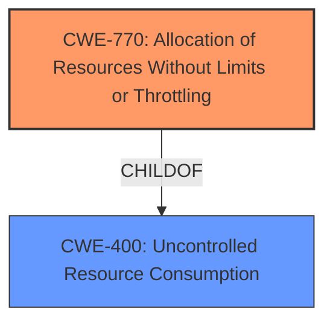

# Analysis for CVE-2022-21698

# Summary
| CWE ID  | CWE Name                                                                           | Confidence | CWE Abstraction Level | CWE Vulnerability Mapping Label | CWE-Vulnerability Mapping Notes |
| ------- | ---------------------------------------------------------------------------------- | ---------- | --------------------- | ------------------------------- | --------------------------------- |
| CWE-770 | Allocation of Resources Without Limits or Throttling                                | 0.9        | Base                  | Primary                         | Allowed                           |
| CWE-400 | Uncontrolled Resource Consumption                                                 | 0.7        | Class                 | Secondary                       | Discouraged                       |

## Evidence and Confidence

*   **Confidence Score:** 0.8
*   **Evidence Strength:** HIGH

## Relationship Analysis
The primary CWE selected is CWE-770 (Allocation of Resources Without Limits or Throttling), which is a Base level CWE. It is a child of CWE-400 (Uncontrolled Resource Consumption), a Class level CWE. The vulnerability involves **unbounded cardinality** leading to potential memory exhaustion, aligning with CWE-770's description. CWE-400 is a broader category, and while relevant, CWE-770 provides a more precise characterization of the weakness.

## Vulnerability Chain
The vulnerability chain starts with the **lack of limits or throttling** on resource allocation (CWE-770), leading to **uncontrolled resource consumption** (CWE-400), and finally resulting in a **denial of service** and **memory exhaustion**.

## Summary of Analysis
Initially, the vulnerability description indicates a **weakness** due to **unbounded cardinality** that leads to a denial of service and potential memory exhaustion. The vulnerability occurs when handling requests with non-standard HTTP methods. The `promhttp` package in `client_golang` is susceptible.

The CVE Reference Links Content Summary confirms this, stating, "HTTP server susceptible to a Denial of Service through **unbounded cardinality**, and potential memory exhaustion, when handling requests with non-standard HTTP methods." It lists CWE-400 in the weaknesses section.

Based on the Retriever Results, CWE-770 (Allocation of Resources Without Limits or Throttling) is the top match. The CWE description fits well: "The product allocates a reusable resource or group of resources on behalf of an actor without imposing any restrictions on the size or number of resources that can be allocated, in violation of the intended security policy for that actor." The vulnerability occurs because the `promhttp` package doesn't limit the cardinality of the metrics it tracks based on HTTP methods.

CWE-400 (Uncontrolled Resource Consumption) is also relevant but is a more general category. CWE-770 is more specific to the **allocation of resources without limits**, which aligns better with the **root cause**.

The mapping guidance for CWE-770 allows its usage and states that it "is at the Base level of abstraction, which is a preferred level of abstraction for mapping to the root causes of vulnerabilities."

Therefore, CWE-770 is the primary CWE, and CWE-400 is a secondary CWE, representing the broader impact.

CWEs considered but not used:

*   CWE-212: Improper Removal of Sensitive Information Before Storage or Transfer - This CWE is not applicable because the vulnerability is not about sensitive information leakage.
*   CWE-20: Improper Input Validation - While non-standard HTTP methods are a form of input, the core issue is the lack of resource management, not the validation of the methods themselves.
*   CWE-201: Insertion of Sensitive Information Into Sent Data - The vulnerability does not involve the insertion of sensitive information.
*   CWE-444: Inconsistent Interpretation of HTTP Requests ('HTTP Request/Response Smuggling') - This CWE is not applicable because the vulnerability is not about HTTP request/response smuggling.
*   CWE-226: Sensitive Information in Resource Not Removed Before Reuse - This CWE is not about removing sensitive data before reuse, but about resource exhaustion.
*   CWE-863: Incorrect Authorization - The vulnerability is not related to authorization.
*   CWE-502: Deserialization of Untrusted Data - Deserialization is not involved in this vulnerability.
*   CWE-22: Improper Limitation of a Pathname to a Restricted Directory ('Path Traversal') - The vulnerability is not related to path traversal.

Relevant CWE Information: