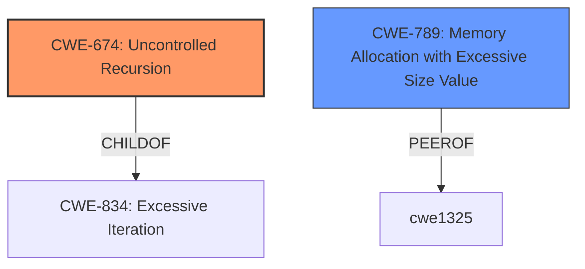

# Enhanced Analysis for CVE-2022-21708

# Summary
| CWE ID | CWE Name | Confidence | CWE Abstraction Level | CWE Vulnerability Mapping Label | CWE-Vulnerability Mapping Notes |
|---|---|---|---|---|---|
| CWE-674 | Uncontrolled Recursion | 0.9 | Class | Allowed-with-Review | Primary CWE |
| CWE-789 | Memory Allocation with Excessive Size Value | 0.7 | Variant | Allowed | Secondary Candidate |

## Evidence and Confidence

*   **Confidence Score:** 0.8
*   **Evidence Strength:** HIGH

## Relationship Analysis
The primary relationship influencing the selection was the ChildOf relationship between CWE-674 (Uncontrolled Recursion) and CWE-834 (Excessive Iteration). While the vulnerability description mentions "stack overflow", the root cause is the uncontrolled recursion, which leads to excessive resource consumption. CWE-789 (Memory Allocation with Excessive Size Value) was also considered due to the stack exhaustion aspect, and is a peer of CWE-1325.



## Vulnerability Chain
The vulnerability chain starts with a **bug in the library** that leads to **uncontrolled recursion** when processing specifically designed GraphQL queries. This **uncontrolled recursion** results in a **stack overflow**, ultimately causing a denial of service.

## Summary of Analysis
Initially, the "stack overflow" impact suggested CWE-121 (Stack-based Buffer Overflow). However, the root cause analysis points to uncontrolled recursion due to a **bug in the library** related to the `MaxDepth` schema option, especially fragment spreads. The `CVE Reference Links Content Summary` confirms the **incorrect depth calculation** and **lack of cycle detection**, leading to **unbounded recursion**. Therefore, CWE-674 (Uncontrolled Recursion) is the more appropriate primary CWE as the **bug** leads to uncontrolled recursion which results in a **stack overflow**.

CWE-789 (Memory Allocation with Excessive Size Value) was also considered because the stack overflow ultimately exhausts memory, but it's a secondary effect of the recursion. I am relying heavily on the `CVE Reference Links Content Summary` section.

Relevant CWE Information:

# Enhanced Context (25 CWEs)

## CWE-789: Memory Allocation with Excessive Size Value
**Abstraction Level**: Variant
**Similarity Score**: 0.78
**Source**: dense

**Description**:
The product allocates memory based on an untrusted, large size value, but it does not ensure that the size is within expected limits, allowing arbitrary amounts of memory to be allocated.

**Mapping Guidance**:
- Usage: Allowed
- Rationale: This CWE entry is at the Variant level of abstraction, which is a preferred level of abstraction for mapping to the root causes of vulnerabilities.

## CWE-674: Uncontrolled Recursion
**Abstraction Level**: Class
**Similarity Score**: 0.75
**Source**: dense

**Description**:
The product does not properly control the amount of recursion that takes place,  consuming excessive resources, such as allocated memory or the program stack.

**Mapping Guidance**:
- Usage: Allowed-with-Review
- Rationale: This CWE entry is a Class and might have Base-level children that would be more appropriate

### CWE Selection Details:

*   **CWE-674: Uncontrolled Recursion**
    *   **Explanation:** The core issue is the uncontrolled recursion caused by a **bug** in the library's depth validation logic. The description states "The product does not properly control the amount of recursion that takes place, consuming excessive resources, such as allocated memory or the program stack." The vulnerability details clearly indicate this uncontrolled recursion leads to stack exhaustion.
    *   **Security Implications:** Leads to denial of service due to stack exhaustion.
    *   **Relationships:** ChildOf CWE-834 (Excessive Iteration).
    *   **Mapping Guidance:** The mapping guidance suggests this is a Class and might have more appropriate Base-level children, but in this case, the root cause is the uncontrolled recursion itself, making this the most suitable choice.
    *   **Evidence:** "**bug in the library** that would allow an attacker with specifically designed queries to cause **stack overflow** panics". "This bug allows crafted GraphQL queries to bypass the intended maximum depth check, leading to stack overflow panics due to excessive recursion."
    *   **Confidence:** 0.9

*   **CWE-789: Memory Allocation with Excessive Size Value**
    *   **Explanation:** While the stack overflow does exhaust memory, the root cause is the uncontrolled recursion, not the allocation of excessive memory directly. This is a consequence of the uncontrolled recursion.
    *   **Security Implications:** Denial of service due to memory exhaustion.
    *   **Relationships:** ChildOf CWE-770 (Allocation of Resources Without Limits or Throttling).
    *   **Mapping Guidance:** Allowed.
    *   **Evidence:** "stack overflow panics".
    *   **Confidence:** 0.7

### CWEs Considered but Not Used:

*   **CWE-121: Stack-based Buffer Overflow:** The vulnerability results in a stack overflow, but the root cause isn't a typical buffer overflow scenario. It's the uncontrolled recursion that exhausts the stack.
*   **CWE-190: Integer Overflow or Wraparound:** Not applicable, as the vulnerability doesn't involve integer overflow issues.
*   **CWE-770: Allocation of Resources Without Limits or Throttling:** The vulnerability is more specifically about uncontrolled recursion rather than general resource allocation without limits.
*   **CWE-1333: Inefficient Regular Expression Complexity:** Not related to regular expression complexity.
*   **CWE-1284: Improper Validation of Specified Quantity in Input:** While depth limits aren't properly validated, the core issue is recursion, not just input validation.


## CWE Relationship Analysis

Current CWEs represent these abstraction levels: .


### Vulnerability Chain Analysis

**Chain starting from CWE-190:**
- 190 (Integer Overflow or Wraparound) - ROOT


**Chain starting from CWE-1325:**
- 1325 (Improperly Controlled Sequential Memory Allocation) - ROOT


### CWE Relationship Diagram

```mermaid
graph TD
    classDef primary fill:#f96,stroke:#333,stroke-width:2px
    classDef secondary fill:#69f,stroke:#333
    classDef tertiary fill:#9e9,stroke:#333
```