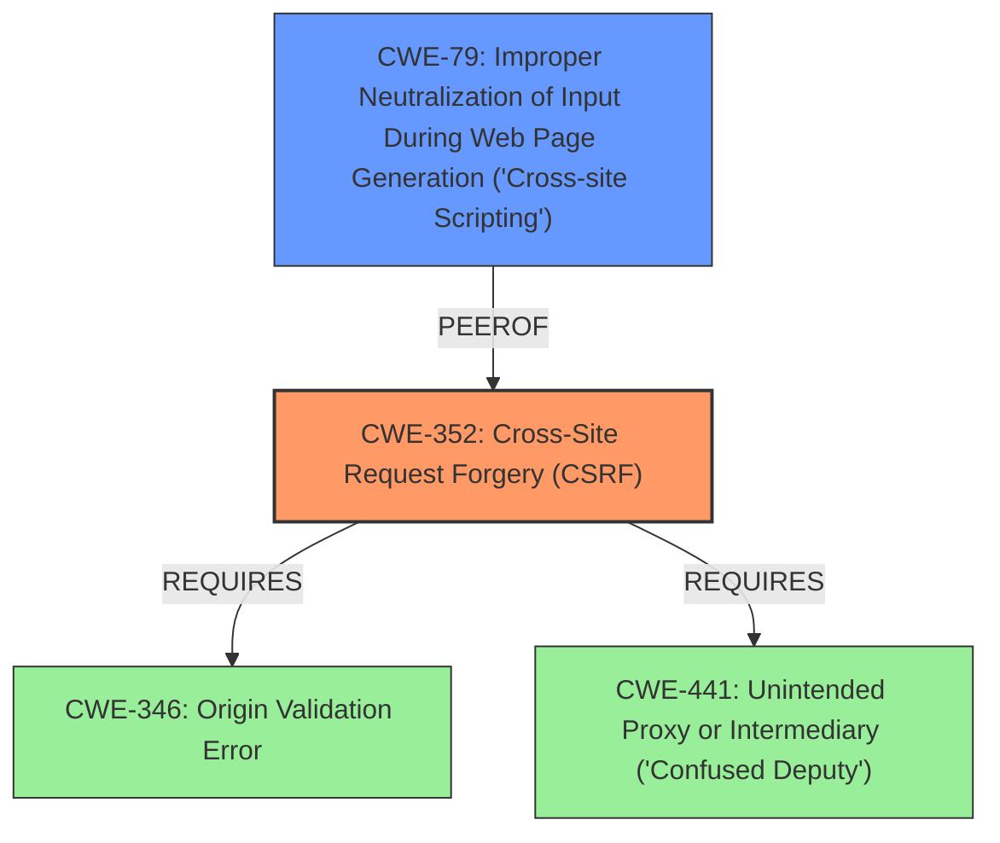

# Analysis for CVE-2022-2171

# Summary
| CWE ID | CWE Name | Confidence | CWE Abstraction Level | CWE Vulnerability Mapping Label | CWE-Vulnerability Mapping Notes |
|---|---|---|---|---|---|
| CWE-352 | Cross-Site Request Forgery (CSRF) | 1.0 | Compound | Primary | Allowed |
| CWE-79 | Improper Neutralization of Input During Web Page Generation ('Cross-site Scripting') | 1.0 | Base | Secondary | Allowed |

## Evidence and Confidence

*   **Confidence Score:** 1.0
*   **Evidence Strength:** HIGH

## Relationship Analysis
The primary weakness is the **lack of CSRF protection (CWE-352)**, which allows attackers to modify plugin settings. A secondary weakness is the **Stored XSS (CWE-79)** vulnerability due to allowing arbitrary HTML input in settings, exploitable through the CSRF vulnerability. CWE-352 is a Compound CWE, representing a combination of weaknesses, while CWE-79 is a Base CWE, indicating a specific type of input validation issue. There's a PeerOf relationship between CWE-79 and CWE-352, as XSS can be a consequence of CSRF. CWE-352 Requires CWE-346 (Origin Validation) and CWE-441 (Unintended Proxy or Intermediary), among others, highlighting the multiple aspects involved in preventing CSRF.

## Vulnerability Chain
The vulnerability chain starts with the **lack of CSRF protection (CWE-352)**, allowing an attacker to inject arbitrary HTML into plugin settings. This leads to a **Stored XSS vulnerability (CWE-79)**, where the injected HTML is rendered on the frontend, potentially leading to session hijacking, malware distribution, website defacement, or redirection to malicious sites.

## Summary of Analysis
The analysis indicates two distinct but related vulnerabilities: a **missing CSRF check (CWE-352)** and a **Stored XSS vulnerability (CWE-79)**.

The primary vulnerability is the **lack of CSRF protection**, as indicated by the vulnerability description key phrases: "**rootcause:** **lacking CSRF check**". The "CVE Reference Links Content Summary" also states: "**CSRF:** The absence of CSRF checks allows attackers to make unauthorized changes to the plugin settings on behalf of a logged-in administrator." This aligns perfectly with the description of CWE-352.

The second vulnerability is the **Stored XSS**, supported by the key phrases: "**weakness:** **cross-site scripting**" and "**vector:** arbitrary HTML". The "CVE Reference Links Content Summary" states: "**Stored XSS (Cross-Site Scripting):** The ability to inject arbitrary HTML into plugin settings allows attackers to inject malicious scripts." This directly corresponds to the description of CWE-79.

CWE-862 (Missing Authorization) was considered but not selected. While the **lack of CSRF** can be seen as a form of missing authorization, CWE-352 is a more specific and appropriate classification for this particular case, especially given the context of web application vulnerabilities. CWE-862 is also a Class level, so the Compound CWE-352 is a better match.

CWE-116 (Improper Encoding or Escaping of Output) was also considered for the XSS, but since the root cause is the allowance of arbitrary HTML input in the settings without proper CSRF protection, CWE-79 is more directly related to the vulnerability.

The selected CWEs are at the optimal level of specificity, with CWE-352 being a Compound weakness and CWE-79 being a Base weakness, both providing a clear and accurate representation of the vulnerabilities.