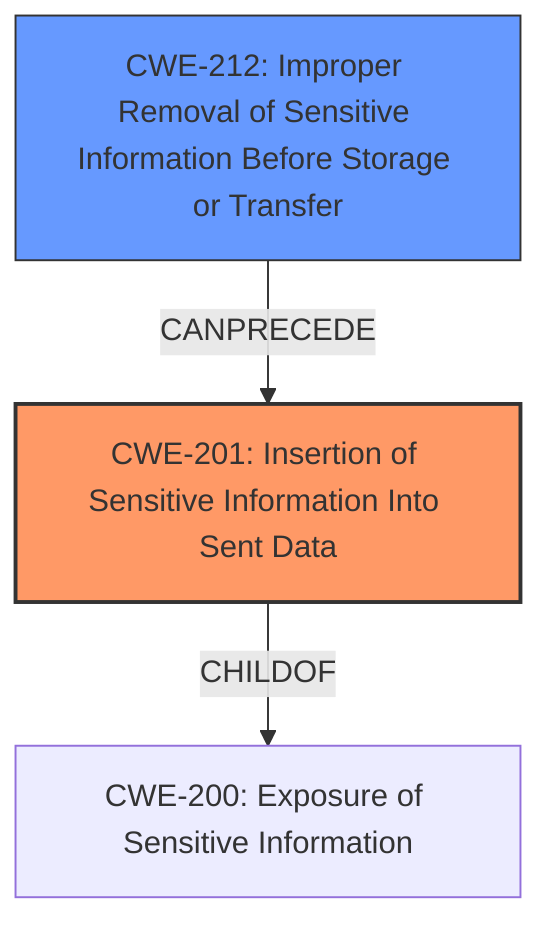

# Raw Analyzer Response for CVE-2022-21712

# Summary
| CWE ID | CWE Name | Confidence | CWE Abstraction Level | CWE Vulnerability Mapping Label | CWE-Vulnerability Mapping Notes |
|---|---|---|---|---|---|
| CWE-201 | Insertion of Sensitive Information Into Sent Data | 0.9 | Base | Primary | Allowed |
| CWE-212 | Improper Removal of Sensitive Information Before Storage or Transfer | 0.7 | Base | Secondary | Allowed |

## Evidence and Confidence

*   **Confidence Score:** 0.8
*   **Evidence Strength:** HIGH

## Relationship Analysis
The primary relationship that influenced the selection was the ChildOf relationship. CWE-201 is a Base level CWE, and it describes the insertion of sensitive information into sent data. CWE-212 describes the improper removal of sensitive data before storage or transfer and CAN PRECEDE CWE-201. These relationships show how information can be exposed.

## Vulnerability Chain
The vulnerability chain starts with the **exposing cookies and authorization headers when following cross-origin redirects** (CWE-201).

## Summary of Analysis
The initial assessment identified CWE-201 as the primary weakness, which is supported by the vulnerability description that twisted **exposes cookies and authorization headers when following cross-origin redirects**. This aligns directly with CWE-201's description: "The code transmits data to another actor, but a portion of the data includes sensitive information that should not be accessible to that actor." The evidence and retriever results strongly support this classification.

The vulnerability description key phrases also highlight the **weakness**: **exposes cookies and authorization headers when following cross-origin redirects**. The CVE Reference Links Content Summary confirms this, stating: "The core weakness is the leakage of sensitive HTTP headers (e.g., `Authorization`, `Cookie`) during cross-origin redirects."

The decision to use CWE-201 is further reinforced by its Base level of abstraction, making it specific enough to describe the vulnerability accurately.

CWE-212 was considered as a secondary weakness: "Improper Removal of Sensitive Information Before Storage or Transfer." While not the primary issue, the vulnerability involves a failure to remove sensitive headers before redirection, aligning with CWE-212. This is further supported by the relationship where CWE-212 CanPrecede CWE-201, indicating a potential sequence of weaknesses.

Based on the evidence, graph relationships, and mapping guidance, the selected CWEs are at the optimal level of specificity. The assessment is based on provided evidence only.

Relevant CWE Information:

# Enhanced Context (25 CWEs)
The following CWEs were identified as potentially relevant to this vulnerability:

## CWE-113: Improper Neutralization of CRLF Sequences in HTTP Headers ('HTTP Request/Response Splitting')
**Abstraction Level**: Variant
**Similarity Score**: 0.75
**Source**: dense

**Description**:
The product receives data from an HTTP agent/component (e.g., web server, proxy, browser, etc.), but it does not neutralize or incorrectly neutralizes CR and LF characters before the data is included in outgoing HTTP headers.

**Mapping Guidance**:
- Usage: Allowed
- Rationale: This CWE entry is at the Variant level of abstraction, which is a preferred level of abstraction for mapping to the root causes of vulnerabilities.

Analysis: Considered but not chosen because the vulnerability description doesn't refer to CRLF sequences.

## CWE-226: Sensitive Information in Resource Not Removed Before Reuse
**Abstraction Level**: Base
**Similarity Score**: 0.75
**Source**: dense

**Description**:
The product releases a resource such as memory or a file so that it can be made available for reuse, but it does not clear or "zeroize" the information contained in the resource before the product performs a critical state transition or makes the resource available for reuse by other entities.

**Mapping Guidance**:
- Usage: Allowed
- Rationale: This CWE entry is at the Base level of abstraction, which is a preferred level of abstraction for mapping to the root causes of vulnerabilities.

Analysis: Considered but not chosen because the vulnerability focuses on transmission, not reuse.

## CWE-668: Exposure of Resource to Wrong Sphere
**Abstraction Level**: Class
**Similarity Score**: 0.74
**Source**: dense

**Description**:
The product exposes a resource to the wrong control sphere, providing unintended actors with inappropriate access to the resource.

**Mapping Guidance**:
- Usage: Discouraged
- Rationale: CWE-668 is high-level and is often misused as a catch-all when lower-level CWE IDs might be applicable. It is sometimes used for low-information vulnerability reports [REF-1287]. It is a level-1 Class (i.e., a child of a Pillar). It is not useful for trend analysis.

Analysis: Considered but not chosen because it is too high-level.

## CWE-212: Improper Removal of Sensitive Information Before Storage or Transfer
**Abstraction Level**: Base
**Similarity Score**: 0.74
**Source**: dense

**Description**:
The product stores, transfers, or shares a resource that contains sensitive information, but it does not properly remove that information before the product makes the resource available to unauthorized actors.

**Mapping Guidance**:
- Usage: Allowed
- Rationale: This CWE entry is at the Base level of abstraction, which is a preferred level of abstraction for mapping to the root causes of vulnerabilities.

Analysis: Selected as secondary because it relates to not removing the headers, but it is not the primary issue.

## CWE-807: Reliance on Untrusted Inputs in a Security Decision
**Abstraction Level**: Base
**Similarity Score**: 0.74
**Source**: dense

**Description**:
The product uses a protection mechanism that relies on the existence or values of an input, but the input can be modified by an untrusted actor in a way that bypasses the protection mechanism.

**Mapping Guidance**:
- Usage: Allowed
- Rationale: This CWE entry is at the Base level of abstraction, which is a preferred level of abstraction for mapping to the root causes of vulnerabilities.

Analysis: Considered but not chosen because the vulnerability isn't directly about relying on untrusted inputs for security decisions.

## CWE-639: Authorization Bypass Through User-Controlled Key
**Abstraction Level**: Base
**Similarity Score**: 0.74
**Source**: dense

**Description**:
The system's authorization functionality does not prevent one user from gaining access to another user's data or record by modifying the key value identifying the data.

**Mapping Guidance**:
- Usage: Allowed
- Rationale: This CWE entry is at the Base level of abstraction, which is a preferred level of abstraction for mapping to the root causes of vulnerabilities.

Analysis: Considered but not chosen because the vulnerability is not about authorization bypass through user-controlled keys.

## CWE-41: Improper Resolution of Path Equivalence
**Abstraction Level**: Base
**Similarity Score**: 0.74
**Source**: dense

**Description**:
The product is vulnerable to file system contents disclosure through path equivalence. Path equivalence involves the use of special characters in file and directory names. The associated manipulations are intended to generate multiple names for the same object.

**Mapping Guidance**:
- Usage: Allowed
- Rationale: This CWE entry is at the Base level of abstraction, which is a preferred level of abstraction for mapping to the root causes of vulnerabilities.

Analysis: Considered but not chosen because the vulnerability is unrelated to path equivalence.

## CWE-1289: Improper Validation of Unsafe Equivalence in Input
**Abstraction Level**: Base
**Similarity Score**: 0.74
**Source**: dense

**Description**:
The product receives an input value that is used as a resource identifier or other type of reference, but it does not validate or incorrectly validates that the input is equivalent to a potentially-unsafe value.

**Mapping Guidance**:
- Usage: Allowed
- Rationale: This CWE entry is at the Base level of abstraction, which is a preferred level of abstraction for mapping to the root causes of vulnerabilities.

Analysis: Considered but not chosen because the vulnerability is not about validating unsafe equivalence in input.

## CWE-405: Asymmetric Resource Consumption (Amplification)
**Abstraction Level**: Class
**Similarity Score**: 0.74
**Source**: dense

**Description**:
The product does not properly control situations in which an adversary can cause the product to consume or produce excessive resources without requiring the adversary to invest equivalent work or otherwise prove authorization, i.e., the adversary's influence is "asymmetric."

**Mapping Guidance**:
- Usage: Allowed-with-Review
- Rationale: