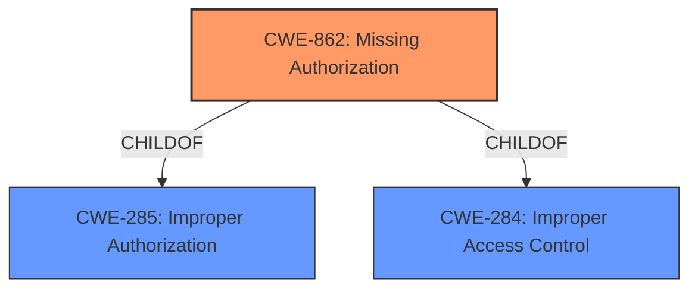

# Analysis for CVE-2022-21763

# Summary
| CWE ID | CWE Name | Confidence | CWE Abstraction Level | CWE Vulnerability Mapping Label | CWE-Vulnerability Mapping Notes |
|---|---|---|---|---|---|
| CWE-862 | Missing Authorization | 1.0 | Class | Primary | Allowed-with-Review |

## Evidence and Confidence

*   **Confidence Score:** 1.0
*   **Evidence Strength:** HIGH

## Relationship Analysis
The primary relationship that influenced the selection of CWE-862 is its parent-child relationship with CWE-285 and CWE-284, which represent broader categories of improper access control. While CWE-862 is a Class-level CWE, it is the most specific and appropriate choice given the available evidence pointing to a **missing permission check**.

## Vulnerability Chain
The chain of events in this vulnerability is straightforward:
1.  **Root Cause:** **Missing permission check** (CWE-862)
2.  **Impact:** Information disclosure

## Summary of Analysis
The analysis strongly supports the selection of CWE-862 (**Missing Authorization**) as the primary CWE for this vulnerability.

The vulnerability description clearly states a "**missing permission check**" as the root cause, which directly aligns with the definition of CWE-862. The impact of this **missing check** is local information disclosure.

The "Vulnerability Description Key Phrases" section reinforces this by explicitly identifying "**missing permission check**" as the root cause.

The "CVE Reference Links Content Summary" also highlights the "**Root cause of vulnerability: Missing permission check** in the telecom service" and "**Weaknesses/vulnerabilities present: Improper access control (CWE-284)**. The vulnerability lies in the **lack of proper permission verification**, allowing unauthorized access."

The retriever results also list CWE-862 as the top candidate. While it is a Class-level CWE, the mapping guidance suggests examining its children for a better fit, but none of the children are more appropriate given the available information.

Therefore, based on the clear evidence and alignment with the CWE definition, CWE-862 is the most accurate and specific classification for this vulnerability.

Relevant CWE Information:
*   **CWE-862: Missing Authorization:** This CWE accurately captures the essence of the vulnerability, which stems from the product's failure to perform an authorization check when an actor attempts to access a resource or perform an action. The "**missing permission check**" directly translates to **missing authorization**.

Other CWEs Considered and Rejected:

*   CWE-927 (**Use of Implicit Intent for Sensitive Communication**): While the vulnerability involves information disclosure, there is no mention of implicit intents being used.
*   CWE-665 (**Improper Initialization**) and CWE-908 (**Use of Uninitialized Resource**): The root cause isn't related to initialization, but rather a **missing permission check**.
*   CWE-514 (**Covert Channel**) and CWE-205 (**Observable Behavioral Discrepancy**): The vulnerability doesn't involve covert channels or behavioral discrepancies, but rather a direct **lack of authorization**.
*   CWE-213 (**Exposure of Sensitive Information Due to Incompatible Policies**): While information disclosure is the impact, the root cause is not due to incompatible policies but rather a **missing permission check**.
*   CWE-362 (**Concurrent Execution using Shared Resource with Improper Synchronization ('Race Condition')**) and CWE-667 (**Improper Locking**): The vulnerability doesn't seem to be related to concurrent execution or locking issues.
*   CWE-1021 (**Improper Restriction of Rendered UI Layers or Frames**): This CWE is related to clickjacking vulnerabilities and is not applicable here.