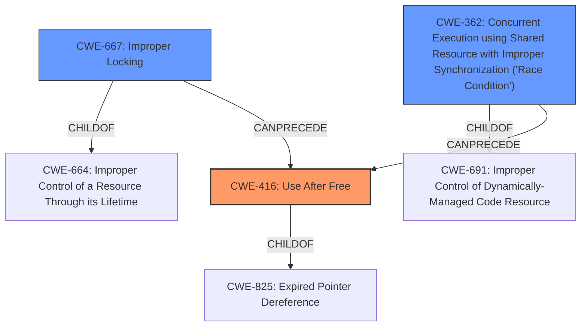

# Analysis Report for CVE-2022-21775

# Vulnerability Analysis Report: CVE-2022-21775

## Description


## Analysis (with Relationship Data)

# Summary
| CWE ID | CWE Name | Confidence | CWE Abstraction Level | CWE Vulnerability Mapping Label | CWE-Vulnerability Mapping Notes |
|---|---|---|---|---|---|
| **CWE-416** | **Use After Free** | 1 | Variant | Primary | Allowed |
| CWE-667 | Improper Locking | 0.7 | Class | Secondary | Allowed-with-Review |
| CWE-362 | Concurrent Execution using Shared Resource with Improper Synchronization ('Race Condition') | 0.6 | Class | Secondary | Allowed-with-Review |

## Evidence and Confidence

*   **Confidence Score:** 0.8
*   **Evidence Strength:** HIGH

## Relationship Analysis
The primary weakness is **CWE-416 (Use After Free)**, which is a variant-level CWE and directly matches the vulnerability description. **CWE-416** is a child of **CWE-825 (Expired Pointer Dereference)** and **CWE-672 (Operation on a Resource after Expiration)**. The vulnerability also involves **improper locking**, suggesting a race condition leading to the **use-after-free**, therefore **CWE-667 (Improper Locking)** and **CWE-362 (Concurrent Execution using Shared Resource with Improper Synchronization ('Race Condition'))** are also relevant.



## Vulnerability Chain
The vulnerability chain starts with **improper locking (CWE-667)**, which leads to a **race condition (CWE-362)**, and finally results in a **use-after-free (CWE-416)** condition. The **use-after-free** then allows for local escalation of privilege.

## Summary of Analysis
The initial assessment identified the **use-after-free** as the primary issue. The retriever results pointed to **CWE-667 (Improper Locking)**, **CWE-362 (Concurrent Execution using Shared Resource with Improper Synchronization ('Race Condition'))**, and **CWE-416 (Use After Free)** as potential matches. The evidence from the vulnerability description and the CVE reference summary supports the **use-after-free** condition due to **improper locking**. The relationship analysis shows that **CWE-416** is a variant and the most specific match for the core issue, while **CWE-667** and **CWE-362** explain how the **use-after-free** condition was reached.

The selection of **CWE-416** is at the optimal level of specificity because it directly describes the **use-after-free** condition.

Relevant CWE Information:

# Enhanced Context (25 CWEs)

## CWE-667: Improper Locking
**Abstraction Level**: Class
**Similarity Score**: 0.79
**Source**: dense

**Description**:
The product does not properly acquire or release a lock on a resource, leading to unexpected resource state changes and behaviors.

**Mapping Guidance**:
- Usage: Allowed-with-Review
- Rationale: This CWE entry is a Class and might have Base-level children that would be more appropriate

## CWE-416: Use After Free
**Abstraction Level**: Variant
**Similarity Score**: 0.79
**Source**: dense

**Description**:
The product reuses or references memory after it has been freed. At some point afterward, the memory may be allocated again and saved in another pointer, while the original pointer references a location somewhere within the new allocation. Any operations using the original pointer are no longer valid because the memory "belongs" to the code that operates on the new pointer.

**Mapping Guidance**:
- Usage: Allowed
- Rationale: This CWE entry is at the Variant level of abstraction, which is a preferred level of abstraction for mapping to the root causes of vulnerabilities.

## CWE-362: Concurrent Execution using Shared Resource with Improper Synchronization ('Race Condition')
**Abstraction Level**: Class
**Similarity Score**: 0.79
**Source**: dense

**Description**:
The product contains a concurrent code sequence that requires temporary, exclusive access to a shared resource, but a timing window exists in which the shared resource can be modified by another code sequence operating concurrently.

**Mapping Guidance**:
- Usage: Allowed-with-Review
- Rationale: This CWE entry is a Class and might have Base-level children that would be more appropriate

## CWE-416: Use After Free
**Abstraction Level**: variant
**Similarity Score**: 4.33
**Source**: graph

**Description**:
CWE-416: Use After Free

**Mapping Guidance**:
- Usage: Allowed
- Rationale: This CWE entry is at the Variant level of abstraction, which is a preferred level of abstraction for mapping to the root causes of vulnerabilities.

**Relationships**:
- CANFOLLOW -> CWE-754
- CANFOLLOW -> CWE-364
- CANFOLLOW -> CWE-362
- CANFOLLOW -> CWE-1265
- CANPRECEDE -> CWE-123

## CWE-416: Use After Free
**Abstraction Level**: Variant
**Similarity Score**: 0.79
**Source**: dense

**Description**:
The product reuses or references memory after it has been freed. At some point afterward, the memory may be allocated again and saved in another pointer, while the original pointer references a location somewhere within the new allocation. Any operations using the original pointer are no longer valid because the memory "belongs" to the code that operates on the new pointer.

**Mapping Guidance**:
- Usage: Allowed
- Rationale: This CWE entry is at the Variant level of abstraction, which is a preferred level of abstraction for mapping to the root causes of vulnerabilities.


## CWE Relationship Analysis

Current CWEs represent these abstraction levels: .


### Vulnerability Chain Analysis

**Chain starting from CWE-825:**
- 825 (Expired Pointer Dereference) - ROOT


**Chain starting from CWE-672:**
- 672 (Operation on a Resource after Expiration or Release) - ROOT


### CWE Relationship Diagram

```mermaid
graph TD
    classDef primary fill:#f96,stroke:#333,stroke-width:2px
    classDef secondary fill:#69f,stroke:#333
    classDef tertiary fill:#9e9,stroke:#333
```


*Report generated on 2025-03-30 15:24:41*
