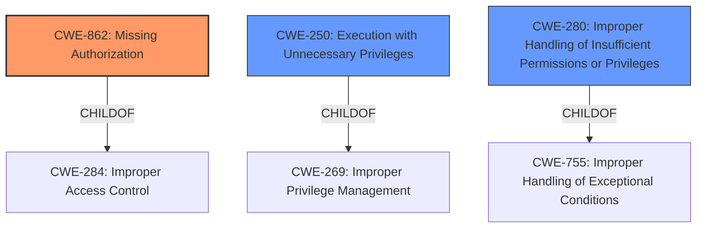

# Raw Analyzer Response for CVE-2022-21777

# Summary
| CWE ID | CWE Name | Confidence | CWE Abstraction Level | CWE Vulnerability Mapping Label | CWE-Vulnerability Mapping Notes |
|---|---|---|---|---|---|
| CWE-862 | Missing Authorization | 1.0 | Class | Allowed-with-Review | Primary CWE |
| CWE-250 | Execution with Unnecessary Privileges | 0.7 | Base | Allowed | Secondary Candidate |
| CWE-280 | Improper Handling of Insufficient Permissions or Privileges  | 0.6 | Base | Allowed | Secondary Candidate |

## Evidence and Confidence

*   **Confidence Score:** 0.9
*   **Evidence Strength:** HIGH

## Relationship Analysis
The primary relationship that influenced the CWE selection was the hierarchical relationship between CWE-862 (Missing Authorization), a Class-level CWE, and its potential Base-level children. However, the vulnerability description is explicit about the **missing permission check**, making CWE-862 the most appropriate choice, as more specific information is not available.

## Vulnerability Chain
The vulnerability chain starts with a **missing permission check** (CWE-862), which leads to a permission bypass and a local escalation of privilege.

## Summary of Analysis
The initial analysis focused on identifying the root cause of the vulnerability, which is the **missing permission check**. The primary CWE match is CWE-862 (Missing Authorization), which directly addresses this root cause. The evidence from the vulnerability description key phrases and CVE reference links content summary supports this selection.

The vulnerability description states: "In Autoboot, there is a possible permission bypass due to a **missing permission check**. This could lead to local escalation of privilege with no additional execution privileges needed." The CVE Reference Links Content Summary reinforces this: "Root cause of vulnerability: **Missing permission check** in Autoboot...Weaknesses/vulnerabilities present: Improper access control (CWE-284). Permission bypass...Impact of exploitation: Local escalation of privilege."

CWE-862 is a Class-level CWE, and the mapping guidance suggests examining children of this entry for a better fit. However, the provided information doesn't offer enough detail to map to a more specific child CWE.

CWE-250 (Execution with Unnecessary Privileges) and CWE-280 (Improper Handling of Insufficient Permissions or Privileges) were considered as secondary CWEs. CWE-250 could be relevant if Autoboot executes with unnecessary privileges, exacerbating the impact of the **missing permission check**. CWE-280 could be relevant if the application doesn't properly handle scenarios where it lacks necessary permissions.

The final decision is based on the explicit evidence of a **missing permission check**, making CWE-862 the most appropriate primary CWE.

Relevant CWE Information:

# Enhanced Context (25 CWEs)

## CWE-131: Incorrect Calculation of Buffer Size
**Abstraction Level**: Base
**Similarity Score**: 0.80
**Source**: dense

**Description**:
The product does not correctly calculate the size to be used when allocating a buffer, which could lead to a buffer overflow.

**Mapping Guidance**:
- Usage: Allowed
- Rationale: This CWE entry is at the Base level of abstraction, which is a preferred level of abstraction for mapping to the root causes of vulnerabilities.

*Not Used:* This CWE is not relevant as the vulnerability is related to a **missing permission check** and not buffer size calculation.

## CWE-667: Improper Locking
**Abstraction Level**: Class
**Similarity Score**: 0.78
**Source**: dense

**Description**:
The product does not properly acquire or release a lock on a resource, leading to unexpected resource state changes and behaviors.

**Mapping Guidance**:
- Usage: Allowed-with-Review
- Rationale: This CWE entry is a Class and might have Base-level children that would be more appropriate

*Not Used:* This CWE is not relevant as the vulnerability is related to a **missing permission check** and not locking mechanisms.

## CWE-682: Incorrect Calculation
**Abstraction Level**: Pillar
**Similarity Score**: 0.78
**Source**: dense

**Description**:
The product performs a calculation that generates incorrect or unintended results that are later used in security-critical decisions or resource management.

**Mapping Guidance**:
- Usage: Discouraged
- Rationale: This CWE entry is extremely high-level, a Pillar. In many cases, lower-level children or descendants are more appropriate. However, sometimes this weakness is forced to be used due to the lack of in-depth weakness research. See Research Gaps.

*Not Used:* This CWE is too abstract and does not directly relate to the **missing permission check**.

## CWE-191: Integer Underflow (Wrap or Wraparound)
**Abstraction Level**: Base
**Similarity Score**: 0.78
**Source**: dense

**Description**:
The product subtracts one value from another, such that the result is less than the minimum allowable integer value, which produces a value that is not equal to the correct result.

**Mapping Guidance**:
- Usage: Allowed
- Rationale: This CWE entry is at the Base level of abstraction, which is a preferred level of abstraction for mapping to the root causes of vulnerabilities.

*Not Used:* This CWE is not relevant as the vulnerability is related to a **missing permission check** and not integer underflow.

## CWE-362: Concurrent Execution using Shared Resource with Improper Synchronization ('Race Condition')
**Abstraction Level**: Class
**Similarity Score**: 0.77
**Source**: dense

**Description**:
The product contains a concurrent code sequence that requires temporary, exclusive access to a shared resource, but a timing window exists in which the shared resource can be modified by another code sequence operating concurrently.

**Mapping Guidance**:
- Usage: Allowed-with-Review
- Rationale: This CWE entry is a Class and might have Base-level children that would be more appropriate

*Not Used:* This CWE is not relevant as the vulnerability is related to a **missing permission check** and not race conditions.

## CWE-805: Buffer Access with Incorrect Length Value
**Abstraction Level**: Base
**Similarity Score**: 0.77
**Source**: dense

**Description**:
The product uses a sequential operation to read or write a buffer, but it uses an incorrect length value that causes it to access memory that is outside of the bounds of the buffer.

**Mapping Guidance**:
- Usage: Allowed
- Rationale: This CWE entry is at the Base level of abstraction, which is a preferred level of abstraction for mapping to the root causes of vulnerabilities.

*Not Used:* This CWE is not relevant as the vulnerability is related to a **missing permission check** and not buffer access.

## CWE-404: Improper Resource Shutdown or Release
**Abstraction Level**: Class
**Similarity Score**: 0.77
**Source**: dense

**Description**:
The product does not release or incorrectly releases a resource before it is made available for re-use.

**Mapping Guidance**:
- Usage: Allowed-with-Review
- Rationale: This CWE entry is a Class and might have Base-level children that would be more appropriate

*Not Used:* This CWE is not relevant as the vulnerability is related to a **missing permission check** and not resource management.

## CWE-681: Incorrect Conversion between Numeric Types
**Abstraction Level**: Base
**Similarity Score**: 0.76
**Source**: dense

**Description**:
When converting from one data type to another, such as long to integer, data can be omitted or translated in a way that produces unexpected values. If the resulting values are used in a sensitive context, then dangerous behaviors may occur.

**Mapping Guidance**:
- Usage: Allowed
- Rationale: This CWE entry is at the Base level of abstraction, which is a preferred level of abstraction for mapping to the root causes of vulnerabilities.

*Not Used:* This CWE is not relevant as the vulnerability is related to a **missing permission check** and not numeric type conversion.

## CWE-754: Improper Check for Unusual or Exceptional Conditions
**Abstraction Level**: Class
**Similarity Score**: 0.76
**Source**: dense

**Description**:
The product does not check or incorrectly checks for unusual or exceptional conditions that are not expected to occur frequently during day to day operation of the product.

**Mapping Guidance**:
- Usage: Allowed-with-Review