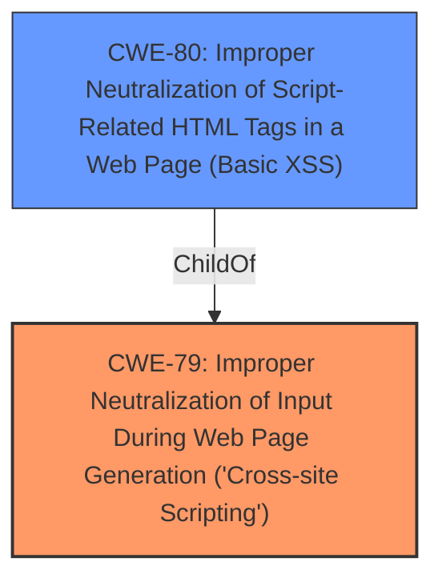

# Raw Analyzer Response for CVE-2022-2178

# Summary
| CWE ID | CWE Name | Confidence | CWE Abstraction Level | CWE Vulnerability Mapping Label | CWE-Vulnerability Mapping Notes |
|---|---|---|---|---|---|
| CWE-79 | Improper Neutralization of Input During Web Page Generation ('Cross-site Scripting') | 1.0 | Base | Primary | Allowed |
| CWE-80 | Improper Neutralization of Script-Related HTML Tags in a Web Page (Basic XSS) | 0.7 | Variant | Secondary | Allowed |

## Evidence and Confidence

*   **Confidence Score:** 0.9
*   **Evidence Strength:** HIGH

## Relationship Analysis
The primary CWE is CWE-79, which represents the base class of Cross-Site Scripting. CWE-80, a variant of CWE-79, focuses on improper neutralization of script-related HTML tags. The vulnerability description explicitly mentions "Cross-site Scripting (XSS)" and "**improper input neutralization**", aligning directly with CWE-79. The description doesn't provide enough specific detail to definitively say the XSS is specifically related to script-related HTML tags, but it is possible. Therefore, CWE-80 is a reasonable, but less confident, secondary classification.

## Vulnerability Chain
The vulnerability chain starts with the **improper neutralization** of user-supplied input. This **weakness** leads to the possibility of injecting malicious scripts into web pages served to other users, resulting in Cross-Site Scripting.

## Summary of Analysis
The initial analysis correctly identifies CWE-79 as the primary weakness due to the explicit mention of Cross-Site Scripting and **improper input neutralization** in the vulnerability description. The retriever results also support this classification, with CWE-79 having the highest relevance score.

The selection of CWE-79 is based on the following evidence from the vulnerability description:

*   "Improper Neutralization of Input During Web Page Generation (Cross-site Scripting) vulnerability..."
*   "**rootcause: improper input neutralization**"
*   "**weakness: cross-site scripting**"

The graph relationships influenced the decision to include CWE-80 as a secondary candidate. While the description does not explicitly mention HTML tags, the possibility exists, making CWE-80 a plausible, albeit less certain, classification.

The selected CWEs are at the optimal level of specificity. CWE-79 represents the general class of XSS vulnerabilities, while CWE-80 offers a more specific variant related to HTML tags. Since the evidence does not definitively point to HTML tags, CWE-79 remains the primary classification.

Relevant CWE Information:

# Enhanced Context (25 CWEs)
The following CWEs were identified as potentially relevant to this vulnerability:

## CWE-80: Improper Neutralization of Script-Related HTML Tags in a Web Page (Basic XSS)
**Abstraction Level**: Variant
**Similarity Score**: 0.82
**Source**: dense

**Description**:
The product receives input from an upstream component, but it does not neutralize or incorrectly neutralizes special characters such as "<", ">", and "&" that could be interpreted as web-scripting elements when they are sent to a downstream component that processes web pages.

**Mapping Guidance**:
- Usage: Allowed
- Rationale: This CWE entry is at the Variant level of abstraction, which is a preferred level of abstraction for mapping to the root causes of vulnerabilities.

## CWE-79: Improper Neutralization of Input During Web Page Generation ('Cross-site Scripting')
**Abstraction Level**: Base
**Similarity Score**: 7567.82
**Source**: sparse

**Description**:
The product does not neutralize or incorrectly neutralizes user-controllable input before it is placed in output that is used as a web page that is served to other users.

**Mapping Guidance**:
- Usage: Allowed
- Rationale: This CWE entry is at the Base level of abstraction, which is a preferred level of abstraction for mapping to the root causes of vulnerabilities.