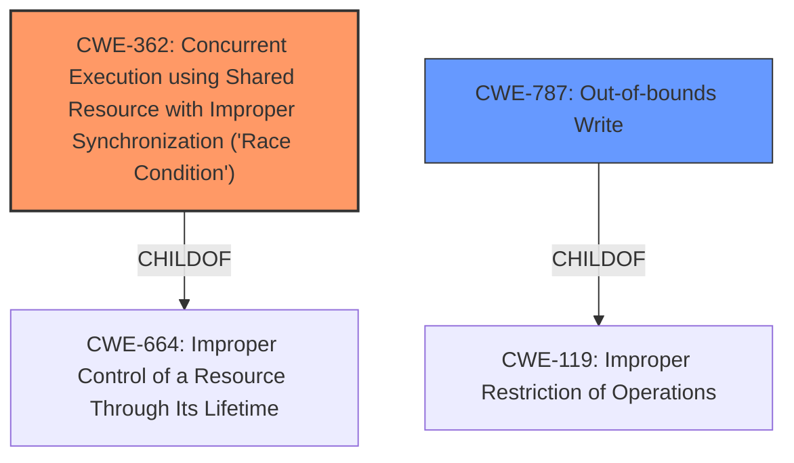

# Analysis Report for CVE-2022-21789

# Vulnerability Analysis Report: CVE-2022-21789

## Description


## Analysis (with Relationship Data)

# Summary
| CWE ID  | CWE Name                                                                                                                                | Confidence | CWE Abstraction Level | CWE Vulnerability Mapping Label | CWE-Vulnerability Mapping Notes |
| :-------- | :--------------------------------------------------------------------------------------------------------------------------------------- | :---------- | :---------------------- | :------------------------------ | :------------------------------ |
| CWE-362   | Concurrent Execution using Shared Resource with Improper Synchronization ('**Race Condition**')                                           | 0.85       | Class                   | Primary                         | Allowed-with-Review           |
| CWE-787 | Out-of-bounds Write                                                                                                                                | 0.75       | Base                   | Secondary                         | Allowed           |

## Evidence and Confidence

*   **Confidence Score:** 0.80
*   **Evidence Strength:** HIGH

## Relationship Analysis
The primary relationship influencing the CWE selection is the parent-child relationship where CWE-362 is a Class-level CWE, and several Base-level CWEs, like CWE-367 (Time-of-check Time-of-use **(TOCTOU) Race Condition**), are children. CWE-787 is included due to **memory corruption** being described, and is a child of CWE-119 (Improper Restriction of Operations within the Bounds of a Memory Buffer). The "Top CWEs" section also indicates CWE-787, CWE-125 and CWE-416 as frequent matches.



## Vulnerability Chain
The vulnerability chain starts with a **race condition** (CWE-362), which then leads to **memory corruption** (CWE-787), culminating in local escalation of privilege.

## Summary of Analysis
Initially, CWE-787 (Out-of-bounds Write) was considered based on the description mentioning "**memory corruption**". However, the key phrase also mentions "**race condition**" and the description in the CVE Reference Links Content Summary explicitly states: "**Root cause of vulnerability:** Concurrent execution using a shared resource without proper synchronization in audio ipi." This aligns better with CWE-362 (Concurrent Execution using Shared Resource with Improper Synchronization (**'Race Condition'**)).

The vulnerability description clearly indicates a **race condition** as the root cause, with **memory corruption** as a consequence. The Retriever Results also list CWE-362 as the top combined result. While CWE-787 is present as a Top CWE for similar CVE descriptions, the root cause is better captured by CWE-362.

The final decision is to select CWE-362 as the primary CWE because it directly addresses the root cause which is the **race condition**. CWE-787 is selected as a secondary CWE because it describes the **memory corruption** that occurs because of the **race condition**. Both selected CWEs are at the optimal level of specificity, with CWE-362 being a Class and CWE-787 being a Base.


## CWE Relationship Analysis

Current CWEs represent these abstraction levels: .


### Vulnerability Chain Analysis

**Chain starting from CWE-362:**
- 362 (Concurrent Execution using Shared Resource with Improper Synchronization ('Race Condition')) - ROOT


**Chain starting from CWE-119:**
- 119 (Improper Restriction of Operations within the Bounds of a Memory Buffer) - ROOT


### CWE Relationship Diagram

```mermaid
graph TD
    classDef primary fill:#f96,stroke:#333,stroke-width:2px
    classDef secondary fill:#69f,stroke:#333
    classDef tertiary fill:#9e9,stroke:#333
```


*Report generated on 2025-03-31 00:43:16*
