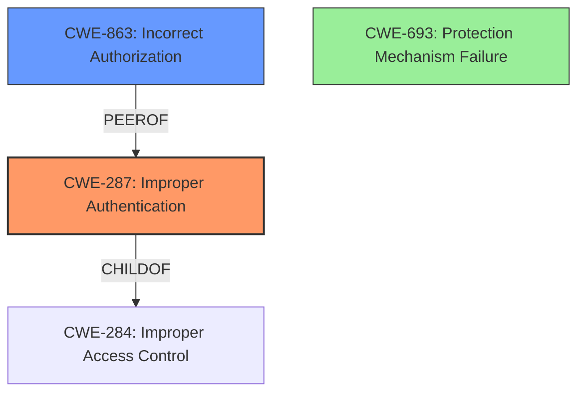

# Raw Analyzer Response for CVE-2022-21794

# Summary
| CWE ID | CWE Name | Confidence | CWE Abstraction Level | CWE Vulnerability Mapping Label | CWE-Vulnerability Mapping Notes |
|---|---|---|---|---|---|
| CWE-287 | Improper Authentication | 0.9 | Class | Primary | Allowed-with-Review |
| CWE-863 | Incorrect Authorization | 0.7 | Class | Secondary | Allowed-with-Review |
| CWE-693 | Protection Mechanism Failure | 0.6 | Pillar | Secondary | Discouraged |

## Evidence and Confidence

*   **Confidence Score:** 0.9
*   **Evidence Strength:** HIGH

## Relationship Analysis
The primary CWE is CWE-287, Improper Authentication, which is a child of CWE-284, Improper Access Control. This indicates that the vulnerability stems from a failure to properly verify the identity of a user. CWE-863, Incorrect Authorization, is considered a secondary CWE, as it relates to the incorrect performance of an authorization check, which could be a consequence of the authentication failure. CWE-693, Protection Mechanism Failure is a high level pillar that represents a failure in the overall protection strategy.

## Vulnerability Chain
The vulnerability chain starts with **Improper authentication in BIOS firmware** (CWE-287) which leads to a privileged user potentially enabling **escalation of privilege**.

## Summary of Analysis
The initial analysis identified **Improper authentication in BIOS firmware** as the primary weakness. The vulnerability description and the CVE Reference Links Content Summary both explicitly mention "Improper authentication." This points directly to CWE-287 (Improper Authentication).

The vulnerability description states: "**Improper authentication in BIOS firmware** for some Intel(R) NUC Boards, Intel(R) NUC Business, Intel(R) NUC Enthusiast, Intel(R) NUC Kits before version HN0067 may allow a privileged user to potentially enable escalation of privilege via local access."

The CVE Reference Links Content Summary states:
*   "Root cause of vulnerability: **Improper authentication in BIOS firmware**"
*   "Weaknesses/vulnerabilities present: Improper authentication"
*   "Impact of exploitation: Escalation of privilege"

CWE-287 is a Class-level CWE, and while it is discouraged, the retriever suggests considering CWE-1390 (Weak Authentication) or CWE-306 (Missing Authentication for Critical Function). However, the description only mentions "improper authentication," and there isn't sufficient evidence to determine if the authentication is weak or completely missing. Therefore, CWE-287 is the most appropriate choice based on the available evidence.

CWE-863 (Incorrect Authorization) was considered because the impact is escalation of privilege. Authorization is the process of determining if a user has permission to perform an action, and improper authentication can lead to incorrect authorization. However, since the root cause is the authentication issue, and the authorization issue is a consequence, CWE-287 is the primary weakness.

CWE-693 (Protection Mechanism Failure) was considered because **Improper authentication in BIOS firmware** represents a **failure** in the system's protection mechanism. However, it is a very high-level (Pillar) CWE, and CWE-287 provides a more specific and accurate description of the vulnerability.

The selected CWEs are at the optimal level of specificity because they accurately represent the identified weaknesses based on the provided evidence. CWE-287 directly addresses the **improper authentication**, while CWE-863 accounts for the potential authorization issues.