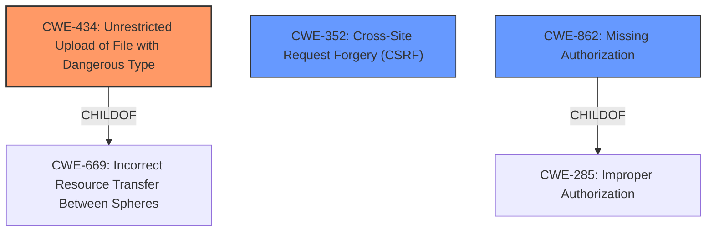

# Raw Analyzer Response for CVE-2022-2180

# Summary
| CWE ID | CWE Name | Confidence | CWE Abstraction Level | CWE Vulnerability Mapping Label | CWE-Vulnerability Mapping Notes |
|---|---|---|---|---|---|
| CWE-434 | Unrestricted Upload of File with Dangerous Type | 1.0 | Base | Allowed | Primary CWE |
| CWE-352 | Cross-Site Request Forgery (CSRF) | 0.9 | Compound | Allowed | Secondary CWE |
| CWE-862 | Missing Authorization | 0.9 | Class | Allowed-with-Review | Secondary CWE |

## Evidence and Confidence

*   **Confidence Score:** 0.95
*   **Evidence Strength:** HIGH

## Relationship Analysis
The primary CWE is CWE-434 (Unrestricted Upload of File with Dangerous Type), which directly reflects the vulnerability's core issue: the ability to upload arbitrary files without proper restrictions. Supporting this, CWE-352 (Cross-Site Request Forgery (CSRF)) and CWE-862 (Missing Authorization) are contributing factors, highlighting the lack of necessary security checks.

## Vulnerability Chain
The vulnerability chain begins with the **improper input validation** and lack of security checks:
1.  **Missing Authorization (CWE-862):** The application **fails to check** if the user has the necessary permissions to upload files.
2.  **Cross-Site Request Forgery (CSRF) (CWE-352):** The application **lacks** CSRF protection, allowing attackers to potentially trick users into unknowingly triggering file uploads.
3.  **Unrestricted Upload of File with Dangerous Type (CWE-434):** Due to the **lack** of validation, arbitrary files, including PHP source files, can be uploaded.
4.  **Remote Code Execution (RCE):** The uploaded PHP files can be executed, leading to remote code execution.

## Summary of Analysis
The initial assessment strongly points to CWE-434 as the primary weakness because the core vulnerability lies in the **unrestricted upload** of arbitrary files, which directly aligns with CWE-434's description. The vulnerability description explicitly mentions that the theme "does not properly validate uploaded custom font packages" and allows "an unauthenticated attacker to upload arbitrary files including php source files, leading to possible remote code execution (RCE)." The CVE Reference Links Content Summary confirms the **lack of proper validation** and the ability to upload any file type, including PHP.

The other suggested CWEs provide supporting context. The application's failure to check authorization (CWE-862) and implement CSRF protection (CWE-352) are contributing factors that exacerbate the risk posed by the **unrestricted file upload**. These weaknesses create an environment where an attacker can easily upload and execute malicious files.

*   **CWE-434: Unrestricted Upload of File with Dangerous Type**
    *   **How it matches:** The vulnerability allows the upload of arbitrary files, including PHP, which can be executed on the server. This directly aligns with the description of CWE-434.
    *   **Security Implications:** This can lead to remote code execution, allowing an attacker to take control of the server.
    *   **Relationships:** This is a Base-level CWE, providing a specific description of the vulnerability. It is a ChildOf CWE-669 (Incorrect Resource Transfer Between Spheres).
    *   **Mapping Guidance:** The usage is "Allowed" and the rationale is that it is at the Base level of abstraction.
*   **CWE-352: Cross-Site Request Forgery (CSRF)**
    *   **How it matches:** The vulnerability description mentions a **lack of CSRF checks**, allowing an attacker to potentially trick a user into uploading malicious files.
    *   **Security Implications:** An attacker could craft a malicious request that, if triggered by an authenticated user, would upload dangerous files without the user's knowledge.
    *   **Relationships:** This is a Compound CWE. It is a ChildOf CWE-345 (Insufficient Verification of Data Authenticity)
    *   **Mapping Guidance:** The usage is "Allowed" and the rationale is that it is a well-known Composite of multiple weaknesses that must all occur simultaneously.
*   **CWE-862: Missing Authorization**
    *   **How it matches:** The vulnerability description indicates that the application does not perform authorization checks on file uploads, allowing unauthenticated users to upload arbitrary files.
    *   **Security Implications:** This can lead to unauthorized access and modification of system resources.
    *   **Relationships:** This is a Class-level CWE. It is a ChildOf CWE-285 (Improper Authorization) and CWE-284 (Improper Access Control).
    *   **Mapping Guidance:** The usage is "Allowed-with-Review".

Other CWEs Considered:

*   CWE-22: Improper Limitation of a Pathname to a Restricted Directory ('Path Traversal') - While the CVE description mentions that the lack of checks on the upload path and filename allows writing to arbitrary locations, the primary issue is the unrestricted file upload, not the path traversal. Path traversal is a consequence of the unrestricted upload, not the root cause.
*   CWE-73: External Control of File Name or Path - Similar to CWE-22, this is a consequence of the unrestricted file upload, not the root cause.

The final selection of CWEs accurately represents the vulnerability, with CWE-434 as the primary weakness and CWE-352 and CWE-862 as contributing factors. The chosen CWEs are at the optimal level of specificity, providing a clear and concise description of the vulnerability and its underlying causes.