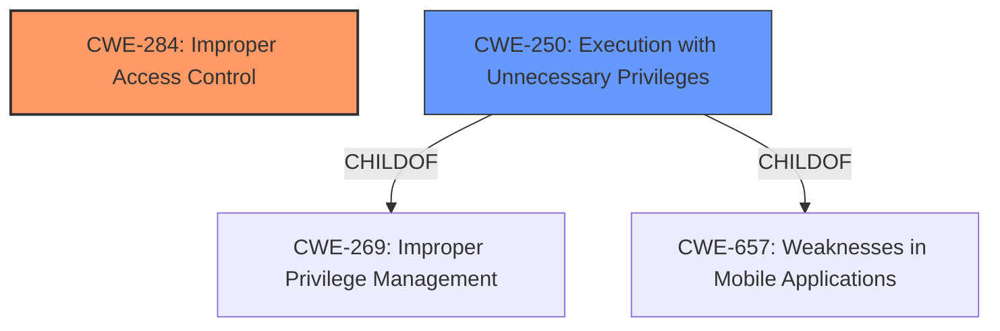

# Analysis for CVE-2022-21812

# Summary

| CWE ID | CWE Name | Confidence | CWE Abstraction Level | CWE Vulnerability Mapping Label | CWE-Vulnerability Mapping Notes |
|---|---|---|---|---|---|
| CWE-284 | Improper Access Control | 0.9 | Pillar | Primary | Discouraged |
| CWE-250 | Execution with Unnecessary Privileges | 0.7 | Base | Secondary | Allowed |

## Evidence and Confidence

*   **Confidence Score:** 0.8
*   **Evidence Strength:** HIGH

## Relationship Analysis

The primary CWE is CWE-284, "Improper Access Control," which is a high-level Pillar. Due to the limited information, choosing a more specific child CWE is challenging. However, CWE-250, "Execution with Unnecessary Privileges," a Base level CWE, is considered a secondary candidate as it may be applicable if the **improper access control** leads to executing code with higher than necessary privileges.

## Vulnerability Chain

The chain of events based on the vulnerability description is:

1.  **Root Cause:** **Improper access control** (CWE-284)
2.  **Impact:** Potential privilege escalation, possibly through **execution with unnecessary privileges** (CWE-250).

## Summary of Analysis

The initial analysis pointed towards **improper access control** as the root cause, leading to potential privilege escalation. The description indicates a **weakness** in how access to resources is controlled within the Intel HAXM software. The evidence from the "Vulnerability Description Key Phrases" and "CVE Reference Links Content Summary" confirms **improper access control** as the **root cause**.

The selection of CWE-284 is based on the explicit mention of "**Improper access control**" in both the vulnerability description and the CVE reference summary. While CWE-284 is a high-level Pillar, the limited information prevents a more specific classification. The MITRE mapping guidance discourages the use of CWE-284 due to its high-level nature but suggests alternatives like CWE-862 (Missing Authorization) or CWE-863 (Incorrect Authorization). However, without more details on the specific authorization mechanism, CWE-284 remains the most appropriate primary classification based on available evidence.

CWE-250 is considered as a secondary weakness if the **improper access control** leads to the code being executed with higher than necessary privileges.

Relevant CWE Information:

# Enhanced Context (25 CWEs)

## CWE-1289: Improper Validation of Unsafe Equivalence in Input
**Abstraction Level**: Base
**Similarity Score**: 0.80

**Description**:
The product receives an input value that is used as a resource identifier or other type of reference, but it does not validate or incorrectly validates that the input is equivalent to a potentially-unsafe value.

**Mapping Guidance**:
- Usage: Allowed

This CWE is not applicable because there is no mention of input validation issues.

## CWE-807: Reliance on Untrusted Inputs in a Security Decision
**Abstraction Level**: Base
**Similarity Score**: 0.78

**Description**:
The product uses a protection mechanism that relies on the existence or values of an input, but the input can be modified by an untrusted actor in a way that bypasses the protection mechanism.

**Mapping Guidance**:
- Usage: Allowed

This CWE is not applicable because there is no indication that untrusted inputs are directly influencing security decisions.

## CWE-183: Permissive List of Allowed Inputs
**Abstraction Level**: Base
**Similarity Score**: 0.76

**Description**:
The product implements a protection mechanism that relies on a list of inputs (or properties of inputs) that are explicitly allowed by policy because the inputs are assumed to be safe, but the list is too permissive - that is, it allows an input that is unsafe, leading to resultant weaknesses.

**Mapping Guidance**:
- Usage: Allowed

This CWE is not applicable as the vulnerability description does not specify issues with allowed input lists.

## CWE-1288: Improper Validation of Consistency within Input
**Abstraction Level**: Base
**Similarity Score**: 0.76

**Description**:
The product receives a complex input with multiple elements or fields that must be consistent with each other, but it does not validate or incorrectly validates that the input is actually consistent.

**Mapping Guidance**:
- Usage: Allowed

This CWE is not applicable because the vulnerability does not involve complex inputs with consistency requirements.

## CWE-691: Insufficient Control Flow Management
**Abstraction Level**: Pillar
**Similarity Score**: 0.76

**Description**:
The code does not sufficiently manage its control flow during execution, creating conditions in which the control flow can be modified in unexpected ways.

**Mapping Guidance**:
- Usage: Discouraged

This CWE is too abstract and does not directly relate to the **improper access control** issue.

## CWE-274: Improper Handling of Insufficient Privileges
**Abstraction Level**: Base
**Similarity Score**: 0.76

**Description**:
The product does not handle or incorrectly handles when it has insufficient privileges to perform an operation, leading to resultant weaknesses.

**Mapping Guidance**:
- Usage: Discouraged

This CWE is not applicable, as the description centers around **improper access control**, not the handling of insufficient privileges.

## CWE-653: Improper Isolation or Compartmentalization
**Abstraction Level**: Class
**Similarity Score**: 0.76

**Description**:
The product does not properly compartmentalize or isolate functionality, processes, or resources that require different privilege levels, rights, or permissions.

**Mapping Guidance**:
- Usage: Allowed

This CWE could be relevant if the **improper access control** stems from a lack of isolation, but the description does not provide enough evidence.

## CWE-184: Incomplete List of Disallowed Inputs
**Abstraction Level**: Base
**Similarity Score**: 0.75

**Description**:
The product implements a protection mechanism that relies on a list of inputs (or properties of inputs) that are not allowed by policy or otherwise require other action to neutralize before additional processing takes place, but the list is incomplete.

**Mapping Guidance**:
- Usage: Allowed

This CWE is not applicable because the vulnerability description doesn't refer to disallowed input lists.

## CWE-1173: Improper Use of Validation Framework
**Abstraction Level**: Base
**Similarity Score**: 0.75

**Description**:
The product does not use, or incorrectly uses, an input validation framework that is provided by the source language or an independent library.

**Mapping Guidance**:
- Usage: Allowed

This CWE is not applicable, as the description doesn't refer to the usage of a validation framework.

## CWE-179: Incorrect Behavior Order: Early Validation
**Abstraction Level**: Base
**Similarity Score**: 0.75

**Description**:
The product validates input before applying protection mechanisms that modify the input, which could allow an attacker to bypass the validation via dangerous inputs that only arise after the modification.

**Mapping Guidance**:
- Usage: Allowed

This CWE is not applicable because the vulnerability description does not mention issues with validation order.

## CWE-863: Incorrect Authorization
**Abstraction Level**: Class
**Similarity Score**: 6067.38

**Description**:
The product performs an authorization check when an actor attempts to access a resource or perform an action, but it does not correctly perform the check.

**Mapping Guidance**:
- Usage: Allowed-with-Review

This CWE is a more specific type of **improper access control**, but the description lacks the necessary details to confirm that incorrect authorization checks are the root cause.

## CWE-639: Authorization Bypass Through User-Controlled Key
**Abstraction Level**: Base
**Similarity Score**: 6044.07

**Description**:
The system's authorization functionality does not prevent one user from gaining access to another user's data or record by modifying the key value identifying the data.

**Mapping Guidance**:
- Usage: Allowed

This CWE is not applicable, as there is no mention of user-controlled keys in the description.

## CWE-119: Improper Restriction of Operations within the Bounds of a Memory Buffer
**Abstraction Level**: Class
**Similarity Score**: 6040.29

**Description**:
The product performs operations on a memory buffer, but it reads from or writes to a memory location outside the buffer's intended boundary. This may result in read or write operations on unexpected memory locations that could be linked to other variables, data structures, or internal program data.

**Mapping Guidance**:
- Usage: Discouraged

This CWE is not applicable, as there is no indication