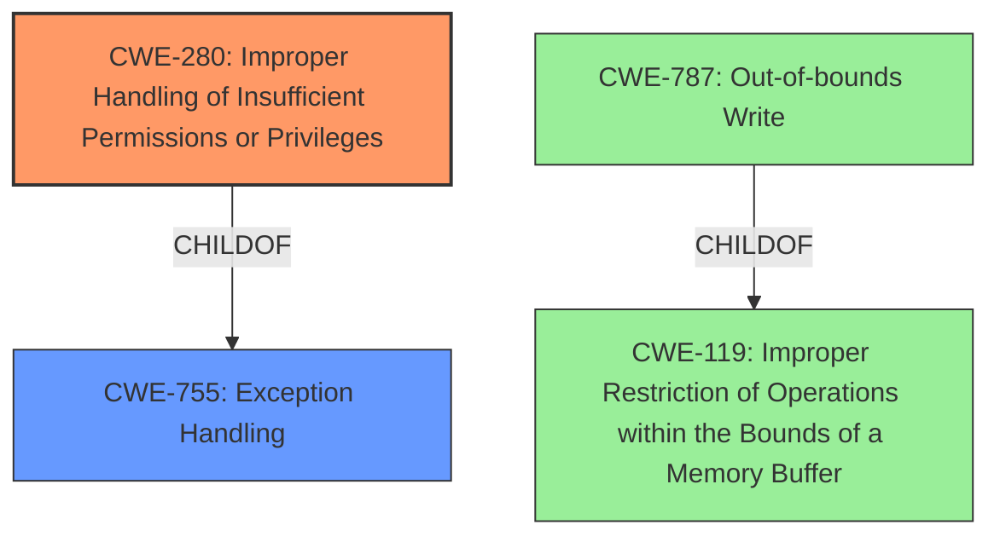

# Analysis Report for CVE-2022-21813

# Vulnerability Analysis Report: CVE-2022-21813

## Description


## Analysis (with Relationship Data)

# Summary
| CWE ID | CWE Name | Confidence | CWE Abstraction Level | CWE Vulnerability Mapping Label | CWE-Vulnerability Mapping Notes |
|---|---|---|---|---|---|
| CWE-280 | Improper Handling of Insufficient Permissions or Privileges | 0.9 | Base | Allowed | Primary CWE |
| CWE-787 | Out-of-bounds Write | 0.5 | Base | Allowed | Secondary Candidate |
| CWE-119 | Improper Restriction of Operations within the Bounds of a Memory Buffer | 0.4 | Class | Discouraged | Secondary Candidate |

## Evidence and Confidence

*   **Confidence Score:** 0.9
*   **Evidence Strength:** HIGH

## Relationship Analysis
The primary relationship influencing the CWE selection is the direct match of the vulnerability description's root cause to CWE-280. While other CWEs like CWE-787 and CWE-119 are related to memory access issues, they don't directly address the **improper handling of insufficient permissions or privileges**.



## Vulnerability Chain
The vulnerability chain starts with **improper handling of insufficient permissions or privileges** (CWE-280), leading to limited write access to protected memory, which can then lead to a denial of service. A potential, but not explicitly stated, weakness is an Out-of-bounds Write (CWE-787) arising from the memory access.
  - CWE-280: Improper Handling of Insufficient Permissions or Privileges (**Root Cause**)
  - Limited Write Access to Protected Memory
  - CWE-787: Out-of-bounds Write (Potential weakness, if the write is out of bounds)
  - Denial of Service (**Impact**)

## Summary of Analysis
The initial analysis correctly identified CWE-280 as a strong candidate due to the explicit mention of "**improper handling of insufficient permissions or privileges**" in the vulnerability description and the "CVE Reference Links Content Summary". The Retriever Results also listed CWE-280 as the top candidate.

The evidence is very strong, as the vulnerability description key phrases include "**rootcause:** **improper handling of insufficient permissions or privileges**". Also, the "CVE Reference Links Content Summary" section states: "**Improper Privilege Management:** The driver fails to properly enforce permission checks, leading to a vulnerability."

The graph relationships support the selection of CWE-280, as it is a more direct representation of the root cause than memory corruption issues. While memory corruption can be a consequence, the initial flaw is in the privilege handling.

CWE-280 is at the Base level of abstraction, which is optimal for mapping to root causes.

Relevant CWE Information:

# Enhanced Context (25 CWEs)

## CWE-280: Improper Handling of Insufficient Permissions or Privileges 
**Abstraction Level**: Base
**Similarity Score**: 0.80
**Source**: dense

**Description**:
The product does not handle or incorrectly handles when it has insufficient privileges to access resources or functionality as specified by their permissions. This may cause it to follow unexpected code paths that may leave the product in an invalid state.

**Mapping Guidance**:
- Usage: Allowed
- Rationale: This CWE entry is at the Base level of abstraction, which is a preferred level of abstraction for mapping to the root causes of vulnerabilities.

## CWE-787: Out-of-bounds Write
**Abstraction Level**: base
**Similarity Score**: 4.33
**Source**: graph

**Description**:
CWE-787: Out-of-bounds Write

**Mapping Guidance**:
- Usage: Allowed
- Rationale: This CWE entry is at the Base level of abstraction, which is a preferred level of abstraction for mapping to the root causes of vulnerabilities.

## CWE-119: Improper Restriction of Operations within the Bounds of a Memory Buffer
**Abstraction Level**: Class
**Similarity Score**: 6548.18
**Source**: sparse

**Description**:
The product performs operations on a memory buffer, but it reads from or writes to a memory location outside the buffer's intended boundary. This may result in read or write operations on unexpected memory locations that could be linked to other variables, data structures, or internal program data.

**Mapping Guidance**:
- Usage: Discouraged
- Rationale: CWE-119 is commonly misused in low-information vulnerability reports when lower-level CWEs could be used instead, or when more details about the vulnerability are available.

### Technical Explanation for CWE-280:

*   **How the vulnerability's details match the CWE's characteristics:** The vulnerability description explicitly states "**improper handling of insufficient permissions or privileges**". This aligns directly with CWE-280's description: "The product does not handle or incorrectly handles when it has insufficient privileges to access resources or functionality as specified by their permissions."
*   **The security implications and potential impact:** The security implication is that an unprivileged user can perform actions they should not be able to, in this case, writing to protected memory. The potential impact is a denial of service.
*   **Any parent-child relationships or chain patterns that influenced your mapping:** CWE-280 is a child of CWE-755 (Exception Handling), but this relationship didn't directly influence the mapping.
*   **Whether the weakness is primary or secondary in the vulnerability:** This is the primary weakness, as it's the root cause that leads to the other consequences.
*   **How the official MITRE mapping guidance influenced your decision:** The MITRE mapping guidance for CWE-280 states that it's at the Base level of abstraction, which is preferred for mapping root causes, and the Usage is Allowed. This supports the decision to choose CWE-280.

### Technical Explanation for CWE-787:

*   **How the vulnerability's details match the CWE's characteristics:** The vulnerability allows limited write access to protected memory. If the write goes beyond the boundaries of the allocated buffer, then this could be CWE-787. However, there isn't explicit evidence to confirm the out-of-bounds write.
*   **The security implications and potential impact:** Out-of-bounds writes can lead to code execution, denial of service, or other unpredictable behavior.
*   **Any parent-child relationships or chain patterns that influenced your mapping:** CWE-787 is a child of CWE-119.
*   **Whether the weakness is primary or secondary in the vulnerability:** This is a potential secondary weakness if the write access to protected memory is beyond the allocated bounds.
*   **How the official MITRE mapping guidance influenced your decision:** The MITRE mapping guidance for CWE-787 states that it's at the Base level of abstraction, and the Usage is Allowed.

### Technical Explanation for CWE-119:

*   **How the vulnerability's details match the CWE's characteristics:** The vulnerability allows limited write access to protected memory, which *could* be outside the intended buffer.
*   **The security implications and potential impact:** Out-of-bounds write can lead to code execution, denial of service, or other unpredictable behavior.
*   **Any parent-child relationships or chain patterns that influenced your mapping:** CWE-787 is a child of CWE-119.
*   **Whether the weakness is primary or secondary in the vulnerability:** This could be a secondary weakness if the write access to protected memory is beyond the allocated bounds. It is less descriptive than CWE-787.
*   **How the official MITRE mapping guidance influenced your decision:** The MITRE mapping guidance for CWE-119 is **Discouraged**.

### Summary of CWEs Considered But Not Used:

*   **CWE-732 (Incorrect Permission Assignment for Critical Resource):** While related to permissions, this CWE focuses on the *assignment* of incorrect permissions, rather than the *handling* of insufficient permissions. The vulnerability is about what happens when a process *doesn't* have the required permissions, not that the resource was incorrectly configured.
*   **CWE-250 (Execution with Unnecessary Privileges):** This is the opposite problem; the vulnerability isn't that the code is running with too many privileges, but that it's not handling situations where it lacks sufficient privileges.
*   **CWE-782 (Exposed IOCTL with Insufficient Access Control):** This is specific to IOCTLs, and while the GPU driver likely uses IO


## CWE Relationship Analysis

Current CWEs represent these abstraction levels: .


### Vulnerability Chain Analysis

**Chain starting from CWE-280:**
- 280 (Improper Handling of Insufficient Permissions or Privileges ) - ROOT


**Chain starting from CWE-755:**
- 755 (Improper Handling of Exceptional Conditions) - ROOT


### CWE Relationship Diagram

```mermaid
graph TD
    classDef primary fill:#f96,stroke:#333,stroke-width:2px
    classDef secondary fill:#69f,stroke:#333
    classDef tertiary fill:#9e9,stroke:#333
```


*Report generated on 2025-03-30 13:46:52*
