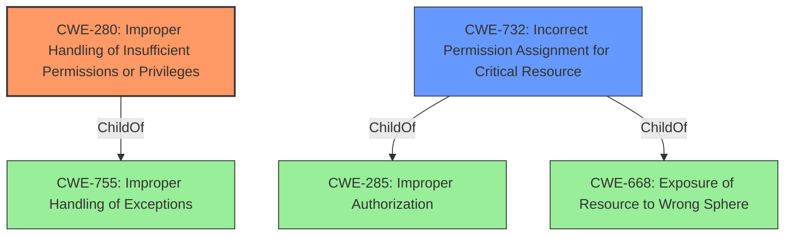

# Enhanced Analysis for CVE-2022-21814

# Summary
| CWE ID | CWE Name | Confidence | CWE Abstraction Level | CWE Vulnerability Mapping Label | CWE-Vulnerability Mapping Notes |
|---|---|---|---|---|---|
| CWE-280 | Improper Handling of Insufficient Permissions or Privileges | 1.0 | Base | Allowed | Primary CWE |
| CWE-732 | Incorrect Permission Assignment for Critical Resource | 0.7 | Class | Allowed-with-Review | Secondary Candidate |

## Evidence and Confidence

*   **Confidence Score:** 1.0
*   **Evidence Strength:** HIGH

## Relationship Analysis
The primary CWE, CWE-280, is a Base level CWE and is a ChildOf CWE-755. CWE-732 is a Class level CWE and is a ChildOf CWE-285 and CWE-668. While both CWE-280 and CWE-732 are related to permission issues, CWE-280 is more accurately describes the **improper handling** aspect mentioned in the vulnerability.



## Vulnerability Chain
The vulnerability chain starts with the **improper handling of insufficient permissions or privileges** (CWE-280), which allows an unprivileged local user limited write access to protected memory, ultimately leading to a denial of service.

## Summary of Analysis
The initial analysis focused on identifying the root cause and impact of the vulnerability. The vulnerability description clearly states that the root cause is the **improper handling of insufficient permissions or privileges**. The evidence is clear from the "Vulnerability Description Key Phrases" section, which states: "**rootcause:** **improper handling of insufficient permissions or privileges**" and the "CVE Reference Links Content Summary" section which says "**Root Cause of Vulnerability:** The vulnerability stems from improper handling of insufficient permissions or privileges within the NVIDIA GPU Display Driver's kernel driver package."

CWE-280 (Improper Handling of Insufficient Permissions or Privileges) directly addresses this root cause, and its description aligns perfectly with the vulnerability: "The product does not handle or incorrectly handles when it has insufficient privileges to access resources or functionality as specified by their permissions."

The Retriever Results also list CWE-280 as the top candidate CWE, further supporting this choice.

Other CWEs were considered but deemed less appropriate:

*   CWE-732 (Incorrect Permission Assignment for Critical Resource): While related to permissions, this CWE focuses on the assignment of incorrect permissions, rather than the *handling* of insufficient permissions. The vulnerability description emphasizes the **improper handling** aspect, making CWE-280 a better fit.
*   CWE-782 (Exposed IOCTL with Insufficient Access Control): This CWE is specific to IOCTLs, and while the vulnerability is in a driver, there is no explicit mention of IOCTLs being the affected component.
*   CWE-119 (Improper Restriction of Operations within the Bounds of a Memory Buffer): This CWE relates to memory buffer issues, but the primary issue is permission handling, not a buffer overflow or similar memory error.

The final decision to use CWE-280 is based on the direct evidence from the vulnerability description, the alignment of the CWE description with the root cause, and the supporting evidence from the Retriever Results. This CWE is at the appropriate level of specificity (Base) and accurately represents the core weakness. The overall confidence in this assessment is high (1.0) due to the clear evidence and direct alignment with the CWE definition.


## CWE Relationship Analysis

Current CWEs represent these abstraction levels: .


### Vulnerability Chain Analysis

**Chain starting from CWE-280:**
- 280 (Improper Handling of Insufficient Permissions or Privileges ) - ROOT


**Chain starting from CWE-755:**
- 755 (Improper Handling of Exceptional Conditions) - ROOT


### CWE Relationship Diagram

```mermaid
graph TD
    classDef primary fill:#f96,stroke:#333,stroke-width:2px
    classDef secondary fill:#69f,stroke:#333
    classDef tertiary fill:#9e9,stroke:#333
```