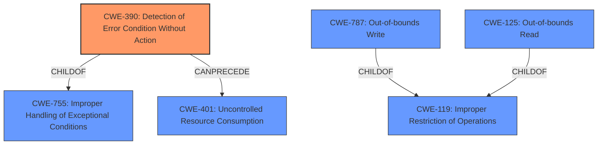

# Analysis for CVE-2022-21820

# Summary
| CWE ID | CWE Name | Confidence | CWE Abstraction Level | CWE Vulnerability Mapping Label | CWE-Vulnerability Mapping Notes |
|---|---|---|---|---|---|
| CWE-390 | Detection of Error Condition Without Action | 0.9 | Base | Allowed | Primary CWE |
| CWE-787 | Out-of-bounds Write | 0.4 | Base | Allowed | Secondary Candidate |
| CWE-125 | Out-of-bounds Read | 0.4 | Base | Allowed | Secondary Candidate |

## Evidence and Confidence

*   **Confidence Score:** 0.7
*   **Evidence Strength:** MEDIUM

## Relationship Analysis
The primary CWE is CWE-390, a base-level weakness. Other CWEs considered included CWE-787 and CWE-125, related to out-of-bounds memory access. CWE-390's relationships show it as a child of CWE-755 (Improper Handling of Exceptional Conditions) and potentially preceding CWE-401 (Missing Check of Error Condition). CWE-787 and CWE-125 are children of CWE-119 (Improper Restriction of Operations within the Bounds of a Memory Buffer), indicating a more general class of memory safety issues.

## Vulnerability Chain
The vulnerability chain starts with a network user triggering an error condition in `nvhostengine`. The key aspect is the **detection of error conditions without action**, as described in the vulnerability. This may lead to limited code execution, some denial of service, escalation of privileges, and limited impacts to both data confidentiality and integrity. While memory corruption may occur as a result of the error being undetected, the description lacks explicit details of memory corruption.

## Summary of Analysis
The initial assessment focused on identifying the core weakness. The vulnerability description emphasizes that a network user can trigger error conditions, but the system **does not act** upon them. This aligns directly with **CWE-390: Detection of Error Condition Without Action**.

The evidence from the "CVE Reference Links Content Summary" supports this: "A network user can trigger error conditions within `nvhostengine` without requiring specific actions from the user of DCGM."

The retriever results also support CWE-390 as the top candidate.

Other CWEs like CWE-787 (Out-of-bounds Write) and CWE-125 (Out-of-bounds Read) were considered, as the impact includes limited code execution and potential impacts to data integrity, which could be related to memory corruption. However, the description does not explicitly mention memory corruption, so these are secondary considerations.

CWE-119 (Improper Restriction of Operations within the Bounds of a Memory Buffer) is a higher-level class that could encompass memory corruption issues. However, without specific evidence of out-of-bounds reads or writes, it's less appropriate than CWE-390.

CWE-285 (Improper Authorization) was considered due to the "escalation of privileges" impact, but the primary issue is the lack of error handling, not an authorization bypass.

CWE-755 (Improper Handling of Exceptional Conditions) is a parent of CWE-390, making CWE-390 more specific and thus a better fit.

The final decision is to map the vulnerability primarily to **CWE-390: Detection of Error Condition Without Action**. This accurately reflects the root cause: the system detects an error but fails to handle it. The selection of CWE-390 is at the optimal level of specificity (Base) based on the provided evidence.

CWE-787 and CWE-125 are secondary candidates, with lower confidence, because memory corruption may occur, but the description doesn't state this directly.