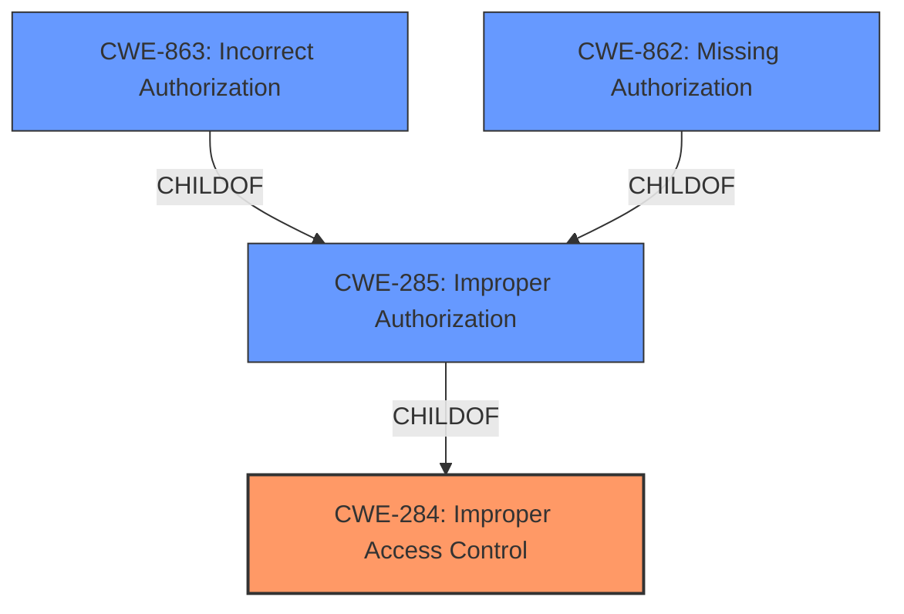

# Enhanced Analysis for CVE-2022-21825

# Summary
| CWE ID | CWE Name | Confidence | CWE Abstraction Level | CWE Vulnerability Mapping Label | CWE-Vulnerability Mapping Notes |
|---|---|---|---|---|---|
| CWE-284 | Improper Access Control | 0.75 | Pillar | Discouraged | The vulnerability description indicates an **Improper Access Control** issue, making this a candidate. However, it is a Pillar and discouraged, so we look for more specific options. |
| CWE-863 | Incorrect Authorization | 0.65 | Class | Allowed-with-Review | The vulnerability involves an **improper access control** in the Citrix Workspace App, potentially related to incorrect authorization checks. This is a more specific Class-level CWE than CWE-284. |
| CWE-285 | Improper Authorization | 0.50 | Class | Discouraged | This CWE represents a lack of or incorrect authorization check, which is a possible root cause, but it is a discouraged Class level. |
| CWE-862 | Missing Authorization | 0.50 | Class | Allowed-with-Review | This CWE is for missing authorization, where authorization is simply not performed. This isn't described in the vulnerability description. |

## Evidence and Confidence

*   **Confidence Score:** 0.70
*   **Evidence Strength:** MEDIUM

## Relationship Analysis
The primary relationship influencing the decision is the parent-child relationship between CWE-284 (Improper Access Control) and its children, such as CWE-863 (Incorrect Authorization) and CWE-862 (Missing Authorization). CWE-284 is a high-level Pillar, whereas CWE-863 and CWE-862 are more specific Class-level CWEs. The description indicates an issue with access control that may be related to authorization, suggesting either CWE-863 or CWE-862 could be relevant.
Here's the Mermaid Diagram:



## Vulnerability Chain
The vulnerability chain starts with the **Improper Access Control**, which leads to the ability for an attacker to perform local privilege escalation. The chain is:
1.  **Improper Access Control** (CWE-284): The initial weakness.
2.  Local Privilege Escalation (Impact): The resulting impact from the access control issue.

## Summary of Analysis
Initially, CWE-284 (Improper Access Control) seemed like the most appropriate choice given the vulnerability description. However, CWE-284 is a Pillar-level CWE and is discouraged due to its high level of abstraction. The analysis then shifted to its children, specifically CWE-863 (Incorrect Authorization) and CWE-862 (Missing Authorization). The description mentions "Improper Access Control" which can be interpreted as an authorization issue. Since the information is limited, a specific determination between incorrect or missing authorization cannot be made. Therefore, CWE-284 is chosen because it is the weakness explicitly mentioned, but it is a high level weakness.

Relevant CWE Information:
- The vulnerability description indicates an **Improper Access Control** issue in Citrix Workspace App for Linux.
- The impact is that an attacker can perform local privilege escalation.
- The key phrase is **"Improper Access Control"**.

CWEs Considered But Not Used:

*   CWE-269 (Improper Privilege Management): While the impact is privilege escalation, the root cause is **Improper Access Control**, not directly related to privilege management.
*   CWE-367 (Time-of-check Time-of-use (TOCTOU) Race Condition): There is no indication of a race condition in the description.
*   CWE-287 (Improper Authentication): The vulnerability description does not mention authentication issues.
*   CWE-862 (Missing Authorization): While possible, the description states **"Improper Access Control"** which indicates there is some form of access control, but it is not implemented correctly.
*   CWE-250 (Execution with Unnecessary Privileges): There is no mention of unnecessary privileges being used.
*   CWE-386 (Symbolic Name not Mapping to Correct Object): This CWE is not relevant to the vulnerability description.
*   CWE-522 (Insufficiently Protected Credentials): There is no mention of credential protection issues.
*   CWE-732 (Incorrect Permission Assignment for Critical Resource): This CWE is specific to permission assignments for resources, and there's no direct evidence for this.
*   CWE-285 (Improper Authorization): The description mentions **"Improper Access Control"**, indicating that some form of access control is present, but it's flawed.

The final decision is to map to CWE-284 because the vulnerability description explicitly states **"Improper Access Control"**. It is at the optimal level of specificity given the limited information available.


## CWE Relationship Analysis

Current CWEs represent these abstraction levels: .


### Vulnerability Chain Analysis

**Chain starting from CWE-862:**
- 862 (Missing Authorization) - ROOT


**Chain starting from CWE-522:**
- 522 (Insufficiently Protected Credentials) - ROOT


### CWE Relationship Diagram

```mermaid
graph TD
    classDef primary fill:#f96,stroke:#333,stroke-width:2px
    classDef secondary fill:#69f,stroke:#333
    classDef tertiary fill:#9e9,stroke:#333
```