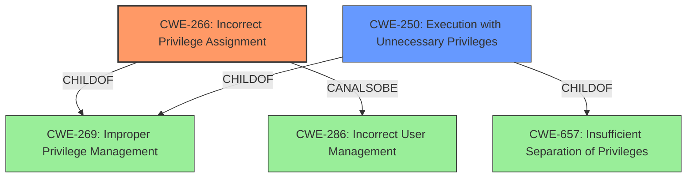

# Enhanced Analysis for CVE-2022-21827

# Summary
| CWE ID | CWE Name | Confidence | CWE Abstraction Level | CWE Vulnerability Mapping Label | CWE-Vulnerability Mapping Notes |
|---|---|---|---|---|---|
| CWE-266 | Incorrect Privilege Assignment | 0.9 | Base | Primary | Allowed |
| CWE-250 | Execution with Unnecessary Privileges | 0.7 | Base | Secondary | Allowed |

## Evidence and Confidence

*   **Confidence Score:** 0.8
*   **Evidence Strength:** HIGH

## Relationship Analysis
The primary CWE is CWE-266 (Incorrect Privilege Assignment), which is a Base level CWE. It is a child of CWE-269 (Improper Privilege Management), which is a Class level CWE. CWE-266 also has a CanAlsoBe relationship with CWE-286. The secondary CWE is CWE-250 (Execution with Unnecessary Privileges), which is also a Base level CWE. It is a child of both CWE-269 and CWE-657 (Insufficient Separation of Privileges).



## Vulnerability Chain
The vulnerability chain starts with the **incorrect privilege** assignment, leading to the ability of an attacker with local access to corrupt or delete files as SYSTEM.
  - **Root Cause:** **Improper Privilege** (CWE-266)
  - **Impact:** Corrupt or delete files as SYSTEM

## Summary of Analysis
The vulnerability description clearly indicates an **improper privilege** issue that allows an attacker to corrupt or delete files as SYSTEM.

The primary CWE selected is CWE-266 (Incorrect Privilege Assignment) because the vulnerability description states an "**improper privilege**" which directly aligns with the description of CWE-266, "A product incorrectly assigns a privilege to a particular actor, creating an unintended sphere of control for that actor." The evidence for this is "**improper privilege** vulnerability" from the Vulnerability Description Key Phrases.

A secondary CWE considered is CWE-250 (Execution with Unnecessary Privileges). While not as direct a fit as CWE-266, it's possible the plugin is running with SYSTEM privileges when it doesn't need to. The evidence for this is the "corrupt or delete files as SYSTEM" impact, which suggests the process is running with elevated privileges.

CWE-269 (Improper Privilege Management) was considered but not used as it's a Class-level CWE and the description for CWE-266 is a better, more specific, fit. The mapping guidance for CWE-269 discourages its use when more specific children can be used.
CWE-284 (Improper Access Control) was considered but not used as it is a Pillar level and too high-level.
CWE-287 (Improper Authentication) was considered but not used as it involves authentication and isn't related to the description.
CWE-863 (Incorrect Authorization) was considered but not used as the description is about privilege assignment, not about performing authorization checks incorrectly.
CWE-732 (Incorrect Permission Assignment for Critical Resource) was considered but not used as the description is about privilege assignment and the root cause does not seem to be directly related to permissions.
CWE-276 (Incorrect Default Permissions) was considered but not used as it involves incorrect default permissions during installation.
CWE-285 (Improper Authorization) was considered but not used as it involves not performing or incorrectly performing an authorization check.
CWE-613 (Insufficient Session Expiration) was considered but not used as it involves session expiration.

The selection of CWE-266 is at the optimal level of specificity because it directly describes the **improper privilege** assignment and its consequences, aligning with the provided evidence. The confidence score reflects the high confidence in the assessment based on the clear alignment of the vulnerability description with the selected CWEs.

Relevant CWE Information:


## CWE Relationship Analysis

Current CWEs represent these abstraction levels: .


### Vulnerability Chain Analysis

**Chain starting from CWE-613:**
- 613 (Insufficient Session Expiration) - ROOT


**Chain starting from CWE-266:**
- 266 (Incorrect Privilege Assignment) - ROOT


### CWE Relationship Diagram

```mermaid
graph TD
    classDef primary fill:#f96,stroke:#333,stroke-width:2px
    classDef secondary fill:#69f,stroke:#333
    classDef tertiary fill:#9e9,stroke:#333
```