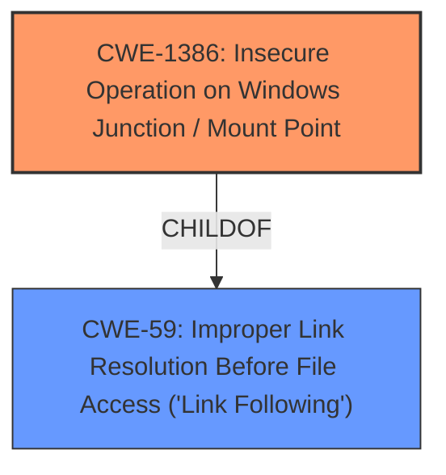

# Analysis Report for CVE-2022-21895

# Vulnerability Analysis Report: CVE-2022-21895

## Description


## Analysis (with Relationship Data)

# Summary
| CWE ID | CWE Name | Confidence | CWE Abstraction Level | CWE Vulnerability Mapping Label | CWE-Vulnerability Mapping Notes |
|---|---|---|---|---|---|
| CWE-1386 | Insecure Operation on Windows Junction / Mount Point | 0.9 | Base | Allowed | Primary CWE |
| CWE-59 | Improper Link Resolution Before File Access ('Link Following') | 0.7 | Base | Allowed | Secondary Candidate |

## Evidence and Confidence

*   **Confidence Score:** 0.8
*   **Evidence Strength:** MEDIUM

## Relationship Analysis
The primary CWE selected is CWE-1386, which is a child of CWE-59. This indicates a hierarchical relationship where CWE-1386 is a specific type of CWE-59. The relationship influenced the decision to select CWE-1386 because it is a more specific and fitting description of the vulnerability than its parent.



## Vulnerability Chain
The vulnerability chain starts with the **improper handling of directory junctions** by the User Profile Service, leading to the ability for an attacker to delete a file and ultimately escalate privileges.

## Summary of Analysis
The initial analysis identified several potential CWEs, but the evidence strongly supports CWE-1386 as the primary weakness. The "CVE Reference Links Content Summary" clearly states that "By creating a directory junction, an attacker can abuse the service to delete a file." This aligns directly with the description of CWE-1386, which focuses on **insecure operations on Windows junctions or mount points**.

The relationship analysis further supports this decision, as CWE-1386 is a child of CWE-59 (Improper Link Resolution), providing a more specific classification.

Based on the evidence and relationship analysis, CWE-1386 is selected as the primary CWE with high confidence. CWE-59 is also considered as a secondary candidate due to its broader scope. The choice of CWE-1386 provides the optimal level of specificity for this vulnerability.

Relevant CWE Information:

# Enhanced Context (25 CWEs)

## CWE-59: Improper Link Resolution Before File Access ('Link Following')
**Abstraction Level**: Base
**Similarity Score**: 0.80
**Source**: dense

**Description**:
The product attempts to access a file based on the filename, but it does not properly prevent that filename from identifying a link or shortcut that resolves to an unintended resource.

**Mapping Guidance**:
- Usage: Allowed
- Rationale: This CWE entry is at the Base level of abstraction, which is a preferred level of abstraction for mapping to the root causes of vulnerabilities.

## CWE-1386: Insecure Operation on Windows Junction / Mount Point
**Abstraction Level**: Base
**Similarity Score**: 5089.67
**Source**: sparse

**Description**:
The product opens a file or directory, but it does not properly prevent the name from being associated with a junction or mount point to a destination that is outside of the intended control sphere.

**Mapping Guidance**:
- Usage: Allowed
- Rationale: This CWE entry is at the Base level of abstraction, which is a preferred level of abstraction for mapping to the root causes of vulnerabilities.

## Vulnerability Description
Windows User Profile Service Elevation of Privilege Vulnerability

### Vulnerability Description Key Phrases
- **impact:** Elevation of Privilege
- **product:** Windows
- **component:** User Profile Service

### CWE for similar CVE Descriptions
### Primary CWE Match
CWE-NVD-noinfo

#### Top CWEs
- CWE-NVD-noinfo (Count: 282)
- CWE-269 (Count: 54)
- CWE-59 (Count: 30)

## CVE Reference Links Content Summary
```json
{
  "CVE-2022-21895": {
    "related": true,
    "details": {
      "root_cause": "The vulnerability exists within the User Profile Service. By creating a directory junction, an attacker can abuse the service to delete a file.",
      "weaknesses": [
        "Improper handling of directory junctions"
      ],
      "impact": "An attacker can leverage this vulnerability to escalate privileges and execute arbitrary code in the context of SYSTEM.",
      "attack_vectors": [
        "Local access",
         "Abuse of User Profile Service via directory junction"
      ],
      "attacker_capabilities": "An attacker must first obtain the ability to execute low-privileged code on the target system."
    }
  }
}
```


## CWE Relationship Analysis

Current CWEs represent these abstraction levels: .


### Vulnerability Chain Analysis

**Chain starting from CWE-1386:**
- 1386 (Insecure Operation on Windows Junction / Mount Point) - ROOT


**Chain starting from CWE-269:**
- 269 (Improper Privilege Management) - ROOT


### CWE Relationship Diagram

```mermaid
graph TD
    classDef primary fill:#f96,stroke:#333,stroke-width:2px
    classDef secondary fill:#69f,stroke:#333
    classDef tertiary fill:#9e9,stroke:#333
```


*Report generated on 2025-03-31 00:45:18*
