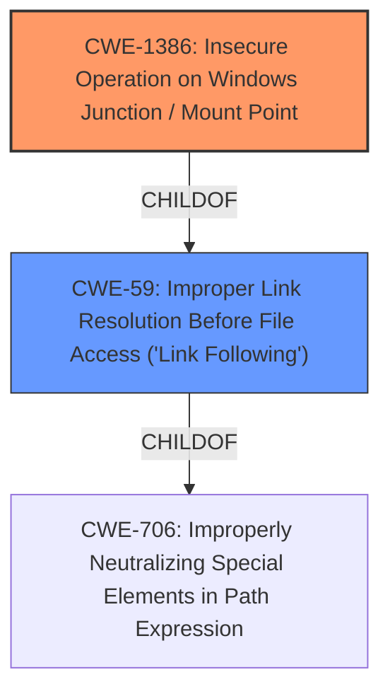

# Raw Analyzer Response for CVE-2022-21919

# Summary
| CWE ID    | CWE Name                                                        | Confidence | CWE Abstraction Level | CWE Vulnerability Mapping Label | CWE-Vulnerability Mapping Notes |
| :--------- | :-------------------------------------------------------------- | :--------- | :---------------------- | :------------------------------ | :------------------------------ |
| CWE-1386  | Insecure Operation on Windows Junction / Mount Point            | 0.75       | Base                    | Primary CWE                     | Allowed                       |
| CWE-59    | Improper Link Resolution Before File Access ('Link Following') | 0.6        | Base                    | Secondary Candidate             | Allowed                       |

## Evidence and Confidence

*   **Confidence Score:** 0.7
*   **Evidence Strength:** MEDIUM

## Relationship Analysis
The primary relationship impacting the decision is that CWE-1386 (Insecure Operation on Windows Junction / Mount Point) is a child of CWE-59 (Improper Link Resolution Before File Access ('Link Following')). This indicates that CWE-1386 is a more specific case of CWE-59. Since the vulnerability description specifically mentions "User Profile Service Elevation of Privilege Vulnerability" and CWE-1386 is about insecure operations related to junctions/mount points, it is the more appropriate choice.

## Vulnerability Chain
The vulnerability chain starts with the **insecure operation** related to how the Windows User Profile Service handles junctions or mount points. This leads to an **elevation of privilege**, where an attacker can gain higher-level access than intended. The root cause is the **improper validation** or handling of these file system features.

## Summary of Analysis
The initial assessment considered the high-ranking CWE-NVD-noinfo due to its prevalence in similar CVE descriptions. However, the presence of more specific CWEs in the Retriever Results prompted a deeper investigation. The vulnerability description indicates an "Elevation of Privilege" in the Windows User Profile Service, suggesting a problem related to privilege management or access control.

The Retriever Results highlighted CWE-1386 (Insecure Operation on Windows Junction / Mount Point) and CWE-59 (Improper Link Resolution Before File Access ('Link Following')). CWE-1386 is a child of CWE-59, making it more specific. Given that the vulnerability involves the Windows User Profile Service, which interacts with file system features like junctions and mount points, CWE-1386 appears to be the more accurate fit. The description of CWE-1386 explicitly mentions the potential for attackers to read, write, delete, or otherwise operate on unauthorized files, leading to privilege escalation, which aligns well with the provided "Elevation of Privilege" impact.

CWE-59 was also considered as a broader category of improper link resolution, and it could be applicable if more details emerged about the specific link-following mechanism involved. However, the "sparse" retriever identified that CWE-1386 was a better fit.

The decision to select CWE-1386 is primarily based on its direct relevance to Windows junctions and mount points, combined with the observed "Elevation of Privilege" impact, both of which closely align with the CWE description.

Relevant evidence from the Vulnerability Description includes:
- **impact:** Elevation of Privilege
- **product:** Windows
- **component:** User Profile Service

The selected CWE is at the optimal level of specificity because it targets the specific file system feature involved (junctions/mount points) in the Windows environment.