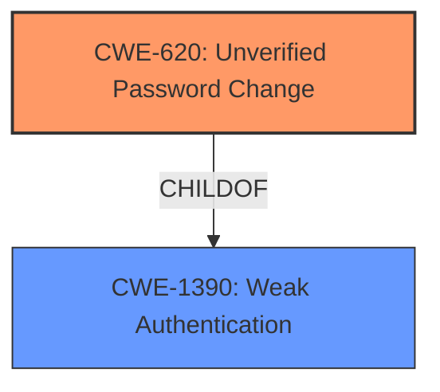

# Analysis for CVE-2022-21935

# Summary
| CWE ID | CWE Name | Confidence | CWE Abstraction Level | CWE Vulnerability Mapping Label | CWE-Vulnerability Mapping Notes |
|---|---|---|---|---|---|
| CWE-620 | Unverified Password Change | 1.0 | Base | Allowed | Primary CWE |
| CWE-1390 | Weak Authentication | 0.7 | Class | Allowed-with-Review | Secondary Candidate |

## Evidence and Confidence

*   **Confidence Score:** 0.9
*   **Evidence Strength:** HIGH

## Relationship Analysis
The primary CWE, CWE-620, is a child of CWE-1390. This indicates a hierarchical relationship where CWE-620 is a specific type of weak authentication. The selection favors the more specific CWE-620 due to its direct match with the vulnerability description.

## Vulnerability Chain
The vulnerability chain consists of the **lack of verification during password change**, leading to the ability to **compromise passwords**.

## Summary of Analysis
The initial assessment strongly supports CWE-620 as the primary weakness, directly aligning with the provided description of "unverified password change." The CVE Reference Links Content Summary explicitly states: "Weaknesses/vulnerabilities present: Unverified Password Change (CWE-620)".

The retriever results also list CWE-620 as the top combined result.

CWE-1390 was considered as a higher-level classification, but the explicit mention of "Unverified Password Change" allows for a more specific mapping to CWE-620.

Relevant CWE Information:

# Enhanced Context (25 CWEs)

## CWE-620: Unverified Password Change
**Abstraction:** Base
**Status:** Draft

### Description
When setting a new password for a user, the product **does not require knowledge of the original password, or using another form of authentication.**

### Mapping Guidance
**Usage:** Allowed
**Rationale:** This CWE entry is at the Base level of abstraction, which is a preferred level of abstraction for mapping to the root causes of vulnerabilities.

## CWE-1390: Weak Authentication
**Abstraction:** Class
**Status:** Incomplete

### Description
The product uses an authentication mechanism to restrict access to specific users or identities, but the mechanism **does not sufficiently prove that the claimed identity is correct.**

### Mapping Guidance
**Usage:** Allowed-with-Review
**Rationale:** This CWE entry is a Class and might have Base-level children that would be more appropriate

The description for CWE-620 precisely captures the vulnerability: the system **does not require verification** when a password is changed. The fact that CWE-620 is a "Base" level and that the mapping guidance says "This CWE entry is at the Base level of abstraction, which is a preferred level of abstraction for mapping to the root causes of vulnerabilities" confirms that CWE-620 is the correct choice. The confidence is very high (1.0) due to the explicit mention of "Unverified Password Change (CWE-620)" in the "CVE Reference Links Content Summary."

CWE-1390 is a reasonable secondary mapping as it is the parent of CWE-620 and the description mentions a product's authentication mechanism is **not sufficient**.