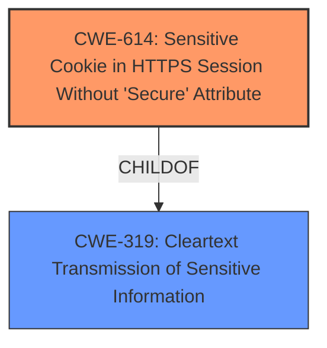

# Analysis Report for CVE-2022-21940

# Vulnerability Analysis Report: CVE-2022-21940

## Description


## Analysis (with Relationship Data)

# Summary
| CWE ID | CWE Name | Confidence | CWE Abstraction Level | CWE Vulnerability Mapping Label | CWE-Vulnerability Mapping Notes |
|---|---|---|---|---|---|
| CWE-614 | Sensitive Cookie in HTTPS Session Without 'Secure' Attribute | 1.0 | Variant | Primary | Allowed |

## Evidence and Confidence

*   **Confidence Score:** 1.0
*   **Evidence Strength:** HIGH

## Relationship Analysis
The primary CWE selected is CWE-614, which is a Variant. It is a ChildOf CWE-319.



## Vulnerability Chain
The vulnerability chain starts with the **missing secure attribute** on a sensitive cookie, leading to the potential for the cookie to be transmitted in cleartext and accessed by unauthorized parties.
  - **Root Cause:** **Missing secure attribute** (CWE-614)
  - **Impact:** Cookie accessible to attackers.

## Summary of Analysis
The analysis indicates a high confidence in mapping the vulnerability to CWE-614. The **root cause** is a **missing secure attribute** for sensitive cookies in an HTTPS session. This aligns directly with the description of CWE-614.

The evidence for this assessment is primarily based on the following:
- **Vulnerability Description Key Phrases**: "**rootcause:** **missing secure attribute**"
- **CVE Reference Links Content Summary**: "The vulnerability is due to the System Configuration Tool (SCT) not setting the "Secure" attribute for sensitive cookies transmitted over HTTPS."

The selection of CWE-614 is at the optimal level of specificity (Variant), as it directly describes the weakness.

Relevant CWE Information:

# Enhanced Context (25 CWEs)

## CWE-807: Reliance on Untrusted Inputs in a Security Decision
**Abstraction Level**: Base
**Similarity Score**: 0.79

**Description**:
The product uses a protection mechanism that relies on the existence or values of an input, but the input can be modified by an untrusted actor in a way that bypasses the protection mechanism.
Not Selected: This CWE is not directly related to the **missing secure attribute** of a cookie.

## CWE-614: Sensitive Cookie in HTTPS Session Without 'Secure' Attribute
**Abstraction Level**: Variant
**Similarity Score**: 0.79
**Source**: dense

**Description**:
The Secure attribute for sensitive cookies in HTTPS sessions is not set, which could cause the user agent to send those cookies in plaintext over an HTTP session.

**Mapping Guidance**:
- Usage: Allowed
- Rationale: This CWE entry is at the Variant level of abstraction, which is a preferred level of abstraction for mapping to the root causes of vulnerabilities.
SELECTED: This CWE perfectly describes the vulnerability.

## CWE-319: Cleartext Transmission of Sensitive Information
**Abstraction Level**: Base
**Similarity Score**: 0.79

**Description**:
The product transmits sensitive or security-critical data in cleartext in a communication channel that can be sniffed by unauthorized actors.
Not Selected: While related, as CWE-614 is a ChildOf CWE-319, CWE-614 is more specific.

## CWE-312: Cleartext Storage of Sensitive Information
**Abstraction Level**: Base
**Similarity Score**: 0.79

**Description**:
The product stores sensitive information in cleartext within a resource that might be accessible to another control sphere.
Not Selected: This vulnerability deals with transmission, not storage.

## CWE-212: Improper Removal of Sensitive Information Before Storage or Transfer
**Abstraction Level**: Base
**Similarity Score**: 0.78

**Description**:
The product stores, transfers, or shares a resource that contains sensitive information, but it does not properly remove that information before the product makes the resource available to unauthorized actors.
Not Selected: The issue is not about removing sensitive information but about transmitting cookies without the secure attribute.

## CWE-311: Missing Encryption of Sensitive Data
**Abstraction Level**: Class
**Similarity Score**: 0.78

**Description**:
The product does not encrypt sensitive or critical information before storage or transmission.
Not Selected: This CWE is too general.

## CWE-303: Incorrect Implementation of Authentication Algorithm
**Abstraction Level**: Base
**Similarity Score**: 0.77

**Description**:
The requirements for the product dictate the use of an established authentication algorithm, but the implementation of the algorithm is incorrect.
Not Selected: Not related to authentication algorithms.

## CWE-538: Insertion of Sensitive Information into Externally-Accessible File or Directory
**Abstraction Level**: Base
**Similarity Score**: 0.77

**Description**:
The product places sensitive information into files or directories that are accessible to actors who are allowed to have access to the files, but not to the sensitive information.
Not Selected: Not related to files or directories.

## CWE-345: Insufficient Verification of Data Authenticity
**Abstraction Level**: Class
**Similarity Score**: 0.77

**Description**:
The product does not sufficiently verify the origin or authenticity of data, in a way that causes it to accept invalid data.
Not Selected: Not related to data authenticity.

## CWE-1391: Use of Weak Credentials
**Abstraction Level**: Class
**Similarity Score**: 0.77

**Description**:
The product uses weak credentials (such as a default key or hard-coded password) that can be calculated, derived, reused, or guessed by an attacker.
Not Selected: Not related to weak credentials.

## CWE-614: Sensitive Cookie in HTTPS Session Without 'Secure' Attribute
**Abstraction Level**: Variant
**Similarity Score**: 5338.15
**Source**: sparse

**Description**:
The Secure attribute for sensitive cookies in HTTPS sessions is not set, which could cause the user agent to send those cookies in plaintext over an HTTP session.
SELECTED: Repeated for clarity. This CWE perfectly describes the vulnerability.

## CWE-863: Incorrect Authorization
**Abstraction Level**: Class
**Similarity Score**: 5281.33

**Description**:
The product performs an authorization check when an actor attempts to access a resource or perform an action, but it does not correctly perform the check.
Not Selected: Not related to authorization checks.

## CWE-1390: Weak Authentication
**Abstraction Level**: Class
**Similarity Score**: 5243.54

**Description**:
The product uses an authentication mechanism to restrict access to specific users or identities, but the mechanism does not sufficiently prove that the claimed identity is correct.
Not Selected: Not related to weak authentication.

## CWE-319: Cleartext Transmission of Sensitive Information
**Abstraction Level**: Base
**Similarity Score**: 5222.37

**Description**:
The product transmits sensitive or security-critical data in cleartext in a communication channel that can be sniffed by unauthorized actors.
Not Selected: While related, as CWE-614 is a ChildOf CWE-319, CWE-614 is more specific.

## CWE-287: Improper Authentication
**Abstraction Level**: Class
**Similarity Score**: 5180.15

**Description**:
When an actor claims to have a given identity, the product does not prove or insufficiently proves that the claim is correct.
Not Selected: Not related to improper authentication.

## CWE-471: Modification of Assumed-Immutable Data (MAID)
**Abstraction Level**: base
**Similarity Score**: 4.33

**Description**:
CWE-471: Modification of Assumed-Immutable Data (MAID)
Not Selected: Does not apply.

## CWE-1275: Sensitive Cookie with Improper SameSite Attribute
**Abstraction Level**: variant
**Similarity Score**: 3.88

**Description**:
CWE-1275: Sensitive Cookie with Improper SameSite Attribute
Not Selected: Deals with the `SameSite` attribute.

## CWE-178: Improper Handling of Case Sensitivity
**Abstraction Level**: base
**Similarity Score**: 3.76

**Description**:
CWE-178: Improper Handling of Case Sensitivity
Not Selected: Does not apply.

## CWE-98: Improper Control of Filename for Include/Require Statement in PHP Program ('PHP Remote File Inclusion')
**Abstraction Level**: variant
**Similarity Score**: 3.75

**Description**:
CWE-98: Improper Control of Filename for Include/Require Statement in PHP Program ('PHP Remote File Inclusion')
Not Selected: Does not apply.

## CWE-1289: Improper Validation of Unsafe Equivalence in Input
**Abstraction Level**: base
**Similarity Score**: 3.64

**Description**:
CWE-1289: Improper Validation of Unsafe Equivalence


## CWE Relationship Analysis

Current CWEs represent these abstraction levels: .


### Vulnerability Chain Analysis

**Chain starting from CWE-1275:**
- 1275 (Sensitive Cookie with Improper SameSite Attribute) - ROOT


**Chain starting from CWE-98:**
- 98 (Improper Control of Filename for Include/Require Statement in PHP Program ('PHP Remote File Inclusion')) - ROOT


### CWE Relationship Diagram

```mermaid
graph TD
    classDef primary fill:#f96,stroke:#333,stroke-width:2px
    classDef secondary fill:#69f,stroke:#333
    classDef tertiary fill:#9e9,stroke:#333
```


*Report generated on 2025-03-30 23:56:43*
