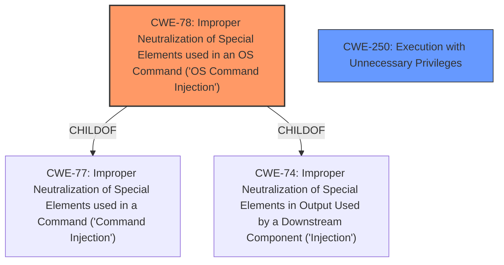

# Analysis for CVE-2022-21941

# Summary
| CWE ID | CWE Name | Confidence | CWE Abstraction Level | CWE Vulnerability Mapping Label | CWE-Vulnerability Mapping Notes |
|---|---|---|---|---|---|
| CWE-78 | Improper Neutralization of Special Elements used in an OS Command ('OS Command Injection') | 1.0 | Base | Allowed | Primary CWE |
| CWE-250 | Execution with Unnecessary Privileges | 0.7 | Base | Allowed | Secondary CWE |

## Evidence and Confidence

*   **Confidence Score:** 0.9
*   **Evidence Strength:** HIGH

## Relationship Analysis
The primary CWE, CWE-78, is a Base level CWE, providing a specific description of the **improper neutralization** of commands used in an OS command. The parent of CWE-78 is CWE-77, which is more general. CWE-78 is the more appropriate choice. CWE-250 describes that the vulnerability is performed with higher than minimum privileges.

## Vulnerability Chain
The vulnerability chain begins with the **improper neutralization** of special elements in an OS command (CWE-78). This leads to an unauthenticated user gaining root access to the system, which results in the ability to execute arbitrary commands with elevated privileges. The chain can be summarized as follows:

1.  **Root Cause:** CWE-78 (**Improper Neutralization** of Special Elements used in an OS Command)
2.  **Impact:** Root access achieved, leading to arbitrary command execution

## Summary of Analysis
The initial analysis identified the presence of **command injection**, which allows an unauthenticated user to gain root access. The root cause of the vulnerability is the **improper neutralization** of special elements used in a command.

The evidence is clear from the "CVE Reference Links Content Summary" section: "**Root cause of vulnerability**: Improper neutralization of special elements used in a command ('Command Injection')" and "**Weaknesses/vulnerabilities present**: Command Injection (CWE-77)".

The retriever results identify CWE-77 and CWE-78 as the most likely candidates. CWE-78 is the more specific Base level CWE and is the better fit.

I am adding CWE-250 as a secondary weakness. The vulnerability allows an unauthenticated user to gain root access to the system, which results in the ability to execute arbitrary commands with elevated privileges. The product performs an operation at a privilege level that is higher than the minimum level required.

CWE-78 is the most appropriate because it precisely describes the vulnerability. It is at the Base level of abstraction, which is preferred.

Relevant CWE Information:

# Enhanced Context (25 CWEs)
The following CWEs were identified as potentially relevant to this vulnerability:

## CWE-74: Improper Neutralization of Special Elements in Output Used by a Downstream Component ('Injection')
**Abstraction Level**: Class
**Similarity Score**: 0.75
**Source**: dense

**Description**:
The product constructs all or part of a command, data structure, or record using externally-influenced input from an upstream component, but it does not neutralize or incorrectly neutralizes special elements that could modify how it is parsed or interpreted when it is sent to a downstream component.

**Mapping Guidance**:
- Usage: Discouraged
- Rationale: CWE-74 is high-level and often misused when lower-level weaknesses are more appropriate.

## CWE-78: Improper Neutralization of Special Elements used in an OS Command ('OS Command Injection')
**Explanation:**

CWE-78 (Improper Neutralization of Special Elements used in an OS Command ('OS Command Injection')) is a base-level CWE that perfectly describes the vulnerability where the system fails to properly neutralize special elements in an OS command, allowing an attacker to inject commands.

The vulnerability description clearly states that the root cause of the vulnerability is the **improper neutralization** of special elements used in a command, which aligns directly with CWE-78.
The security implication is significant: an unauthenticated user can execute arbitrary commands as root, leading to complete system compromise.

## CWE-250: Execution with Unnecessary Privileges
**Explanation:**
CWE-250 (Execution with Unnecessary Privileges) is a base-level CWE that describes the product performing an operation at a privilege level that is higher than the minimum level required, amplifying the consequences of other weaknesses.
The vulnerability description indicates that an unauthenticated user can gain root access, meaning the system is running with unnecessary privileges.

**CWEs Considered but Not Used**

*   **CWE-77:** Improper Neutralization of Special Elements used in a Command ('Command Injection') - While related, CWE-78 is a more specific child of CWE-77 and thus a better fit.
*   **CWE-74:** Improper Neutralization of Special Elements in Output Used by a Downstream Component ('Injection') - This is a high-level class, making CWE-78 a better choice.
*   **CWE-20:** Improper Input Validation - While input validation might be a factor, the core issue is the **improper neutralization** of special elements in the OS command.
*   **CWE-138:** Improper Neutralization of Special Elements - This is a high-level class, making CWE-78 a better choice.
*   **CWE-94:** Improper Control of Generation of Code ('Code Injection') - Not applicable as the issue is not about code generation but command execution.
*   **CWE-88:** Improper Neutralization of Argument Delimiters in a Command ('Argument Injection') - While this could be a contributing factor, the core issue is the **improper neutralization** of the entire command.
*   **CWE-184:** Incomplete List of Disallowed Inputs - This is too generic and doesn't capture the specific nature of **command injection**.
*   **CWE-1336:** Improper Neutralization of Special Elements Used in a Template Engine - Not applicable as the vulnerability isn't related to template engines.