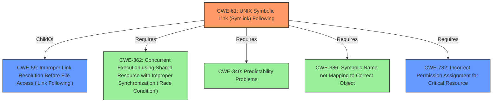

# Raw Analyzer Response for CVE-2022-21944

# Summary
| CWE ID | CWE Name | Confidence | CWE Abstraction Level | CWE Vulnerability Mapping Label | CWE-Vulnerability Mapping Notes |
|---|---|---|---|---|---|
| CWE-61 | UNIX Symbolic Link (Symlink) Following | 1.0 | Compound | Allowed | Primary CWE |
| CWE-59 | Improper Link Resolution Before File Access ('Link Following') | 0.7 | Base | Allowed | Secondary Candidate |
| CWE-732 | Incorrect Permission Assignment for Critical Resource | 0.6 | Class | Allowed-with-Review | Secondary Candidate |

## Evidence and Confidence

*   **Confidence Score:** 0.8
*   **Evidence Strength:** HIGH

## Relationship Analysis
The primary CWE, CWE-61 [UNIX Symbolic Link (Symlink) Following], is a Compound weakness that requires several conditions to be met. It is a child of CWE-59 [Improper Link Resolution Before File Access ('Link Following')], indicating a more specific case of the broader link following issue. CWE-61 also Requires CWE-362 [Concurrent Execution using Shared Resource with Improper Synchronization ('Race Condition')], CWE-340 [Predictability Problems], CWE-386 [Symbolic Name not Mapping to Correct Object], and CWE-732 [Incorrect Permission Assignment for Critical Resource]. This highlights the multi-faceted nature of symlink vulnerabilities. The abstraction levels influenced my selection by prioritizing the Compound CWE-61, as it more precisely captures the combined weaknesses exploited in the vulnerability.

## Vulnerability Chain
The vulnerability chain starts with the **insecure configuration** of the `/run/watchman` directory, which is a public sticky-bit directory. This leads to a **symlink creation** by an unprivileged user within `/run/watchman/$USER-state`. The **`chown` command** in the systemd unit **follows the symlink**, resulting in an **incorrect privilege assignment** on an arbitrary file, leading to **privilege escalation**.
  - Root Cause: Insecure directory configuration and symlink following behavior.
  - Weakness: **UNIX Symbolic Link (Symlink) Following vulnerability**
  - Impact: Privilege escalation to root.

## Summary of Analysis
My analysis concludes that CWE-61 [UNIX Symbolic Link (Symlink) Following] is the most appropriate primary CWE for this vulnerability, with a confidence score of 1.0. This assessment is heavily based on the **Vulnerability Description Key Phrases** identifying a "**UNIX Symbolic Link (Symlink) Following vulnerability**" and the **CVE Reference Links Content Summary**, which details how the `chown` command follows symlinks, leading to arbitrary file ownership changes and potential privilege escalation.
The **Retriever Results** also support this decision, listing CWE-61 as the top combined result. The relationship analysis further solidifies this choice, as CWE-61 encapsulates the various required conditions for the vulnerability to manifest.
CWE-59 [Improper Link Resolution Before File Access ('Link Following')] and CWE-732 [Incorrect Permission Assignment for Critical Resource] were considered as secondary candidates. CWE-59 is a parent of CWE-61, but less specific. CWE-732 captures the incorrect privilege assignment aspect but doesn't fully represent the symlink following issue. The selection of CWE-61 as the primary CWE provides the optimal level of specificity, accurately reflecting the technical details of the vulnerability.

Relevant CWE Information:

# Enhanced Context (25 CWEs)

## CWE-61: UNIX Symbolic Link (Symlink) Following
**Abstraction:** Compound
**Status:** Incomplete

### Description
The product, when opening a file or directory, **does not sufficiently account for when the file is a symbolic link that resolves to a target outside of the intended control sphere**. This could allow an attacker to cause the product to operate on unauthorized files.

### Extended Description
A product that allows UNIX symbolic links (symlink) as part of paths whether in internal code or through user input can allow an attacker to spoof the symbolic link and traverse the file system to unintended locations or access arbitrary files. The symbolic link can permit an attacker to read/write/corrupt a file that they originally did not have permissions to access.

### Relationships
ChildOf -> CWE-59
Requires -> CWE-362
Requires -> CWE-340
Requires -> CWE-386
Requires -> CWE-732