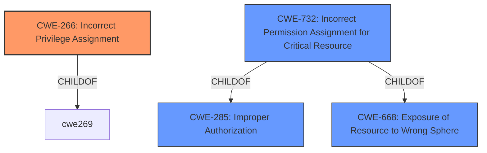

# Analysis for CVE-2022-21946

# Summary
| CWE ID | CWE Name | Confidence | CWE Abstraction Level | CWE Vulnerability Mapping Label | CWE-Vulnerability Mapping Notes |
|---|---|---|---|---|---|
| CWE-266 | Incorrect Privilege Assignment | 0.9 | Base | Allowed | Primary CWE |
| CWE-732 | Incorrect Permission Assignment for Critical Resource | 0.7 | Class | Allowed-with-Review | Secondary Candidate |

## Evidence and Confidence

*   **Confidence Score:** 0.8
*   **Evidence Strength:** HIGH

## Relationship Analysis
The primary CWE selected is CWE-266 (Incorrect Privilege Assignment), which is a Base level CWE. CWE-732 (Incorrect Permission Assignment for Critical Resource) is a Class-level CWE and a child of CWE-285 (Improper Authorization). The relationship analysis supports choosing CWE-266 as it's a more specific, base-level representation of the **incorrect permission assignment** which led to unauthorized privilege escalation.

## Vulnerability Chain
The vulnerability chain starts with an **incorrect permission assignment** in the sudoers configuration (CWE-266), leading to privilege escalation. Local users can then gain elevated privileges (tty and dialout groups) and manipulate cscreen sessions.

## Summary of Analysis
The initial assessment identified CWE-266 as the primary candidate due to the vulnerability description and CVE reference summary highlighting an **incorrect permission assignment**. The sudoers configuration allowed local users to gain unintended privileges.

The vulnerability description states: "A **Incorrect Permission Assignment for Critical Resource** vulnerability in the sudoers configuration in cscreen of openSUSE Factory allows any local users to gain the privileges of the tty and dialout groups and access and manipulate any running cscreen seesion."

The CVE Reference Links Content Summary states: "The vulnerability stems from an overly permissive sudoers rule in the `cscreen` package. The initial configuration allowed *any* user on the system to execute `/usr/bin/screen` as the `_cscreen` user without a password."

The evidence strongly supports CWE-266 as the root cause. While CWE-732 was also considered, CWE-266 more accurately captures the **incorrect assignment** of privileges to users, rather than just an incorrect permission for a resource. The mitigation, which restricted access to members of the `_cscreen` group, further confirms that the issue was an **incorrect privilege assignment**.

CWE-266 is at the optimal level of specificity (Base) because it directly describes the **incorrect assignment** of privileges to an actor, leading to unintended control.

Relevant CWE Information:

# Enhanced Context (25 CWEs)
The following CWEs were identified as potentially relevant to this vulnerability:

## CWE-266: Incorrect Privilege Assignment
**Abstraction Level**: Base
**Similarity Score**: 0.78
**Source**: dense

**Description**:
A product incorrectly assigns a privilege to a particular actor, creating an unintended sphere of control for that actor.

**Mapping Guidance**:
- Usage: Allowed
- Rationale: This CWE entry is at the Base level of abstraction, which is a preferred level of abstraction for mapping to the root causes of vulnerabilities.

## CWE-732: Incorrect Permission Assignment for Critical Resource
**Abstraction Level**: Class
**Similarity Score**: 0.74
**Source**: dense

**Description**:
The product specifies permissions for a security-critical resource in a way that allows that resource to be read or modified by unintended actors.

**Mapping Guidance**:
- Usage: Allowed-with-Review
- Rationale: While the name itself indicates an assignment of permissions for resources, this is often misused for vulnerabilities in which "permissions" are not checked, which is an "authorization" weakness (CWE-285 or descendants) within CWE's model [REF-1287].

## CWE-266: Incorrect Privilege Assignment
CWE-266 (Incorrect Privilege Assignment): The vulnerability involves an **incorrect assignment** of privileges to local users, allowing them to gain the privileges of the tty and dialout groups and access cscreen sessions. This directly matches the CWE description of incorrectly assigning a privilege to an actor. The security implication is privilege escalation, allowing unauthorized access and manipulation of system resources. The MITRE mapping guidance allows for its usage.

CWE-732 (Incorrect Permission Assignment for Critical Resource): While also relevant, this CWE is more focused on resources, whereas the vulnerability is primarily about the **incorrect assignment** of privileges to users. The MITRE mapping guidance recommends reviewing its usage because it is often misused for authorization weaknesses. This CWE was considered but deemed less specific than CWE-266.