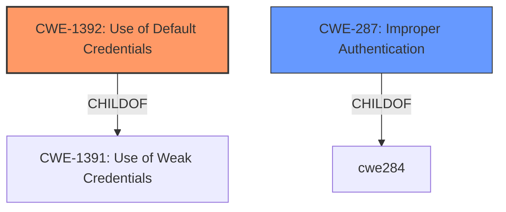

# Enhanced Analysis for CVE-2022-2197

# Summary
| CWE ID  | CWE Name                                                                 | Confidence | CWE Abstraction Level | CWE Vulnerability Mapping Label | CWE-Vulnerability Mapping Notes |
| :-------- | :----------------------------------------------------------------------- | :---------- | :---------------------- | :-------------------------------- | :------------------------------ |
| CWE-1392  | Use of Default Credentials                                               | 0.9        | Base                    | Primary                           | Allowed                       |
| CWE-287   | Improper Authentication                                                  | 0.7        | Class                   | Secondary                         | Discouraged                    |

## Evidence and Confidence

*   **Confidence Score:** 0.8
*   **Evidence Strength:** HIGH

## Relationship Analysis
The primary relationship influencing the CWE selection is the ChildOf relationship where CWE-1392 **[CWE-1392: Use of Default Credentials]** is a child of CWE-1391 **[CWE-1391: Use of Weak Credentials]**, and CWE-287 **[CWE-287: Improper Authentication]**. CWE-1392 **[CWE-1392: Use of Default Credentials]** is a more specific **rootcause** than CWE-287 **[CWE-287: Improper Authentication]**, offering a better representation of the vulnerability. The vulnerability chain involves a **specific credential string** being used to circumvent authentication, leading to administrative operations.



## Vulnerability Chain
The vulnerability chain starts with the **root cause**, which is the **use of a specific credential string**. This leads to **improper authentication**, allowing an attacker to circumvent the authentication scheme and perform administrative operations.

## Summary of Analysis
The initial assessment strongly points to CWE-1392 **[CWE-1392: Use of Default Credentials]** as the primary weakness, given the **root cause** of the vulnerability is the **use of a specific credential string**. The evidence provided from the vulnerability description key phrases and the CVE Reference Links Content Summary supports this decision. The relationship analysis further solidifies this choice, as CWE-1392 **[CWE-1392: Use of Default Credentials]** is a more specific child of the broader CWE-287 **[CWE-287: Improper Authentication]**. The decision to select CWE-1392 **[CWE-1392: Use of Default Credentials]** is based on the evidence that an attacker can circumvent the authentication scheme using a **specific credential string**. This aligns perfectly with the description of CWE-1392 **[CWE-1392: Use of Default Credentials]**, which states that the product uses default credentials for potentially critical functionality.

Relevant CWE Information:

*   **CWE-1392 [CWE-1392: Use of Default Credentials]**: The product uses default credentials (such as passwords or cryptographic keys) for potentially critical functionality.
*   **CWE-287 [CWE-287: Improper Authentication]**: When an actor claims to have a given identity, the product does not prove or insufficiently proves that the claim is correct.

The selection of CWE-1392 **[CWE-1392: Use of Default Credentials]** is at the optimal level of specificity because it directly addresses the **root cause** of the vulnerability, which is the **use of a specific credential string** that allows an attacker to bypass authentication. While CWE-287 **[CWE-287: Improper Authentication]** is related, it is a broader classification that doesn't capture the specific nature of the weakness as accurately as CWE-1392 **[CWE-1392: Use of Default Credentials]**.


## CWE Relationship Analysis

Current CWEs represent these abstraction levels: .


### Vulnerability Chain Analysis

**Chain starting from CWE-1391:**
- 1391 (Use of Weak Credentials) - ROOT


**Chain starting from CWE-287:**
- 287 (Improper Authentication) - ROOT


### CWE Relationship Diagram

```mermaid
graph TD
    classDef primary fill:#f96,stroke:#333,stroke-width:2px
    classDef secondary fill:#69f,stroke:#333
    classDef tertiary fill:#9e9,stroke:#333
```