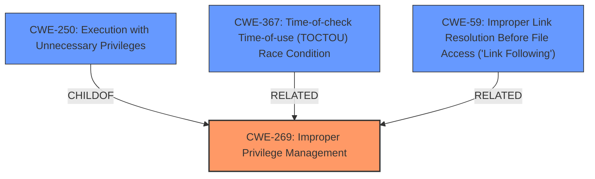

# Raw Analyzer Response for CVE-2022-21997

# Summary
| CWE ID  | CWE Name                                                                   | Confidence | CWE Abstraction Level | CWE Vulnerability Mapping Label | CWE-Vulnerability Mapping Notes |
| :-------- | :------------------------------------------------------------------------- | :--------- | :---------------------- | :------------------------------ | :------------------------------ |
| CWE-269 | Improper Privilege Management                                                   | 0.70      | Class                   | Primary CWE                     | Allowed-with-Review             |
| CWE-250 | Execution with Unnecessary Privileges                                          | 0.60      | Base                    | Secondary Candidate             | Allowed                       |
| CWE-367 | Time-of-check Time-of-use (TOCTOU) Race Condition                               | 0.50      | Base                    | Secondary Candidate             | Allowed                       |
| CWE-59  | Improper Link Resolution Before File Access ('Link Following') | 0.50       | Base                       | Secondary Candidate | Allowed |

## Evidence and Confidence

*   **Confidence Score:** 0.70
*   **Evidence Strength:** LOW

## Relationship Analysis
The primary weakness, CWE-269, is a Class-level CWE. It's related to the Base-level CWE-250 (Execution with Unnecessary Privileges). CWE-269 addresses the general issue of improper privilege management, while CWE-250 focuses on the specific case where a process runs with more privileges than necessary. CWE-367 (TOCTOU) and CWE-59 (Improper Link Resolution) are also related, representing potential attack vectors in privilege management scenarios.

## Vulnerability Chain
The vulnerability chain is not fully evident from the provided description, but it likely involves:
1.  **Improper Privilege Management (CWE-269):** The Print Spooler service isn't correctly managing its privileges.
2.  **Potential Race Condition/Link Following (CWE-367/CWE-59):** Attackers might exploit race conditions or link following vulnerabilities to manipulate file access.
3.  **Elevation of Privilege (Impact):** The attacker gains elevated privileges due to the weaknesses in the Print Spooler service.

## Summary of Analysis
The analysis is primarily based on the limited information provided in the vulnerability description and the retriever results. The vulnerability description mentions "Elevation of Privilege" in the Print Spooler service. The key phrase is impact: Elevation of Privilege.

The primary CWE match for similar CVE descriptions is CWE-NVD-noinfo. However, this is not an informative CWE. The top CWEs for similar descriptions include CWE-269, which is a better fit.

The retriever results suggest several potential CWEs, including CWE-40, CWE-59, CWE-1386, CWE-367, and CWE-250. Given the limited information, it's difficult to pinpoint the exact root cause. However, CWE-269 (Improper Privilege Management) seems like a reasonable starting point, given the "Elevation of Privilege" impact.

The final decision is to use CWE-269 as the primary CWE because it aligns with the observed impact. CWE-250, CWE-367, and CWE-59 are considered as secondary candidates because they represent potential attack vectors or contributing factors to the vulnerability.

Relevant CWE Information:

# Enhanced Context (25 CWEs)
The following CWEs were identified as potentially relevant to this vulnerability:

## CWE-59: Improper Link Resolution Before File Access ('Link Following')
**Abstraction Level**: Base
**Similarity Score**: 0.79
**Source**: dense

**Description**:
The product attempts to access a file based on the filename, but it does not properly prevent that filename from identifying a link or shortcut that resolves to an unintended resource.

**Mapping Guidance**:
- Usage: Allowed
- Rationale: This CWE entry is at the Base level of abstraction, which is a preferred level of abstraction for mapping to the root causes of vulnerabilities.

## CWE-667: Improper Locking
**Abstraction Level**: Class
**Similarity Score**: 0.79
**Source**: dense

**Description**:
The product does not properly acquire or release a lock on a resource, leading to unexpected resource state changes and behaviors.

**Mapping Guidance**:
- Usage: Allowed-with-Review
- Rationale: This CWE entry is a Class and might have Base-level children that would be more appropriate

## CWE-41: Improper Resolution of Path Equivalence
**Abstraction Level**: Base
**Similarity Score**: 0.78
**Source**: dense

**Description**:
The product is vulnerable to file system contents disclosure through path equivalence. Path equivalence involves the use of special characters in file and directory names. The associated manipulations are intended to generate multiple names for the same object.

**Mapping Guidance**:
- Usage: Allowed
- Rationale: This CWE entry is at the Base level of abstraction, which is a preferred level of abstraction for mapping to the root causes of vulnerabilities.

## CWE-131: Incorrect Calculation of Buffer Size
**Abstraction Level**: Base
**Similarity Score**: 0.77
**Source**: dense

**Description**:
The product does not correctly calculate the size to be used when allocating a buffer, which could lead to a buffer overflow.

**Mapping Guidance**:
- Usage: Allowed
- Rationale: This CWE entry is at the Base level of abstraction, which is a preferred level of abstraction for mapping to the root causes of vulnerabilities.

## CWE-367: Time-of-check Time-of-use (TOCTOU) Race Condition
**Abstraction Level**: Base
**Similarity Score**: 0.77
**Source**: dense

**Description**:
The product checks the state of a resource before using that resource, but the resource's state can change between the check and the use in a way that invalidates the results of the check. This can cause the product to perform invalid actions when the resource is in an unexpected state.

**Mapping Guidance**:
- Usage: Allowed
- Rationale: This CWE entry is at the Base level of abstraction, which is a preferred level of abstraction for mapping to the root causes of vulnerabilities.

## CWE-362: Concurrent Execution using Shared Resource with Improper Synchronization ('Race Condition')
**Abstraction Level**: Class
**Similarity Score**: 0.77
**Source**: dense

**Description**:
The product contains a concurrent code sequence that requires temporary, exclusive access to a shared resource, but a timing window exists in which the shared resource can be modified by another code sequence operating concurrently.

**Mapping Guidance**:
- Usage: Allowed-with-Review
- Rationale: This CWE entry is a Class and might have Base-level children that would be more appropriate

## CWE-73: External Control of File Name or Path
**Abstraction Level**: Base
**Similarity Score**: 0.77
**Source**: dense

**Description**:
The product allows user input to control or influence paths or file names that are used in filesystem operations.

**Mapping Guidance**:
- Usage: Allowed
- Rationale: This CWE entry is at the Base level of abstraction, which is a preferred level of abstraction for mapping to the root causes of vulnerabilities.

## CWE-754: Improper Check for Unusual or Exceptional Conditions
**Abstraction Level**: Class
**Similarity Score**: 0.77
**Source**: dense

**Description**:
The product does not check or incorrectly checks for unusual or exceptional conditions that are not expected to occur frequently during day to day operation of the product.

**Mapping Guidance**:
- Usage: Allowed-with-Review
- Rationale: This CWE entry is a Class and might have Base-level children that would be more appropriate

## CWE-653: Improper Isolation or Compartmentalization
**Abstraction Level**: Class
**Similarity Score**: 0.77
**Source**: dense

**Description**:
The product does not properly compartmentalize or isolate functionality, processes, or resources that require different privilege levels, rights, or permissions.

**Mapping Guidance**:
- Usage: Allowed
- Rationale: This CWE entry is at the Base level of abstraction, which is a preferred level of abstraction for mapping to the root causes of vulnerabilities.

## CWE-668: Exposure of Resource to Wrong Sphere
**Abstraction Level**: Class
**Similarity Score**: 0.77
**Source**: dense

**Description**:
The product exposes a resource to the wrong control sphere, providing