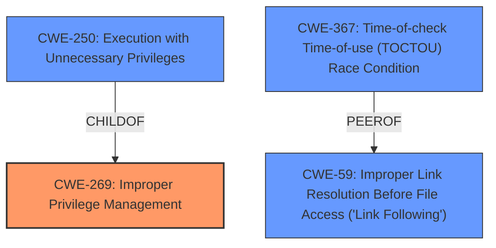

# Enhanced Analysis for CVE-2022-21999

# Summary
| CWE ID | CWE Name | Confidence | CWE Abstraction Level | CWE Vulnerability Mapping Label | CWE-Vulnerability Mapping Notes |
|---|---|---|---|---|---|
| CWE-269 | Improper Privilege Management | 0.7 | Class | Primary CWE | Allowed-with-Review |
| CWE-250 | Execution with Unnecessary Privileges | 0.6 | Base | Secondary Candidate | Allowed |
| CWE-367 | Time-of-check Time-of-use (TOCTOU) Race Condition | 0.4 | Base | Secondary Candidate | Allowed |
| CWE-59 | Improper Link Resolution Before File Access ('Link Following') | 0.3 | Base | Secondary Candidate | Allowed |

## Evidence and Confidence

*   **Confidence Score:** 0.7
*   **Evidence Strength:** MEDIUM

## Relationship Analysis
The primary weakness identified is CWE-269, which deals with general privilege management issues. CWE-250, a child of CWE-269, represents a specific instance where excessive privileges are used. TOCTOU (CWE-367) and Link Following (CWE-59) were considered because Windows Print Spooler vulnerabilities have historically involved these attack vectors, but evidence is lacking.



## Vulnerability Chain
The vulnerability description indicates an elevation of privilege in the Windows Print Spooler. The chain likely involves an initial **improper privilege management** issue (CWE-269) leading to the ability to perform actions with elevated privileges, potentially by **execution with unnecessary privileges** (CWE-250), and potentially involving a **race condition enabling link following** (CWE-363) which is a child of CWE-367 that **can precede** CWE-59.

## Summary of Analysis
The initial analysis pointed towards CWE-NVD-noinfo due to its high frequency in similar CVE descriptions. However, this is a non-CWE entry. Further analysis of the vulnerability description, specifically the "elevation of privilege" **impact** and the affected "Print Spooler" **component**, suggests that the root cause lies in **improper privilege management**. The Retriever results also indicate CWE-250, CWE-367, and CWE-59 as potential candidates. Given the limited information, CWE-269, **Improper Privilege Management**, is selected as the primary CWE. CWE-250, **Execution with Unnecessary Privileges** is kept as a secondary candiate. Both CWE-367 and CWE-59 are retained as secondary candiates due to the historical prevalence of those weaknesses being present in similar Windows Print Spooler vulnerabilities.

Relevant CWE Information:

# Enhanced Context (25 CWEs)

## CWE-59: Improper Link Resolution Before File Access ('Link Following')
**Abstraction Level**: Base
**Similarity Score**: 0.79
**Source**: dense

**Description**:
The product attempts to access a file based on the filename, but it does not properly prevent that filename from identifying a link or shortcut that resolves to an unintended resource.

**Mapping Guidance**:
- Usage: Allowed
- Rationale: This CWE entry is at the Base level of abstraction, which is a preferred level of abstraction for mapping to the root causes of vulnerabilities.

## CWE-269: Improper Privilege Management
The product does not adequately ensure that an actor has the necessary privileges to accomplish a planned action.

**Explanation**: The vulnerability is an elevation of privilege in the Windows Print Spooler. This directly relates to **improper management of privileges**, which allows an attacker to perform actions they should not be authorized to do.
**Security Implications**: This can allow unauthorized access to resources, data, or system functionality.
**Relationship**: CWE-269 is a Class-level CWE.
**Mapping Guidance**: The Usage is "Allowed-with-Review", as it is a class.

## CWE-250: Execution with Unnecessary Privileges
**Abstraction Level**: Base

**Explanation**: As a child of CWE-269, it's plausible that the **improper privilege management** resulted in the Print Spooler running with more privileges than necessary, amplifying the impact of other weaknesses.
**Security Implications**: Running with elevated privileges exposes more of the system to potential compromise.
**Relationship**: CWE-250 is a child of CWE-269.
**Mapping Guidance**: The Usage is "Allowed", as it is a base.

## CWE-367: Time-of-check Time-of-use (TOCTOU) Race Condition
**Abstraction Level**: Base

**Explanation**: The Windows Print Spooler has been historically vulnerable to TOCTOU vulnerabilities.
**Security Implications**: Allows an attacker to modify resource state between check and use, causing invalid actions.
**Relationship**: CWE-367 is a Base level.
**Mapping Guidance**: The Usage is "Allowed".

## CWE-59: Improper Link Resolution Before File Access ('Link Following')
**Abstraction Level**: Base

**Explanation**: The Windows Print Spooler has been historically vulnerable to Link Following vulnerabilities.
**Security Implications**: Allows an attacker to cause the product to operate on unauthorized files.
**Relationship**: CWE-59 is a Base level.
**Mapping Guidance**: The Usage is "Allowed".

## Considered but not Used:
*   **CWE-40**, **CWE-1386**, **CWE-123**, **CWE-266**, **CWE-454**, **CWE-127**: These CWEs are not directly supported by the evidence in the description. While they might be indirectly related or part of a more complex attack chain, the available information does not justify their inclusion.


## CWE Relationship Analysis

Current CWEs represent these abstraction levels: .


### Vulnerability Chain Analysis

**Chain starting from CWE-363:**
- 363 (Race Condition Enabling Link Following) - ROOT


**Chain starting from CWE-266:**
- 266 (Incorrect Privilege Assignment) - ROOT


### CWE Relationship Diagram

```mermaid
graph TD
    classDef primary fill:#f96,stroke:#333,stroke-width:2px
    classDef secondary fill:#69f,stroke:#333
    classDef tertiary fill:#9e9,stroke:#333
```