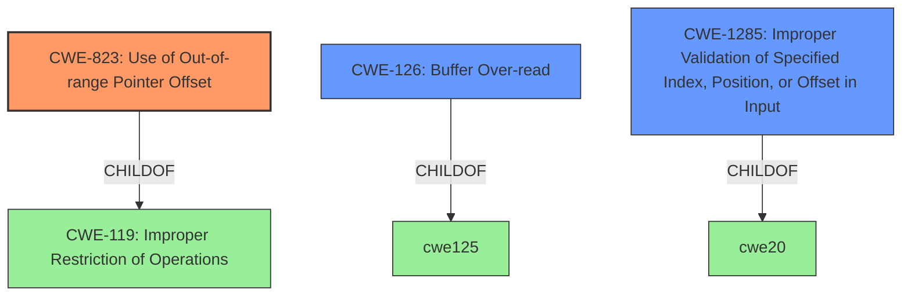

# Analysis for CVE-2022-22070

# Summary
| CWE ID | CWE Name | Confidence | CWE Abstraction Level | CWE Vulnerability Mapping Label | CWE-Vulnerability Mapping Notes |
|---|---|---|---|---|---|
| CWE-823 | Use of Out-of-range Pointer Offset | 0.8 | Base | Allowed | Primary CWE |
| CWE-126 | Buffer Over-read | 0.6 | Variant | Allowed | Secondary Candidate |
| CWE-1285 | Improper Validation of Specified Index, Position, or Offset in Input | 0.6 | Base | Allowed | Secondary Candidate |

## Evidence and Confidence

*   **Confidence Score:** 0.8
*   **Evidence Strength:** HIGH

## Relationship Analysis
The primary CWE selected is CWE-823, which represents the use of an out-of-range pointer offset. This is a base-level CWE and accurately reflects the vulnerability where an invalid routing address leads to memory corruption. CWE-823 is related to CWE-119 (Improper Restriction of Operations within the Bounds of a Memory Buffer), acting as its child. CWE-126 (Buffer Over-read) and CWE-1285 (Improper Validation of Specified Index, Position, or Offset in Input) were also considered as potential secondary CWEs due to the nature of the vulnerability possibly leading to reading beyond buffer boundaries.

## Vulnerability Chain
The vulnerability chain begins with the **lack of check of invalid routing address into APR Routing table**. This **root cause** leads to an **out-of-bounds read**, which ultimately results in memory corruption.

## Summary of Analysis
The initial analysis focused on identifying the root cause of the memory corruption, which is the **lack of check of invalid routing address**. The vulnerability description key phrases "rootcause: **lack of check of invalid routing address into APR Routing table**" and "weakness: **out-of-bounds read**" were instrumental in narrowing down the potential CWEs. The Retriever Results also pointed towards CWE-823 (Use of Out-of-range Pointer Offset), CWE-126 (Buffer Over-read), and CWE-1285 (Improper Validation of Specified Index, Position, or Offset in Input) as strong candidates.

CWE-823 was selected as the primary CWE because it best describes the scenario where the product uses a pointer with an offset that points outside the intended range, leading to memory corruption. The description of CWE-823 aligns with the vulnerability's technical details, specifically the invalid routing address causing the pointer to access unintended memory locations.

CWE-126 (Buffer Over-read) was considered as a secondary CWE because the **out-of-bounds read** could result in reading past the end of a buffer. This aligns with the description of CWE-126 where the product reads from a buffer using mechanisms that reference memory locations after the targeted buffer.

CWE-1285 (Improper Validation of Specified Index, Position, or Offset in Input) was considered as a secondary CWE because the **lack of check** on the routing address constitutes an improper validation of an index, position, or offset in input.

The selected CWEs are at the optimal level of specificity, with CWE-823 being a Base-level CWE and CWE-126 and CWE-1285 being Variant and Base-level CWEs respectively. This provides a balance between accuracy and granularity in representing the vulnerability.

Relevant CWE Information:

**CWE-823: Use of Out-of-range Pointer Offset**
The product performs pointer arithmetic on a valid pointer, but it uses an offset that can point outside of the intended range of valid memory locations for the resulting pointer. This matches the **lack of check of invalid routing address into APR Routing table** leading to memory corruption.

**CWE-126: Buffer Over-read**
The product reads from a buffer using buffer access mechanisms such as indexes or pointers that reference memory locations after the targeted buffer. The **out-of-bounds read** results from the **lack of check of invalid routing address**

**CWE-1285: Improper Validation of Specified Index, Position, or Offset in Input**
The product receives input that is expected to specify an index, position, or offset into an indexable resource such as a buffer or file, but it does not validate or incorrectly validates that the specified index/position/offset has the required properties. The **lack of check of invalid routing address** shows the input isn't validated.