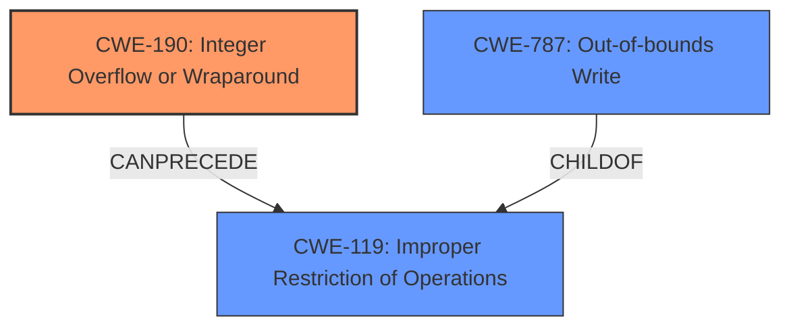

# Raw Analyzer Response for CVE-2022-22074

# Summary
| CWE ID | CWE Name | Confidence | CWE Abstraction Level | CWE Vulnerability Mapping Label | CWE-Vulnerability Mapping Notes |
|---|---|---|---|---|---|
| CWE-190 | Integer Overflow or Wraparound | 1.0 | Base | Allowed | Primary CWE. The vulnerability description explicitly mentions an integer overflow. |
| CWE-787 | Out-of-bounds Write | 0.8 | Base | Allowed | Secondary CWE. Integer overflows can lead to out-of-bounds writes. |

## Evidence and Confidence

*   **Confidence Score:** 0.9
*   **Evidence Strength:** HIGH

## Relationship Analysis
The primary relationship is that CWE-190 **Integer Overflow or Wraparound** can **CanPrecede** CWE-119 **Improper Restriction of Operations within the Bounds of a Memory Buffer**. CWE-787 **Out-of-bounds Write** is a **ChildOf** CWE-119. Thus the **integer overflow** leads to the **out-of-bounds write**.

## Vulnerability Chain
The vulnerability chain starts with an **integer overflow (CWE-190)**, which leads to **memory corruption**, specifically an **out-of-bounds write (CWE-787)**.

## Summary of Analysis
The initial analysis identified the **integer overflow** as the root cause, leading to **memory corruption**. The retriever results and the explicit mention of "**integer overflow**" in the "**rootcause:**" section of the "**Vulnerability Description Key Phrases**" strongly supports CWE-190 as the primary CWE. The "**weakness:**" is "**Memory Corruption**". The relationship graph shows that an integer overflow can precede a buffer overflow, which is a type of memory corruption. Therefore, CWE-787 is included as a secondary CWE, indicating the likely consequence of the overflow.

The evidence provided is sufficient to confidently assign CWE-190 as the primary weakness. The relationship analysis further supports the inclusion of CWE-787 as a related weakness. Both CWEs are at the Base level of abstraction, providing an appropriate level of specificity.

Relevant CWE Information:

# Enhanced Context (25 CWEs)

## CWE-190: Integer Overflow or Wraparound
**Abstraction Level**: Base
**Similarity Score**: 0.80
**Source**: alternate_terms

**Description**:
The product performs a calculation that can
         produce an integer overflow or wraparound when the logic
         assumes that the resulting value will always be larger than
         the original value. This occurs when an integer value is
         incremented to a value that is too large to store in the
         associated representation. When this occurs, the value may
         become a very small or negative number.

## CWE-787: Out-of-bounds Write
**Abstraction Level**: Base
**Similarity Score**: 1.00
**Source**: alternate_terms

**Description**:
The product writes data past the end, or before the beginning, of the intended buffer.