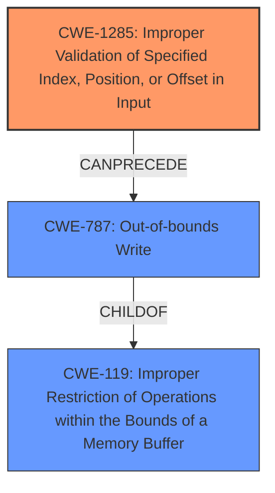

# Analysis for CVE-2022-22080

# Summary
| CWE ID | CWE Name | Confidence | CWE Abstraction Level | CWE Vulnerability Mapping Label | CWE-Vulnerability Mapping Notes |
|---|---|---|---|---|---|
| CWE-1285 | Improper Validation of Specified Index, Position, or Offset in Input | 0.8 | Base | Allowed | Primary CWE |
| CWE-787 | Out-of-bounds Write | 0.6 | Base | Allowed | Secondary Candidate |
| CWE-119 | Improper Restriction of Operations within the Bounds of a Memory Buffer | 0.4 | Class | Discouraged | Secondary Candidate |

## Evidence and Confidence

*   **Confidence Score:** 0.8
*   **Evidence Strength:** MEDIUM

## Relationship Analysis
The primary CWE, CWE-1285, is a base-level weakness related to improper input validation, which can lead to exploitable conditions. CWE-787, a potential result of this **improper validation**, involves writing data outside the intended memory boundaries, causing corruption. CWE-119, a more general class, is the parent of CWE-787 and covers improper memory buffer restrictions. The abstraction levels guided selection, favoring the more specific CWE-1285 at the base level.

## Vulnerability Chain
The vulnerability chain starts with **improper validation** of the backend ID (CWE-1285). If the backend ID is not validated correctly, it can lead to out-of-bounds write (CWE-787), resulting in memory corruption. The chain is:
  - CWE-1285: **Improper validation** of backend ID.
  - CWE-787: Out-of-bounds write due to the **improperly validated** ID.
  - Memory Corruption: The impact of the out-of-bounds write.

## Summary of Analysis
The initial assessment focused on identifying the root cause and the resulting impact. The **improper validation** of the backend ID in the PCM routing process is the clear root cause. The description explicitly states that this **improper validation** leads to memory corruption, pointing to an out-of-bounds write condition.

The retriever results suggested CWE-1285, CWE-787, and CWE-119. CWE-1285 directly aligns with the **improper validation** aspect. CWE-787 (Out-of-bounds Write) is a likely consequence of the **improper validation**, leading to memory corruption. CWE-119 (Improper Restriction of Operations within the Bounds of a Memory Buffer) is a more general category that encompasses both the **improper validation** and out-of-bounds write scenarios.

The relationship graph helped visualize the connection between these CWEs, showing how **improper validation** can precede an out-of-bounds write, and how both relate to the broader class of improper buffer restrictions.

The final selection favored CWE-1285 as the primary CWE because it directly reflects the root cause described in the vulnerability. CWE-787 is included as a secondary candidate since that is the direct result of the root cause.

The selected CWEs are at the optimal level of specificity. CWE-1285 is a base-level CWE that accurately captures the **improper validation** issue.

Relevant CWE Information:

# Enhanced Context (25 CWEs)
The following CWEs were identified as potentially relevant to this vulnerability:

## CWE-1285: Improper Validation of Specified Index, Position, or Offset in Input
**Abstraction Level**: Base
**Similarity Score**: 0.81
**Source**: dense

**Description**:
The product receives input that is expected to specify an index, position, or offset into an indexable resource such as a buffer or file, but it does not validate or incorrectly validates that the specified index/position/offset has the required properties.

**Mapping Guidance**:
- Usage: Allowed
- Rationale: This CWE entry is at the Base level of abstraction, which is a preferred level of abstraction for mapping to the root causes of vulnerabilities.

## CWE-787: Out-of-bounds Write
**Abstraction Level**: base
**Similarity Score**: 4.33
**Source**: graph

**Description**:
CWE-787: Out-of-bounds Write

**Mapping Guidance**:
- Usage: Allowed
- Rationale: This CWE entry is at the Base level of abstraction, which is a preferred level of abstraction for mapping to the root causes of vulnerabilities.

## CWE-119: Improper Restriction of Operations within the Bounds of a Memory Buffer
**Abstraction Level**: Class
**Similarity Score**: 0.78
**Source**: dense

**Description**:
The product performs operations on a memory buffer, but it reads from or writes to a memory location outside the buffer's intended boundary. This may result in read or write operations on unexpected memory locations that could be linked to other variables, data structures, or internal program data.

**Mapping Guidance**:
- Usage: Discouraged
- Rationale: CWE-119 is commonly misused in low-information vulnerability reports when lower-level CWEs could be used instead, or when more details about the vulnerability are available.