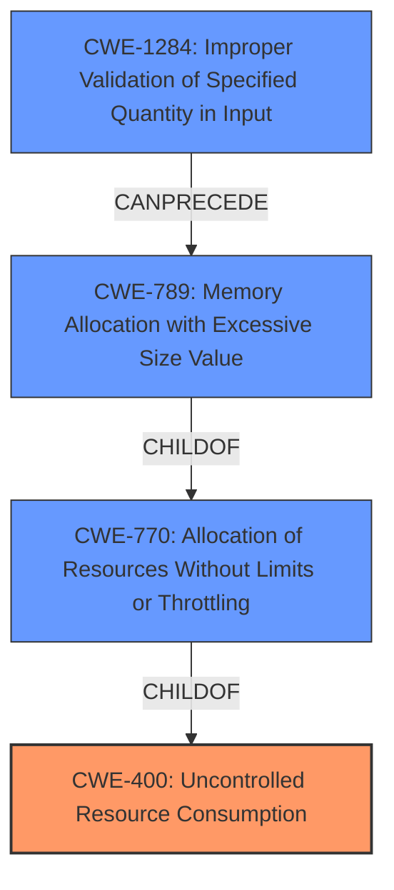

# Analysis for CVE-2022-22101

# Summary
| CWE ID | CWE Name | Confidence | CWE Abstraction Level | CWE Vulnerability Mapping Label | CWE-Vulnerability Mapping Notes |
|---|---|---|---|---|---|
| CWE-400 | Uncontrolled Resource Consumption | 0.9 | Class | Primary | Discouraged |
| CWE-770 | Allocation of Resources Without Limits or Throttling | 0.7 | Base | Secondary | Allowed |
| CWE-789 | Memory Allocation with Excessive Size Value | 0.6 | Variant | Secondary | Allowed |
| CWE-1284 | Improper Validation of Specified Quantity in Input | 0.5 | Base | Secondary | Allowed |

## Evidence and Confidence

*   **Confidence Score:** 0.8
*   **Evidence Strength:** HIGH

## Relationship Analysis
The primary relationship that impacted the decision was the parent-child relationship between CWE-400 and its children, specifically CWE-770 and CWE-789. CWE-400 is a Class-level CWE, while CWE-770 is Base, and CWE-789 is Variant. The description indicates **uncontrolled resource consumption**, which aligns directly with CWE-400. However, the specifics of resource allocation without limits (CWE-770) and excessive memory allocation (CWE-789) provide more granularity, although evidence is not definitive enough to make them primary. CWE-1284 is also relevant as improper input validation can lead to uncontrolled resource allocation.

## Vulnerability Chain
The chain of weaknesses starts with **parsing an incoming HAB message**. The **improper handling of the message** could then lead to **uncontrolled resource consumption**, eventually resulting in **Denial of Service**.
  - Root Cause: Improper parsing of HAB message leading to ...
  - Weakness: **Uncontrolled Resource Consumption** (CWE-400) and potentially **Allocation of Resources Without Limits or Throttling** (CWE-770), **Memory Allocation with Excessive Size Value** (CWE-789), **Improper Validation of Specified Quantity in Input** (CWE-1284)
  - Impact: Denial of Service

## Summary of Analysis
The initial assessment focused on the **uncontrolled resource consumption** aspect of the vulnerability. The retriever results strongly suggested CWE-400 (Uncontrolled Resource Consumption) as a primary candidate. This aligns with the provided description: "Denial of service in multimedia due to **uncontrolled resource consumption** while parsing an incoming HAB message in Snapdragon Auto". The key phrase directly points to this weakness.

However, I considered the mapping guidance for CWE-400, which **discourages** its usage because it is often misused and conflated with the technical impact. The guidance suggests considering children/descendants such as CWE-770, CWE-771, CWE-410, CWE-772, CWE-834, and CWE-405. Given the context of parsing a message, CWE-770 (Allocation of Resources Without Limits or Throttling), CWE-789 (Memory Allocation with Excessive Size Value), and CWE-1284 (Improper Validation of Specified Quantity in Input) also appeared relevant.

Ultimately, I decided to keep CWE-400 as the primary CWE because the description's primary focus is on uncontrolled resource consumption, making it the most direct representation of the stated weakness. It is used with the understanding that it's a class-level CWE and more specific CWEs could apply. I included CWE-770, CWE-789, and CWE-1284 as secondary CWEs to provide additional details about the nature of the resource consumption issue. These provide a more granular explanation of *how* the resource consumption occurs.

The selected CWEs are at the optimal level of specificity given the information provided. While more detailed information about the parsing process could lead to even more specific CWEs, the current evidence supports these choices.

Relevant CWE Information:

# Enhanced Context (25 CWEs)

## CWE-400: Uncontrolled Resource Consumption
**Abstraction:** Class
**Status:** Draft

### Description
The product does not properly control the allocation and maintenance of a limited resource, thereby enabling an actor to influence the amount of resources consumed, eventually leading to the exhaustion of available resources.

### Extended Description

Limited resources include memory, file system storage, database connection pool entries, and CPU. If an attacker can trigger the allocation of these limited resources, but the number or size of the resources is not controlled, then the attacker could cause a denial of service that consumes all available resources. This would prevent valid users from accessing the product, and it could potentially have an impact on the surrounding environment. For example, a memory exhaustion attack against an application could slow down the application as well as its host operating system.

### Mapping Guidance
**Usage:** Discouraged
**Rationale:** CWE-400 is intended for incorrect behaviors in which the product is expected to track and restrict how many resources it consumes, but CWE-400 is often misused because it is conflated with the "technical impact" of vulnerabilities in which resource consumption occurs. It is sometimes used for low-information vulnerability reports. It is a level-1 Class (i.e., a child of a Pillar).
**Comments:** Closely analyze the specific mistake that is causing resource consumption, and perform a CWE mapping for that mistake. Consider children/descendants such as CWE-770: Allocation of Resources Without Limits or Throttling, CWE-771: Missing Reference to Active Allocated Resource, CWE-410: Insufficient Resource Pool, CWE-772: Missing Release of Resource after Effective Lifetime, CWE-834: Excessive Iteration, CWE-405: Asymmetric Resource Consumption (Amplification), and others.

## CWE-770: Allocation of Resources Without Limits or Throttling
**Abstraction:** Base
**Status:** Incomplete

### Description
The product allocates a reusable resource or group of resources on behalf of an actor without imposing any restrictions on the size or number of resources that can be allocated, in violation of the intended security policy for that actor.

### Extended Description

Code frequently has to work with limited resources, so programmers must be careful to ensure that resources are not consumed too quickly, or too easily. Without use of quotas, resource limits, or other protection mechanisms, it can be easy for an attacker to consume many resources by rapidly making many requests, or causing larger resources to be used than is needed. When too many resources are allocated, or if a single resource is too large, then it can prevent the code from working correctly, possibly leading to a denial of service.

### Mapping Guidance
**Usage:** Allowed
**Rationale:** This CWE entry is at the Base level of abstraction, which is a preferred level of abstraction for mapping to the root causes of vulnerabilities.
**Comments:** Carefully read both the name and description to ensure that this mapping is an appropriate fit. Do not try to 'force' a mapping to a lower-level Base/Variant simply to comply with this preferred level of abstraction.

## CWE-789: Memory Allocation with Excessive Size Value
**Abstraction:** Variant
**Status:** Draft

### Description
The product allocates memory based on an untrusted, large size value, but it does not ensure that the size is within expected limits, allowing arbitrary amounts of memory to be allocated.

### Mapping Guidance
**Usage:** Allowed
**Rationale:** This CWE entry is at the Variant level of abstraction, which is a preferred level of abstraction for mapping to the root causes of vulnerabilities.
**Comments:** Carefully read both the name and description to ensure that this mapping is an appropriate fit. Do not try to 'force' a mapping to a lower-level Base/Variant simply to comply with this preferred level of abstraction.

## CWE-1284: Improper Validation of Specified Quantity in Input
**Abstraction:** Base
**Status:** Incomplete

### Description
The product receives input that is expected to specify a quantity (such as size or length), but it does not validate or incorrectly validates that the quantity has the required properties.

### Mapping Guidance
**Usage:** Allowed
**Rationale:** This CWE entry is at the Base level of abstraction, which is a preferred level of abstraction for mapping to the root causes of vulnerabilities.
**Comments:** Carefully read both the name and description to ensure that this mapping is an appropriate fit. Do not try to 'force' a mapping to a lower